# BDWH_ELABGEBA (Application)

:::info Complexity Score
 **S**
:::

## Application Description

**BDWH_ELABGEBA** is a data warehouse application that implements the **ELVS core replacement** process for merging ELVS GEBA data with new data sources from article warehouse management.

This application consolidates **packaging unit data for goods issue** (GEBA) by combining legacy ELVS system data with modern XML messages from the ELISA article warehouse supply system. The process integrates logistic factors and stockkeeping unit entities to create unified datasets in the data warehouse.

The application operates through a **sequential three-job workflow**: DW013803 performs data merging and consolidation from multiple sources, DW013804 transfers processed data from staging to DMA tables, and DW013805 performs cleanup operations on staging tables.

**Key functionalities** include:
- Merging ELVS GEBA data with ELISA stockkeeping unit information
- Implementing historization logic to preserve data lineage
- Managing data quality through deduplication and validation
- Supporting restartable job execution for operational reliability

The application processes critical warehouse attributes such as dimensions, weights, storage classifications, and validity periods. It maintains both current (F_ELAB_GEBA) and historical (F_ELAB_GEBA_HIST) datasets, ensuring comprehensive data availability for downstream business intelligence and operational reporting systems.

**Target environment** utilizes Snowflake data warehouse with SAS processing, supporting the migration from legacy ELVS systems to modern ELISA-based data architecture.

## List of SAS programs

| SAS Program | Description |
|---|---|
| [snow_elabgeba_100_geba_artlag_zusammenf.sas](./snow_elabgeba_100_geba_artlag_zusammenf.sas.md) | tbd |
| [snow_elabgeba_200_nach_dma.sas](./snow_elabgeba_200_nach_dma.sas.md) | tbd |

## Table Lineage

```mermaid
%%{init: {'flowchart': { 'nodeSpacing': 10, 'rankSpacing': 40, 'rankdir': 'TB' }}}%%

flowchart LR

  LEGACY_STAG.F_ELAB_GEBA_WORK["LEGACY_STAG<br/>F_ELAB_GEBA_WORK"] --> LEGACY_DMA.F_ELAB_GEBA["LEGACY_DMA<br/>F_ELAB_GEBA"]
  LEGACY_DMA.F_ELAB_GEBA_HIST["LEGACY_DMA<br/>F_ELAB_GEBA_HIST"] --> LEGACY_STAG.F_ELAB_GEBA_HIST["LEGACY_STAG<br/>F_ELAB_GEBA_HIST"]
  LEGACY_STAG.F_ELAB_GEBA_WORK["LEGACY_STAG<br/>F_ELAB_GEBA_WORK"] --> LEGACY_STAG.F_ELAB_GEBA_HIST["LEGACY_STAG<br/>F_ELAB_GEBA_HIST"]
  LEGACY_EDW.D_ELISA_ARTLAGLOGISTFAKTOREN["LEGACY_EDW<br/>D_ELISA_ARTLAGLOGISTFAKTOREN"] --> LEGACY_EDW.D_ELISA_ARTLAGSTOCKKEEPINGUNIT["LEGACY_EDW<br/>D_ELISA_ARTLAGSTOCKKEEPINGUNIT"]
  LEGACY_EDW.D_ELISA_ARTLAGSTOCKKEEPINGUNIT["LEGACY_EDW<br/>D_ELISA_ARTLAGSTOCKKEEPINGUNIT"] --> LEGACY_STAG.F_ELAB_GEBA_WORK["LEGACY_STAG<br/>F_ELAB_GEBA_WORK"]
  LEGACY_STAG.F_ELAB_GEBA_HIST["LEGACY_STAG<br/>F_ELAB_GEBA_HIST"] --> LEGACY_STAG.F_ELVS_GEBA_HIST["LEGACY_STAG<br/>F_ELVS_GEBA_HIST"]
  LEGACY_EDW.D_ELISA_ARTLAGLOGISTFAKTOREN["LEGACY_EDW<br/>D_ELISA_ARTLAGLOGISTFAKTOREN"] --> LEGACY_STAG.F_ELAB_GEBA_WORK["LEGACY_STAG<br/>F_ELAB_GEBA_WORK"]
  LEGACY_EDW.D_ELISA_ARTLAGLOGISTFAKTOREN["LEGACY_EDW<br/>D_ELISA_ARTLAGLOGISTFAKTOREN"] --> LEGACY_STAG.F_ELVS_GEBA_HIST["LEGACY_STAG<br/>F_ELVS_GEBA_HIST"]
  LEGACY_DWH.F_ELVS_GEBA["LEGACY_DWH<br/>F_ELVS_GEBA"] --> LEGACY_STAG.F_ELVS_GEBA_HIST["LEGACY_STAG<br/>F_ELVS_GEBA_HIST"]
  LEGACY_DMA.F_ELAB_GEBA_HIST["LEGACY_DMA<br/>F_ELAB_GEBA_HIST"] --> LEGACY_STAG.F_ELVS_GEBA_HIST["LEGACY_STAG<br/>F_ELVS_GEBA_HIST"]
  LEGACY_EDW.D_ELISA_ARTLAGLOGISTFAKTOREN["LEGACY_EDW<br/>D_ELISA_ARTLAGLOGISTFAKTOREN"] --> LEGACY_EDW.D_ELISA_ARTLAGLOGISTFAKTOREN["LEGACY_EDW<br/>D_ELISA_ARTLAGLOGISTFAKTOREN"]
  LEGACY_STAG.F_ELAB_GEBA_WORK["LEGACY_STAG<br/>F_ELAB_GEBA_WORK"] --> LEGACY_STAG.F_ELVS_GEBA_HIST["LEGACY_STAG<br/>F_ELVS_GEBA_HIST"]
  LEGACY_DWH.F_ELVS_GEBA["LEGACY_DWH<br/>F_ELVS_GEBA"] --> LEGACY_STAG.F_ELAB_GEBA_WORK["LEGACY_STAG<br/>F_ELAB_GEBA_WORK"]
  LEGACY_STAG.F_ELAB_GEBA_HIST["LEGACY_STAG<br/>F_ELAB_GEBA_HIST"] --> LEGACY_DMA.F_ELAB_GEBA_HIST["LEGACY_DMA<br/>F_ELAB_GEBA_HIST"]
  LEGACY_STAG.F_ELAB_GEBA_HIST["LEGACY_STAG<br/>F_ELAB_GEBA_HIST"] --> LEGACY_STAG.F_ELAB_GEBA_HIST["LEGACY_STAG<br/>F_ELAB_GEBA_HIST"]
  LEGACY_EDW.D_ELISA_ARTLAGSTOCKKEEPINGUNIT["LEGACY_EDW<br/>D_ELISA_ARTLAGSTOCKKEEPINGUNIT"] --> LEGACY_STAG.F_ELVS_GEBA_HIST["LEGACY_STAG<br/>F_ELVS_GEBA_HIST"]
  click LEGACY_STAG.F_ELAB_GEBA_WORK "../../tables/LEGACY_STAG/F_ELAB_GEBA_WORK"
  click LEGACY_DMA.F_ELAB_GEBA_HIST "../../tables/LEGACY_DMA/F_ELAB_GEBA_HIST"
  click LEGACY_STAG.F_ELAB_GEBA_WORK "../../tables/LEGACY_STAG/F_ELAB_GEBA_WORK"
  click LEGACY_EDW.D_ELISA_ARTLAGLOGISTFAKTOREN "../../tables/LEGACY_EDW/D_ELISA_ARTLAGLOGISTFAKTOREN"
  click LEGACY_EDW.D_ELISA_ARTLAGSTOCKKEEPINGUNIT "../../tables/LEGACY_EDW/D_ELISA_ARTLAGSTOCKKEEPINGUNIT"
  click LEGACY_STAG.F_ELAB_GEBA_HIST "../../tables/LEGACY_STAG/F_ELAB_GEBA_HIST"
  click LEGACY_EDW.D_ELISA_ARTLAGLOGISTFAKTOREN "../../tables/LEGACY_EDW/D_ELISA_ARTLAGLOGISTFAKTOREN"
  click LEGACY_EDW.D_ELISA_ARTLAGLOGISTFAKTOREN "../../tables/LEGACY_EDW/D_ELISA_ARTLAGLOGISTFAKTOREN"
  click LEGACY_DWH.F_ELVS_GEBA "../../tables/LEGACY_DWH/F_ELVS_GEBA"
  click LEGACY_DMA.F_ELAB_GEBA_HIST "../../tables/LEGACY_DMA/F_ELAB_GEBA_HIST"
  click LEGACY_EDW.D_ELISA_ARTLAGLOGISTFAKTOREN "../../tables/LEGACY_EDW/D_ELISA_ARTLAGLOGISTFAKTOREN"
  click LEGACY_STAG.F_ELAB_GEBA_WORK "../../tables/LEGACY_STAG/F_ELAB_GEBA_WORK"
  click LEGACY_DWH.F_ELVS_GEBA "../../tables/LEGACY_DWH/F_ELVS_GEBA"
  click LEGACY_STAG.F_ELAB_GEBA_HIST "../../tables/LEGACY_STAG/F_ELAB_GEBA_HIST"
  click LEGACY_STAG.F_ELAB_GEBA_HIST "../../tables/LEGACY_STAG/F_ELAB_GEBA_HIST"
  click LEGACY_EDW.D_ELISA_ARTLAGSTOCKKEEPINGUNIT "../../tables/LEGACY_EDW/D_ELISA_ARTLAGSTOCKKEEPINGUNIT"
  click LEGACY_DMA.F_ELAB_GEBA "../../tables/LEGACY_DMA/F_ELAB_GEBA"
  click LEGACY_STAG.F_ELAB_GEBA_HIST "../../tables/LEGACY_STAG/F_ELAB_GEBA_HIST"
  click LEGACY_STAG.F_ELAB_GEBA_HIST "../../tables/LEGACY_STAG/F_ELAB_GEBA_HIST"
  click LEGACY_EDW.D_ELISA_ARTLAGSTOCKKEEPINGUNIT "../../tables/LEGACY_EDW/D_ELISA_ARTLAGSTOCKKEEPINGUNIT"
  click LEGACY_STAG.F_ELAB_GEBA_WORK "../../tables/LEGACY_STAG/F_ELAB_GEBA_WORK"
  click LEGACY_STAG.F_ELVS_GEBA_HIST "../../tables/LEGACY_STAG/F_ELVS_GEBA_HIST"
  click LEGACY_STAG.F_ELAB_GEBA_WORK "../../tables/LEGACY_STAG/F_ELAB_GEBA_WORK"
  click LEGACY_STAG.F_ELVS_GEBA_HIST "../../tables/LEGACY_STAG/F_ELVS_GEBA_HIST"
  click LEGACY_STAG.F_ELVS_GEBA_HIST "../../tables/LEGACY_STAG/F_ELVS_GEBA_HIST"
  click LEGACY_STAG.F_ELVS_GEBA_HIST "../../tables/LEGACY_STAG/F_ELVS_GEBA_HIST"
  click LEGACY_EDW.D_ELISA_ARTLAGLOGISTFAKTOREN "../../tables/LEGACY_EDW/D_ELISA_ARTLAGLOGISTFAKTOREN"
  click LEGACY_STAG.F_ELVS_GEBA_HIST "../../tables/LEGACY_STAG/F_ELVS_GEBA_HIST"
  click LEGACY_STAG.F_ELAB_GEBA_WORK "../../tables/LEGACY_STAG/F_ELAB_GEBA_WORK"
  click LEGACY_DMA.F_ELAB_GEBA_HIST "../../tables/LEGACY_DMA/F_ELAB_GEBA_HIST"
  click LEGACY_STAG.F_ELAB_GEBA_HIST "../../tables/LEGACY_STAG/F_ELAB_GEBA_HIST"
  click LEGACY_STAG.F_ELVS_GEBA_HIST "../../tables/LEGACY_STAG/F_ELVS_GEBA_HIST"
```

