# BDWH_ELABGEBA (Application)

:::danger Complexity Score
 **XL**
:::

## Application Description

_No description available_

## List of SAS programs

| SAS Program | Description |
|---|---|
| [snow_elabgeba_100_geba_artlag_zusammenf.sas](./snow_elabgeba_100_geba_artlag_zusammenf.sas.md) | tbd |
| [snow_elabgeba_200_nach_dma.sas](./snow_elabgeba_200_nach_dma.sas.md) | tbd |

## Table Lineage

```mermaid
%%{init: {'flowchart': { 'nodeSpacing': 10, 'rankSpacing': 40, 'rankdir': 'TB' }}}%%

flowchart LR

  LEGACY_DWH.F_ELVS_GEBA["LEGACY_DWH<br/>F_ELVS_GEBA"] --> LEGACY_STAG.F_ELAB_GEBA_WORK["LEGACY_STAG<br/>F_ELAB_GEBA_WORK"]
  LEGACY_STAG.F_ELAB_GEBA_HIST["LEGACY_STAG<br/>F_ELAB_GEBA_HIST"] --> LEGACY_DMA.F_ELAB_GEBA_HIST["LEGACY_DMA<br/>F_ELAB_GEBA_HIST"]
  LEGACY_STAG.F_ELAB_GEBA_HIST["LEGACY_STAG<br/>F_ELAB_GEBA_HIST"] --> LEGACY_STAG.F_ELAB_GEBA_HIST["LEGACY_STAG<br/>F_ELAB_GEBA_HIST"]
  LEGACY_EDW.D_ELISA_ARTLAGSTOCKKEEPINGUNIT["LEGACY_EDW<br/>D_ELISA_ARTLAGSTOCKKEEPINGUNIT"] --> LEGACY_STAG.F_ELVS_GEBA_HIST["LEGACY_STAG<br/>F_ELVS_GEBA_HIST"]
  LEGACY_STAG.F_ELAB_GEBA_WORK["LEGACY_STAG<br/>F_ELAB_GEBA_WORK"] --> LEGACY_DMA.F_ELAB_GEBA["LEGACY_DMA<br/>F_ELAB_GEBA"]
  LEGACY_DMA.F_ELAB_GEBA_HIST["LEGACY_DMA<br/>F_ELAB_GEBA_HIST"] --> LEGACY_STAG.F_ELAB_GEBA_HIST["LEGACY_STAG<br/>F_ELAB_GEBA_HIST"]
  LEGACY_STAG.F_ELAB_GEBA_WORK["LEGACY_STAG<br/>F_ELAB_GEBA_WORK"] --> LEGACY_STAG.F_ELAB_GEBA_HIST["LEGACY_STAG<br/>F_ELAB_GEBA_HIST"]
  LEGACY_EDW.D_ELISA_ARTLAGLOGISTFAKTOREN["LEGACY_EDW<br/>D_ELISA_ARTLAGLOGISTFAKTOREN"] --> LEGACY_EDW.D_ELISA_ARTLAGSTOCKKEEPINGUNIT["LEGACY_EDW<br/>D_ELISA_ARTLAGSTOCKKEEPINGUNIT"]
  LEGACY_EDW.D_ELISA_ARTLAGSTOCKKEEPINGUNIT["LEGACY_EDW<br/>D_ELISA_ARTLAGSTOCKKEEPINGUNIT"] --> LEGACY_STAG.F_ELAB_GEBA_WORK["LEGACY_STAG<br/>F_ELAB_GEBA_WORK"]
  LEGACY_STAG.F_ELAB_GEBA_HIST["LEGACY_STAG<br/>F_ELAB_GEBA_HIST"] --> LEGACY_STAG.F_ELVS_GEBA_HIST["LEGACY_STAG<br/>F_ELVS_GEBA_HIST"]
  LEGACY_EDW.D_ELISA_ARTLAGLOGISTFAKTOREN["LEGACY_EDW<br/>D_ELISA_ARTLAGLOGISTFAKTOREN"] --> LEGACY_STAG.F_ELAB_GEBA_WORK["LEGACY_STAG<br/>F_ELAB_GEBA_WORK"]
  LEGACY_EDW.D_ELISA_ARTLAGLOGISTFAKTOREN["LEGACY_EDW<br/>D_ELISA_ARTLAGLOGISTFAKTOREN"] --> LEGACY_STAG.F_ELVS_GEBA_HIST["LEGACY_STAG<br/>F_ELVS_GEBA_HIST"]
  LEGACY_DWH.F_ELVS_GEBA["LEGACY_DWH<br/>F_ELVS_GEBA"] --> LEGACY_STAG.F_ELVS_GEBA_HIST["LEGACY_STAG<br/>F_ELVS_GEBA_HIST"]
  LEGACY_DMA.F_ELAB_GEBA_HIST["LEGACY_DMA<br/>F_ELAB_GEBA_HIST"] --> LEGACY_STAG.F_ELVS_GEBA_HIST["LEGACY_STAG<br/>F_ELVS_GEBA_HIST"]
  LEGACY_EDW.D_ELISA_ARTLAGLOGISTFAKTOREN["LEGACY_EDW<br/>D_ELISA_ARTLAGLOGISTFAKTOREN"] --> LEGACY_EDW.D_ELISA_ARTLAGLOGISTFAKTOREN["LEGACY_EDW<br/>D_ELISA_ARTLAGLOGISTFAKTOREN"]
  LEGACY_STAG.F_ELAB_GEBA_WORK["LEGACY_STAG<br/>F_ELAB_GEBA_WORK"] --> LEGACY_STAG.F_ELVS_GEBA_HIST["LEGACY_STAG<br/>F_ELVS_GEBA_HIST"]
  click LEGACY_DWH.F_ELVS_GEBA "../../tables/LEGACY_DWH/F_ELVS_GEBA"
  click LEGACY_STAG.F_ELAB_GEBA_HIST "../../tables/LEGACY_STAG/F_ELAB_GEBA_HIST"
  click LEGACY_STAG.F_ELAB_GEBA_HIST "../../tables/LEGACY_STAG/F_ELAB_GEBA_HIST"
  click LEGACY_EDW.D_ELISA_ARTLAGSTOCKKEEPINGUNIT "../../tables/LEGACY_EDW/D_ELISA_ARTLAGSTOCKKEEPINGUNIT"
  click LEGACY_STAG.F_ELAB_GEBA_WORK "../../tables/LEGACY_STAG/F_ELAB_GEBA_WORK"
  click LEGACY_DMA.F_ELAB_GEBA_HIST "../../tables/LEGACY_DMA/F_ELAB_GEBA_HIST"
  click LEGACY_STAG.F_ELAB_GEBA_WORK "../../tables/LEGACY_STAG/F_ELAB_GEBA_WORK"
  click LEGACY_EDW.D_ELISA_ARTLAGLOGISTFAKTOREN "../../tables/LEGACY_EDW/D_ELISA_ARTLAGLOGISTFAKTOREN"
  click LEGACY_EDW.D_ELISA_ARTLAGSTOCKKEEPINGUNIT "../../tables/LEGACY_EDW/D_ELISA_ARTLAGSTOCKKEEPINGUNIT"
  click LEGACY_STAG.F_ELAB_GEBA_HIST "../../tables/LEGACY_STAG/F_ELAB_GEBA_HIST"
  click LEGACY_EDW.D_ELISA_ARTLAGLOGISTFAKTOREN "../../tables/LEGACY_EDW/D_ELISA_ARTLAGLOGISTFAKTOREN"
  click LEGACY_EDW.D_ELISA_ARTLAGLOGISTFAKTOREN "../../tables/LEGACY_EDW/D_ELISA_ARTLAGLOGISTFAKTOREN"
  click LEGACY_DWH.F_ELVS_GEBA "../../tables/LEGACY_DWH/F_ELVS_GEBA"
  click LEGACY_DMA.F_ELAB_GEBA_HIST "../../tables/LEGACY_DMA/F_ELAB_GEBA_HIST"
  click LEGACY_EDW.D_ELISA_ARTLAGLOGISTFAKTOREN "../../tables/LEGACY_EDW/D_ELISA_ARTLAGLOGISTFAKTOREN"
  click LEGACY_STAG.F_ELAB_GEBA_WORK "../../tables/LEGACY_STAG/F_ELAB_GEBA_WORK"
  click LEGACY_STAG.F_ELAB_GEBA_WORK "../../tables/LEGACY_STAG/F_ELAB_GEBA_WORK"
  click LEGACY_DMA.F_ELAB_GEBA_HIST "../../tables/LEGACY_DMA/F_ELAB_GEBA_HIST"
  click LEGACY_STAG.F_ELAB_GEBA_HIST "../../tables/LEGACY_STAG/F_ELAB_GEBA_HIST"
  click LEGACY_STAG.F_ELVS_GEBA_HIST "../../tables/LEGACY_STAG/F_ELVS_GEBA_HIST"
  click LEGACY_DMA.F_ELAB_GEBA "../../tables/LEGACY_DMA/F_ELAB_GEBA"
  click LEGACY_STAG.F_ELAB_GEBA_HIST "../../tables/LEGACY_STAG/F_ELAB_GEBA_HIST"
  click LEGACY_STAG.F_ELAB_GEBA_HIST "../../tables/LEGACY_STAG/F_ELAB_GEBA_HIST"
  click LEGACY_EDW.D_ELISA_ARTLAGSTOCKKEEPINGUNIT "../../tables/LEGACY_EDW/D_ELISA_ARTLAGSTOCKKEEPINGUNIT"
  click LEGACY_STAG.F_ELAB_GEBA_WORK "../../tables/LEGACY_STAG/F_ELAB_GEBA_WORK"
  click LEGACY_STAG.F_ELVS_GEBA_HIST "../../tables/LEGACY_STAG/F_ELVS_GEBA_HIST"
  click LEGACY_STAG.F_ELAB_GEBA_WORK "../../tables/LEGACY_STAG/F_ELAB_GEBA_WORK"
  click LEGACY_STAG.F_ELVS_GEBA_HIST "../../tables/LEGACY_STAG/F_ELVS_GEBA_HIST"
  click LEGACY_STAG.F_ELVS_GEBA_HIST "../../tables/LEGACY_STAG/F_ELVS_GEBA_HIST"
  click LEGACY_STAG.F_ELVS_GEBA_HIST "../../tables/LEGACY_STAG/F_ELVS_GEBA_HIST"
  click LEGACY_EDW.D_ELISA_ARTLAGLOGISTFAKTOREN "../../tables/LEGACY_EDW/D_ELISA_ARTLAGLOGISTFAKTOREN"
  click LEGACY_STAG.F_ELVS_GEBA_HIST "../../tables/LEGACY_STAG/F_ELVS_GEBA_HIST"
```

