# snow_elabgeba_100_geba_artlag_zusammenf.sas (SAS Program)

:::warning Complexity Score
 **M**
| Category | Measure | Value |
|---|---|---|
| Code Size | NBR_CODE_LINES | 142 |
| Code Size | NBR_DATA_STEPS | 0 |
| Code Size | NBR_PROC_STEPS | 3 |
| Dependencies and Flow Complexity | LEN_OF_COND_CLAUSES | 892 |
| Dependencies and Flow Complexity | NBR_INTERM_TABLES | 2 |
| Dependencies and Flow Complexity | NBR_PROC_STEP_SERIES | 3 |
| SQL Specifics | NBR_ANALYT_FUNCS | 4 |
| SQL Specifics | NBR_NESTED_QUERIES | 1 |
| SQL Specifics | NBR_SQL_STATEMENTS | 15 |
| Technical Complexity | NBR_DYNM_CODE_GEN | 0 |
| Technical Complexity | NBR_EXTERNAL_SYS | 1 |
| Technical Complexity | NBR_MAPPING_FORMATS | 0 |
| Technical Complexity | NBR_USED_MACROS | 1 |
| Transformation Complexity | NBR_COND_LOGIC | 8 |
| Transformation Complexity | NBR_JOINS | 3 |
| Transformation Complexity | NBR_TABLE_INP | 4 |
| Transformation Complexity | NBR_TABLE_OUTP | 2 |
| Transformation Complexity | NBR_TRANSF_TYPES | 6 |
:::

## Program Description

This SAS script is part of the **BDWH_ELABGEBA** application and handles the **ELVS core replacement** process by merging ELVS GEBA data with new data sources from article warehouse management.

The script performs a **three-step data integration process**:

**Step 0010** processes the primary data source from `EDW.D_ELISA_ARTLAGSTOCKKEEPINGUNIT`, which contains newer XML messages from ELISA article warehouse supply. The script creates unique records based on warehouse ID, article ID, unit of measure, and activity indicator, selecting the most recent records and calculating volume metrics.

**Step 0020** integrates legacy data from `DWH.F_ELVS_GEBA` (old ELVS supply) but only includes records that don't already exist in the new data source, ensuring no duplicates while preserving historical data coverage.

**Step 0030** implements **historization logic** by maintaining historical records in `F_ELAB_GEBA_HIST`. This step updates existing records as inactive, merges current data, and manages validity periods to preserve data lineage.

The script transitions from the original ELVS tables (`DWH.F_ELVS_GEBA`, `DWH.F_ELVS_GEBA_HIST`) to new target tables (`DMA.F_ELAB_GEBA`, `DMA.F_ELAB_GEBA_HIST`), supporting the migration from database extracts to daily XML message processing. This ensures **data continuity** during the ELVS system replacement while maintaining compatibility with existing MSI_DWH views that will be redirected to the new tables post-migration.

## Table Lineage

```mermaid
%%{init: {'flowchart': { 'nodeSpacing': 10, 'rankSpacing': 40, 'rankdir': 'TB' }}}%%

flowchart LR

  LEGACY_DWH.F_ELVS_GEBA["LEGACY_DWH<br/><b>F_ELVS_GEBA</b>"] --> LEGACY_STAG.F_ELAB_GEBA_WORK["LEGACY_STAG<br/><b>F_ELAB_GEBA_WORK</b>"]
  LEGACY_DWH.F_ELVS_GEBA["LEGACY_DWH<br/><b>F_ELVS_GEBA</b>"] --> LEGACY_STAG.F_ELVS_GEBA_HIST["LEGACY_STAG<br/><b>F_ELVS_GEBA_HIST</b>"]
  LEGACY_DMA.F_ELAB_GEBA_HIST["LEGACY_DMA<br/><b>F_ELAB_GEBA_HIST</b>"] --> LEGACY_STAG.F_ELAB_GEBA_HIST["LEGACY_STAG<br/><b>F_ELAB_GEBA_HIST</b>"]
  LEGACY_STAG.F_ELAB_GEBA_HIST["LEGACY_STAG<br/><b>F_ELAB_GEBA_HIST</b>"] --> LEGACY_STAG.F_ELVS_GEBA_HIST["LEGACY_STAG<br/><b>F_ELVS_GEBA_HIST</b>"]
  LEGACY_EDW.D_ELISA_ARTLAGSTOCKKEEPINGUNIT["LEGACY_EDW<br/><b>D_ELISA_ARTLAGSTOCKKEEPINGUNIT</b>"] --> LEGACY_STAG.F_ELAB_GEBA_WORK["LEGACY_STAG<br/><b>F_ELAB_GEBA_WORK</b>"]
  LEGACY_EDW.D_ELISA_ARTLAGLOGISTFAKTOREN["LEGACY_EDW<br/><b>D_ELISA_ARTLAGLOGISTFAKTOREN</b>"] --> LEGACY_STAG.F_ELAB_GEBA_WORK["LEGACY_STAG<br/><b>F_ELAB_GEBA_WORK</b>"]
  LEGACY_STAG.F_ELAB_GEBA_WORK["LEGACY_STAG<br/><b>F_ELAB_GEBA_WORK</b>"] --> LEGACY_STAG.F_ELVS_GEBA_HIST["LEGACY_STAG<br/><b>F_ELVS_GEBA_HIST</b>"]
  LEGACY_STAG.F_ELAB_GEBA_HIST["LEGACY_STAG<br/><b>F_ELAB_GEBA_HIST</b>"] --> LEGACY_STAG.F_ELAB_GEBA_HIST["LEGACY_STAG<br/><b>F_ELAB_GEBA_HIST</b>"]
  LEGACY_EDW.D_ELISA_ARTLAGSTOCKKEEPINGUNIT["LEGACY_EDW<br/><b>D_ELISA_ARTLAGSTOCKKEEPINGUNIT</b>"] --> LEGACY_STAG.F_ELVS_GEBA_HIST["LEGACY_STAG<br/><b>F_ELVS_GEBA_HIST</b>"]
  LEGACY_EDW.D_ELISA_ARTLAGLOGISTFAKTOREN["LEGACY_EDW<br/><b>D_ELISA_ARTLAGLOGISTFAKTOREN</b>"] --> LEGACY_EDW.D_ELISA_ARTLAGSTOCKKEEPINGUNIT["LEGACY_EDW<br/><b>D_ELISA_ARTLAGSTOCKKEEPINGUNIT</b>"]
  LEGACY_STAG.F_ELAB_GEBA_WORK["LEGACY_STAG<br/><b>F_ELAB_GEBA_WORK</b>"] --> LEGACY_STAG.F_ELAB_GEBA_HIST["LEGACY_STAG<br/><b>F_ELAB_GEBA_HIST</b>"]
  LEGACY_EDW.D_ELISA_ARTLAGLOGISTFAKTOREN["LEGACY_EDW<br/><b>D_ELISA_ARTLAGLOGISTFAKTOREN</b>"] --> LEGACY_STAG.F_ELVS_GEBA_HIST["LEGACY_STAG<br/><b>F_ELVS_GEBA_HIST</b>"]
  LEGACY_DMA.F_ELAB_GEBA_HIST["LEGACY_DMA<br/><b>F_ELAB_GEBA_HIST</b>"] --> LEGACY_STAG.F_ELVS_GEBA_HIST["LEGACY_STAG<br/><b>F_ELVS_GEBA_HIST</b>"]
  click LEGACY_DWH.F_ELVS_GEBA "../../tables/LEGACY_DWH/F_ELVS_GEBA"
  click LEGACY_DMA.F_ELAB_GEBA_HIST "../../tables/LEGACY_DMA/F_ELAB_GEBA_HIST"
  click LEGACY_STAG.F_ELAB_GEBA_HIST "../../tables/LEGACY_STAG/F_ELAB_GEBA_HIST"
  click LEGACY_EDW.D_ELISA_ARTLAGSTOCKKEEPINGUNIT "../../tables/LEGACY_EDW/D_ELISA_ARTLAGSTOCKKEEPINGUNIT"
  click LEGACY_EDW.D_ELISA_ARTLAGLOGISTFAKTOREN "../../tables/LEGACY_EDW/D_ELISA_ARTLAGLOGISTFAKTOREN"
  click LEGACY_STAG.F_ELAB_GEBA_WORK "../../tables/LEGACY_STAG/F_ELAB_GEBA_WORK"
  click LEGACY_STAG.F_ELAB_GEBA_WORK "../../tables/LEGACY_STAG/F_ELAB_GEBA_WORK"
  click LEGACY_STAG.F_ELVS_GEBA_HIST "../../tables/LEGACY_STAG/F_ELVS_GEBA_HIST"
  click LEGACY_STAG.F_ELAB_GEBA_HIST "../../tables/LEGACY_STAG/F_ELAB_GEBA_HIST"
  click LEGACY_EDW.D_ELISA_ARTLAGSTOCKKEEPINGUNIT "../../tables/LEGACY_EDW/D_ELISA_ARTLAGSTOCKKEEPINGUNIT"
```

