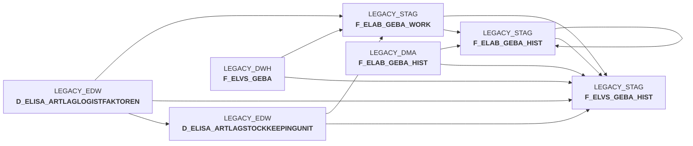

# snow_elabgeba_100_geba_artlag_zusammenf.sas (SAS Program)

## Program Description

_No description available_

## Table Lineage

```mermaid
%%{init: {'flowchart': { 'nodeSpacing': 10, 'rankSpacing': 40, 'rankdir': 'TB' }}}%%

flowchart LR

  LEGACY_EDW.D_ELISA_ARTLAGSTOCKKEEPINGUNIT["LEGACY_EDW<br/><b>D_ELISA_ARTLAGSTOCKKEEPINGUNIT</b>"] --> LEGACY_STAG.F_ELAB_GEBA_WORK["LEGACY_STAG<br/><b>F_ELAB_GEBA_WORK</b>"]
  LEGACY_EDW.D_ELISA_ARTLAGLOGISTFAKTOREN["LEGACY_EDW<br/><b>D_ELISA_ARTLAGLOGISTFAKTOREN</b>"] --> LEGACY_STAG.F_ELAB_GEBA_WORK["LEGACY_STAG<br/><b>F_ELAB_GEBA_WORK</b>"]
  LEGACY_STAG.F_ELAB_GEBA_WORK["LEGACY_STAG<br/><b>F_ELAB_GEBA_WORK</b>"] --> LEGACY_STAG.F_ELVS_GEBA_HIST["LEGACY_STAG<br/><b>F_ELVS_GEBA_HIST</b>"]
  LEGACY_STAG.F_ELAB_GEBA_WORK["LEGACY_STAG<br/><b>F_ELAB_GEBA_WORK</b>"] --> LEGACY_STAG.F_ELAB_GEBA_HIST["LEGACY_STAG<br/><b>F_ELAB_GEBA_HIST</b>"]
  LEGACY_EDW.D_ELISA_ARTLAGLOGISTFAKTOREN["LEGACY_EDW<br/><b>D_ELISA_ARTLAGLOGISTFAKTOREN</b>"] --> LEGACY_STAG.F_ELVS_GEBA_HIST["LEGACY_STAG<br/><b>F_ELVS_GEBA_HIST</b>"]
  LEGACY_DMA.F_ELAB_GEBA_HIST["LEGACY_DMA<br/><b>F_ELAB_GEBA_HIST</b>"] --> LEGACY_STAG.F_ELAB_GEBA_HIST["LEGACY_STAG<br/><b>F_ELAB_GEBA_HIST</b>"]
  LEGACY_STAG.F_ELAB_GEBA_HIST["LEGACY_STAG<br/><b>F_ELAB_GEBA_HIST</b>"] --> LEGACY_STAG.F_ELAB_GEBA_HIST["LEGACY_STAG<br/><b>F_ELAB_GEBA_HIST</b>"]
  LEGACY_EDW.D_ELISA_ARTLAGSTOCKKEEPINGUNIT["LEGACY_EDW<br/><b>D_ELISA_ARTLAGSTOCKKEEPINGUNIT</b>"] --> LEGACY_STAG.F_ELVS_GEBA_HIST["LEGACY_STAG<br/><b>F_ELVS_GEBA_HIST</b>"]
  LEGACY_DMA.F_ELAB_GEBA_HIST["LEGACY_DMA<br/><b>F_ELAB_GEBA_HIST</b>"] --> LEGACY_STAG.F_ELVS_GEBA_HIST["LEGACY_STAG<br/><b>F_ELVS_GEBA_HIST</b>"]
  LEGACY_STAG.F_ELAB_GEBA_HIST["LEGACY_STAG<br/><b>F_ELAB_GEBA_HIST</b>"] --> LEGACY_STAG.F_ELVS_GEBA_HIST["LEGACY_STAG<br/><b>F_ELVS_GEBA_HIST</b>"]
  LEGACY_EDW.D_ELISA_ARTLAGLOGISTFAKTOREN["LEGACY_EDW<br/><b>D_ELISA_ARTLAGLOGISTFAKTOREN</b>"] --> LEGACY_EDW.D_ELISA_ARTLAGSTOCKKEEPINGUNIT["LEGACY_EDW<br/><b>D_ELISA_ARTLAGSTOCKKEEPINGUNIT</b>"]
  LEGACY_DWH.F_ELVS_GEBA["LEGACY_DWH<br/><b>F_ELVS_GEBA</b>"] --> LEGACY_STAG.F_ELAB_GEBA_WORK["LEGACY_STAG<br/><b>F_ELAB_GEBA_WORK</b>"]
  LEGACY_DWH.F_ELVS_GEBA["LEGACY_DWH<br/><b>F_ELVS_GEBA</b>"] --> LEGACY_STAG.F_ELVS_GEBA_HIST["LEGACY_STAG<br/><b>F_ELVS_GEBA_HIST</b>"]
  click LEGACY_EDW.D_ELISA_ARTLAGSTOCKKEEPINGUNIT "../../tables/LEGACY_EDW/D_ELISA_ARTLAGSTOCKKEEPINGUNIT"
  click LEGACY_EDW.D_ELISA_ARTLAGLOGISTFAKTOREN "../../tables/LEGACY_EDW/D_ELISA_ARTLAGLOGISTFAKTOREN"
  click LEGACY_STAG.F_ELAB_GEBA_WORK "../../tables/LEGACY_STAG/F_ELAB_GEBA_WORK"
  click LEGACY_DMA.F_ELAB_GEBA_HIST "../../tables/LEGACY_DMA/F_ELAB_GEBA_HIST"
  click LEGACY_STAG.F_ELAB_GEBA_HIST "../../tables/LEGACY_STAG/F_ELAB_GEBA_HIST"
  click LEGACY_DWH.F_ELVS_GEBA "../../tables/LEGACY_DWH/F_ELVS_GEBA"
  click LEGACY_STAG.F_ELAB_GEBA_WORK "../../tables/LEGACY_STAG/F_ELAB_GEBA_WORK"
  click LEGACY_STAG.F_ELVS_GEBA_HIST "../../tables/LEGACY_STAG/F_ELVS_GEBA_HIST"
  click LEGACY_STAG.F_ELAB_GEBA_HIST "../../tables/LEGACY_STAG/F_ELAB_GEBA_HIST"
  click LEGACY_EDW.D_ELISA_ARTLAGSTOCKKEEPINGUNIT "../../tables/LEGACY_EDW/D_ELISA_ARTLAGSTOCKKEEPINGUNIT"
```
