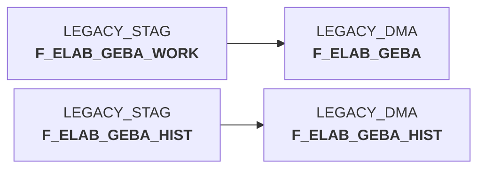

# snow_elabgeba_200_nach_dma.sas (SAS Program)

## Program Description

_No description available_

## Table Lineage

```mermaid
%%{init: {'flowchart': { 'nodeSpacing': 10, 'rankSpacing': 40, 'rankdir': 'TB' }}}%%

flowchart LR

  LEGACY_STAG.F_ELAB_GEBA_WORK["LEGACY_STAG<br/><b>F_ELAB_GEBA_WORK</b>"] --> LEGACY_DMA.F_ELAB_GEBA["LEGACY_DMA<br/><b>F_ELAB_GEBA</b>"]
  LEGACY_STAG.F_ELAB_GEBA_HIST["LEGACY_STAG<br/><b>F_ELAB_GEBA_HIST</b>"] --> LEGACY_DMA.F_ELAB_GEBA_HIST["LEGACY_DMA<br/><b>F_ELAB_GEBA_HIST</b>"]
  click LEGACY_STAG.F_ELAB_GEBA_WORK "../../tables/LEGACY_STAG/F_ELAB_GEBA_WORK"
  click LEGACY_STAG.F_ELAB_GEBA_HIST "../../tables/LEGACY_STAG/F_ELAB_GEBA_HIST"
  click LEGACY_DMA.F_ELAB_GEBA "../../tables/LEGACY_DMA/F_ELAB_GEBA"
  click LEGACY_DMA.F_ELAB_GEBA_HIST "../../tables/LEGACY_DMA/F_ELAB_GEBA_HIST"
```
