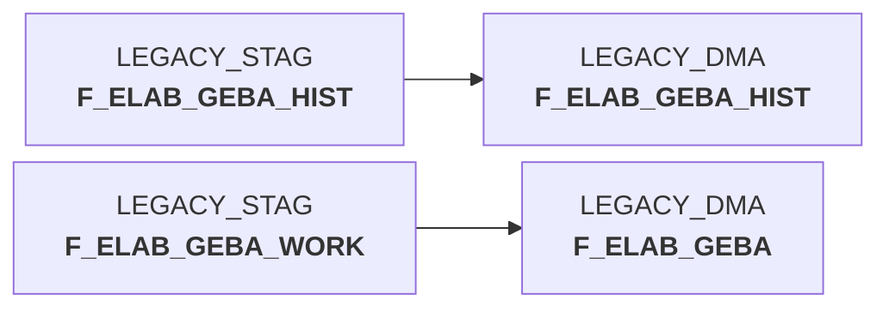

# snow_elabgeba_200_nach_dma.sas (SAS Program)

:::info Complexity Score
 **XS**
| Category | Measure | Value |
|---|---|---|
| Code Size | NBR_CODE_LINES | 16 |
| Code Size | NBR_DATA_STEPS | 0 |
| Code Size | NBR_PROC_STEPS | 2 |
| Dependencies and Flow Complexity | LEN_OF_COND_CLAUSES | 0 |
| Dependencies and Flow Complexity | NBR_INTERM_TABLES | 0 |
| Dependencies and Flow Complexity | NBR_PROC_STEP_SERIES | 2 |
| SQL Specifics | NBR_ANALYT_FUNCS | 0 |
| SQL Specifics | NBR_NESTED_QUERIES | 0 |
| SQL Specifics | NBR_SQL_STATEMENTS | 4 |
| Technical Complexity | NBR_DYNM_CODE_GEN | 0 |
| Technical Complexity | NBR_EXTERNAL_SYS | 1 |
| Technical Complexity | NBR_MAPPING_FORMATS | 0 |
| Technical Complexity | NBR_USED_MACROS | 1 |
| Transformation Complexity | NBR_COND_LOGIC | 0 |
| Transformation Complexity | NBR_JOINS | 0 |
| Transformation Complexity | NBR_TABLE_INP | 2 |
| Transformation Complexity | NBR_TABLE_OUTP | 2 |
| Transformation Complexity | NBR_TRANSF_TYPES | 2 |
:::

## Program Description

This SAS script is part of the **BDWH_ELABGEBA** application and handles the migration of ELVS core dissolution data from the staging (STAG) to the data mart (DMA) environment. The script specifically processes two main tables: **F_ELAB_GEBA** and **F_ELAB_GEBA_HIST**.

The script performs a **complete refresh** operation by first deleting all existing records from the target tables in the DMA schema, then inserting fresh data from the corresponding staging tables. For the historical table, it performs a direct copy from STAG to DMA. For the main table, it selects specific columns including material warehouse ID, warehouse number, article ID, activity indicators, units, weights, dimensions, and various date fields from the work table.

This process consolidates **ELVS GEBA data with new article warehouse data sources** and ensures data consistency between environments. The script uses Snowflake connections and can be **restarted safely** if interruptions occur during execution. It's designed as part of a larger ETL workflow for legacy product data management.

## Table Lineage

