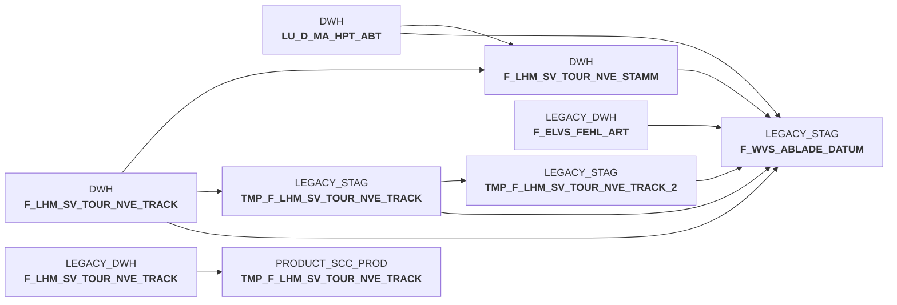

# sccwvs_005_wvs_ablade_tag.sas (SAS Program)

## Program Description

_No description available_

## Table Lineage

```mermaid
%%{init: {'flowchart': { 'nodeSpacing': 10, 'rankSpacing': 40, 'rankdir': 'TB' }}}%%

flowchart LR

  DWH.F_LHM_SV_TOUR_NVE_TRACK["DWH<br/><b>F_LHM_SV_TOUR_NVE_TRACK</b>"] --> LEGACY_STAG.F_WVS_ABLADE_DATUM["LEGACY_STAG<br/><b>F_WVS_ABLADE_DATUM</b>"]
  DWH.LU_D_MA_HPT_ABT["DWH<br/><b>LU_D_MA_HPT_ABT</b>"] --> LEGACY_STAG.F_WVS_ABLADE_DATUM["LEGACY_STAG<br/><b>F_WVS_ABLADE_DATUM</b>"]
  LEGACY_STAG.TMP_F_LHM_SV_TOUR_NVE_TRACK_2["LEGACY_STAG<br/><b>TMP_F_LHM_SV_TOUR_NVE_TRACK_2</b>"] --> LEGACY_STAG.F_WVS_ABLADE_DATUM["LEGACY_STAG<br/><b>F_WVS_ABLADE_DATUM</b>"]
  DWH.F_LHM_SV_TOUR_NVE_TRACK["DWH<br/><b>F_LHM_SV_TOUR_NVE_TRACK</b>"] --> LEGACY_STAG.TMP_F_LHM_SV_TOUR_NVE_TRACK["LEGACY_STAG<br/><b>TMP_F_LHM_SV_TOUR_NVE_TRACK</b>"]
  DWH.LU_D_MA_HPT_ABT["DWH<br/><b>LU_D_MA_HPT_ABT</b>"] --> DWH.F_LHM_SV_TOUR_NVE_STAMM["DWH<br/><b>F_LHM_SV_TOUR_NVE_STAMM</b>"]
  DWH.F_LHM_SV_TOUR_NVE_STAMM["DWH<br/><b>F_LHM_SV_TOUR_NVE_STAMM</b>"] --> LEGACY_STAG.F_WVS_ABLADE_DATUM["LEGACY_STAG<br/><b>F_WVS_ABLADE_DATUM</b>"]
  LEGACY_STAG.TMP_F_LHM_SV_TOUR_NVE_TRACK["LEGACY_STAG<br/><b>TMP_F_LHM_SV_TOUR_NVE_TRACK</b>"] --> LEGACY_STAG.F_WVS_ABLADE_DATUM["LEGACY_STAG<br/><b>F_WVS_ABLADE_DATUM</b>"]
  DWH.F_LHM_SV_TOUR_NVE_TRACK["DWH<br/><b>F_LHM_SV_TOUR_NVE_TRACK</b>"] --> DWH.F_LHM_SV_TOUR_NVE_STAMM["DWH<br/><b>F_LHM_SV_TOUR_NVE_STAMM</b>"]
  LEGACY_DWH.F_LHM_SV_TOUR_NVE_TRACK["LEGACY_DWH<br/><b>F_LHM_SV_TOUR_NVE_TRACK</b>"] --> PRODUCT_SCC_PROD.TMP_F_LHM_SV_TOUR_NVE_TRACK["PRODUCT_SCC_PROD<br/><b>TMP_F_LHM_SV_TOUR_NVE_TRACK</b>"]
  LEGACY_DWH.F_ELVS_FEHL_ART["LEGACY_DWH<br/><b>F_ELVS_FEHL_ART</b>"] --> LEGACY_STAG.F_WVS_ABLADE_DATUM["LEGACY_STAG<br/><b>F_WVS_ABLADE_DATUM</b>"]
  LEGACY_STAG.TMP_F_LHM_SV_TOUR_NVE_TRACK["LEGACY_STAG<br/><b>TMP_F_LHM_SV_TOUR_NVE_TRACK</b>"] --> LEGACY_STAG.TMP_F_LHM_SV_TOUR_NVE_TRACK_2["LEGACY_STAG<br/><b>TMP_F_LHM_SV_TOUR_NVE_TRACK_2</b>"]
  click DWH.F_LHM_SV_TOUR_NVE_TRACK "../../tables/DWH/F_LHM_SV_TOUR_NVE_TRACK"
  click DWH.LU_D_MA_HPT_ABT "../../tables/DWH/LU_D_MA_HPT_ABT"
  click LEGACY_STAG.TMP_F_LHM_SV_TOUR_NVE_TRACK_2 "../../tables/LEGACY_STAG/TMP_F_LHM_SV_TOUR_NVE_TRACK_2"
  click DWH.F_LHM_SV_TOUR_NVE_STAMM "../../tables/DWH/F_LHM_SV_TOUR_NVE_STAMM"
  click LEGACY_STAG.TMP_F_LHM_SV_TOUR_NVE_TRACK "../../tables/LEGACY_STAG/TMP_F_LHM_SV_TOUR_NVE_TRACK"
  click LEGACY_DWH.F_LHM_SV_TOUR_NVE_TRACK "../../tables/LEGACY_DWH/F_LHM_SV_TOUR_NVE_TRACK"
  click LEGACY_DWH.F_ELVS_FEHL_ART "../../tables/LEGACY_DWH/F_ELVS_FEHL_ART"
  click LEGACY_STAG.F_WVS_ABLADE_DATUM "../../tables/LEGACY_STAG/F_WVS_ABLADE_DATUM"
  click LEGACY_STAG.TMP_F_LHM_SV_TOUR_NVE_TRACK "../../tables/LEGACY_STAG/TMP_F_LHM_SV_TOUR_NVE_TRACK"
  click DWH.F_LHM_SV_TOUR_NVE_STAMM "../../tables/DWH/F_LHM_SV_TOUR_NVE_STAMM"
  click PRODUCT_SCC_PROD.TMP_F_LHM_SV_TOUR_NVE_TRACK "../../tables/PRODUCT_SCC_PROD/TMP_F_LHM_SV_TOUR_NVE_TRACK"
  click LEGACY_STAG.TMP_F_LHM_SV_TOUR_NVE_TRACK_2 "../../tables/LEGACY_STAG/TMP_F_LHM_SV_TOUR_NVE_TRACK_2"
```
