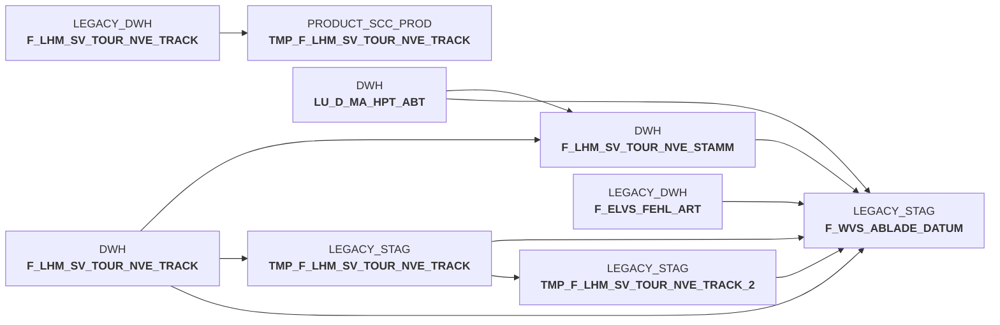

# sccwvs_005_wvs_ablade_tag.sas (SAS Program)

:::warning Complexity Score
 **L**
| Category | Measure | Value |
|---|---|---|
| Code Size | NBR_CODE_LINES | 85 |
| Code Size | NBR_DATA_STEPS | 0 |
| Code Size | NBR_PROC_STEPS | 4 |
| Dependencies and Flow Complexity | LEN_OF_COND_CLAUSES | 1247 |
| Dependencies and Flow Complexity | NBR_INTERM_TABLES | 4 |
| Dependencies and Flow Complexity | NBR_PROC_STEP_SERIES | 4 |
| SQL Specifics | NBR_ANALYT_FUNCS | 8 |
| SQL Specifics | NBR_NESTED_QUERIES | 2 |
| SQL Specifics | NBR_SQL_STATEMENTS | 4 |
| Technical Complexity | NBR_DYNM_CODE_GEN | 0 |
| Technical Complexity | NBR_EXTERNAL_SYS | 2 |
| Technical Complexity | NBR_MAPPING_FORMATS | 0 |
| Technical Complexity | NBR_USED_MACROS | 1 |
| Transformation Complexity | NBR_COND_LOGIC | 15 |
| Transformation Complexity | NBR_JOINS | 8 |
| Transformation Complexity | NBR_TABLE_INP | 8 |
| Transformation Complexity | NBR_TABLE_OUTP | 4 |
| Transformation Complexity | NBR_TRANSF_TYPES | 5 |
:::

## Program Description

This SAS script is part of the **BDWH_SCCWVS** application and determines the **unloading day (Ablade-Tag)** for WVS (Warehouse Management System) operations over the last 28 days. The script processes commissioning data to calculate when goods were unloaded from vehicles.

The script performs several key operations:
- Extracts NVE (Nummer der Versandeinheit) tracking data from the last 28 days with specific status codes (210, 245, 246, 250, 255)
- Uses a **recursive CTE** to build hierarchical NVE relationships and track consolidation paths
- Processes ELVS-free warehouse data to determine actual unloading dates
- Calculates **ablade_tag_sv** (unloading day) and **ablade_tag_kz** (unloading indicator) based on NVE status progression

The logic assigns unloading dates based on NVE status: status 250 uses actual tracking timestamp, while statuses 255, 245, and 246 default to the next calendar day. The script excludes cancelled orders, empty packaging, and duplicate records. All processing is performed on **Snowflake** database tables in the PRODUCT_SCC_PROD schema, with temporary staging tables cleaned up after execution.

*Job: DWDW0463 

## Table Lineage

