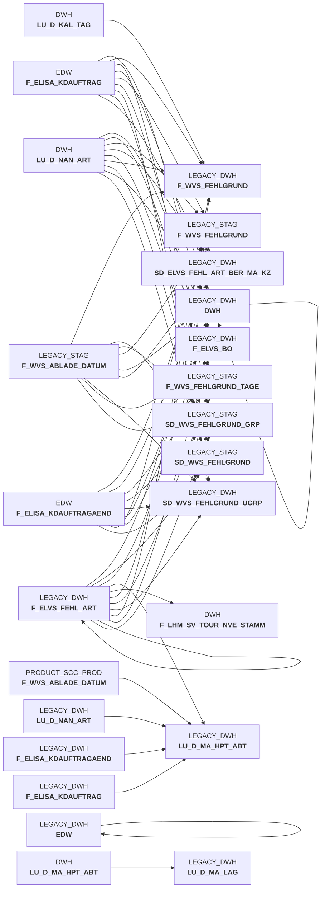

# sccwvs_020_wvs_berechnen_elab.sas (SAS Program)

## Program Description

_No description available_

## Table Lineage

```mermaid
%%{init: {'flowchart': { 'nodeSpacing': 10, 'rankSpacing': 40, 'rankdir': 'TB' }}}%%

flowchart LR

  DWH.LU_D_NAN_ART["DWH<br/><b>LU_D_NAN_ART</b>"] --> LEGACY_DWH.F_ELVS_BO["LEGACY_DWH<br/><b>F_ELVS_BO</b>"]
  EDW.F_ELISA_KDAUFTRAG["EDW<br/><b>F_ELISA_KDAUFTRAG</b>"] --> LEGACY_DWH.F_ELVS_BO["LEGACY_DWH<br/><b>F_ELVS_BO</b>"]
  EDW.F_ELISA_KDAUFTRAG["EDW<br/><b>F_ELISA_KDAUFTRAG</b>"] --> LEGACY_DWH.F_WVS_FEHLGRUND["LEGACY_DWH<br/><b>F_WVS_FEHLGRUND</b>"]
  DWH.LU_D_NAN_ART["DWH<br/><b>LU_D_NAN_ART</b>"] --> LEGACY_STAG.F_WVS_FEHLGRUND_TAGE["LEGACY_STAG<br/><b>F_WVS_FEHLGRUND_TAGE</b>"]
  LEGACY_DWH.F_ELVS_FEHL_ART["LEGACY_DWH<br/><b>F_ELVS_FEHL_ART</b>"] --> LEGACY_DWH.SD_ELVS_FEHL_ART_BER_MA_KZ["LEGACY_DWH<br/><b>SD_ELVS_FEHL_ART_BER_MA_KZ</b>"]
  EDW.F_ELISA_KDAUFTRAG["EDW<br/><b>F_ELISA_KDAUFTRAG</b>"] --> LEGACY_STAG.SD_WVS_FEHLGRUND_GRP["LEGACY_STAG<br/><b>SD_WVS_FEHLGRUND_GRP</b>"]
  LEGACY_DWH.F_ELVS_FEHL_ART["LEGACY_DWH<br/><b>F_ELVS_FEHL_ART</b>"] --> LEGACY_STAG.SD_WVS_FEHLGRUND["LEGACY_STAG<br/><b>SD_WVS_FEHLGRUND</b>"]
  LEGACY_DWH.F_ELVS_FEHL_ART["LEGACY_DWH<br/><b>F_ELVS_FEHL_ART</b>"] --> LEGACY_DWH.DWH["LEGACY_DWH<br/><b>DWH</b>"]
  LEGACY_DWH.F_ELVS_FEHL_ART["LEGACY_DWH<br/><b>F_ELVS_FEHL_ART</b>"] --> LEGACY_DWH.LU_D_MA_HPT_ABT["LEGACY_DWH<br/><b>LU_D_MA_HPT_ABT</b>"]
  LEGACY_DWH.F_ELVS_FEHL_ART["LEGACY_DWH<br/><b>F_ELVS_FEHL_ART</b>"] --> DWH.F_LHM_SV_TOUR_NVE_STAMM["DWH<br/><b>F_LHM_SV_TOUR_NVE_STAMM</b>"]
  LEGACY_DWH.F_ELVS_FEHL_ART["LEGACY_DWH<br/><b>F_ELVS_FEHL_ART</b>"] --> LEGACY_STAG.F_WVS_FEHLGRUND["LEGACY_STAG<br/><b>F_WVS_FEHLGRUND</b>"]
  DWH.LU_D_NAN_ART["DWH<br/><b>LU_D_NAN_ART</b>"] --> LEGACY_STAG.F_WVS_FEHLGRUND["LEGACY_STAG<br/><b>F_WVS_FEHLGRUND</b>"]
  EDW.F_ELISA_KDAUFTRAGAEND["EDW<br/><b>F_ELISA_KDAUFTRAGAEND</b>"] --> LEGACY_STAG.F_WVS_FEHLGRUND["LEGACY_STAG<br/><b>F_WVS_FEHLGRUND</b>"]
  LEGACY_STAG.F_WVS_ABLADE_DATUM["LEGACY_STAG<br/><b>F_WVS_ABLADE_DATUM</b>"] --> LEGACY_DWH.F_WVS_FEHLGRUND["LEGACY_DWH<br/><b>F_WVS_FEHLGRUND</b>"]
  LEGACY_DWH.F_ELVS_FEHL_ART["LEGACY_DWH<br/><b>F_ELVS_FEHL_ART</b>"] --> LEGACY_STAG.F_WVS_FEHLGRUND_TAGE["LEGACY_STAG<br/><b>F_WVS_FEHLGRUND_TAGE</b>"]
  EDW.F_ELISA_KDAUFTRAGAEND["EDW<br/><b>F_ELISA_KDAUFTRAGAEND</b>"] --> LEGACY_DWH.SD_ELVS_FEHL_ART_BER_MA_KZ["LEGACY_DWH<br/><b>SD_ELVS_FEHL_ART_BER_MA_KZ</b>"]
  LEGACY_DWH.F_ELVS_FEHL_ART["LEGACY_DWH<br/><b>F_ELVS_FEHL_ART</b>"] --> LEGACY_DWH.SD_WVS_FEHLGRUND_UGRP["LEGACY_DWH<br/><b>SD_WVS_FEHLGRUND_UGRP</b>"]
  EDW.F_ELISA_KDAUFTRAG["EDW<br/><b>F_ELISA_KDAUFTRAG</b>"] --> LEGACY_DWH.DWH["LEGACY_DWH<br/><b>DWH</b>"]
  DWH.LU_D_MA_HPT_ABT["DWH<br/><b>LU_D_MA_HPT_ABT</b>"] --> LEGACY_DWH.LU_D_MA_LAG["LEGACY_DWH<br/><b>LU_D_MA_LAG</b>"]
  LEGACY_DWH.DWH["LEGACY_DWH<br/><b>DWH</b>"] --> LEGACY_DWH.DWH["LEGACY_DWH<br/><b>DWH</b>"]
  LEGACY_DWH.EDW["LEGACY_DWH<br/><b>EDW</b>"] --> LEGACY_DWH.EDW["LEGACY_DWH<br/><b>EDW</b>"]
  EDW.F_ELISA_KDAUFTRAG["EDW<br/><b>F_ELISA_KDAUFTRAG</b>"] --> LEGACY_STAG.F_WVS_FEHLGRUND["LEGACY_STAG<br/><b>F_WVS_FEHLGRUND</b>"]
  LEGACY_DWH.F_ELVS_FEHL_ART["LEGACY_DWH<br/><b>F_ELVS_FEHL_ART</b>"] --> LEGACY_DWH.F_WVS_FEHLGRUND["LEGACY_DWH<br/><b>F_WVS_FEHLGRUND</b>"]
  EDW.F_ELISA_KDAUFTRAG["EDW<br/><b>F_ELISA_KDAUFTRAG</b>"] --> LEGACY_STAG.F_WVS_FEHLGRUND_TAGE["LEGACY_STAG<br/><b>F_WVS_FEHLGRUND_TAGE</b>"]
  DWH.LU_D_NAN_ART["DWH<br/><b>LU_D_NAN_ART</b>"] --> LEGACY_DWH.SD_ELVS_FEHL_ART_BER_MA_KZ["LEGACY_DWH<br/><b>SD_ELVS_FEHL_ART_BER_MA_KZ</b>"]
  LEGACY_STAG.F_WVS_ABLADE_DATUM["LEGACY_STAG<br/><b>F_WVS_ABLADE_DATUM</b>"] --> LEGACY_STAG.SD_WVS_FEHLGRUND["LEGACY_STAG<br/><b>SD_WVS_FEHLGRUND</b>"]
  EDW.F_ELISA_KDAUFTRAG["EDW<br/><b>F_ELISA_KDAUFTRAG</b>"] --> LEGACY_DWH.SD_WVS_FEHLGRUND_UGRP["LEGACY_DWH<br/><b>SD_WVS_FEHLGRUND_UGRP</b>"]
  PRODUCT_SCC_PROD.F_WVS_ABLADE_DATUM["PRODUCT_SCC_PROD<br/><b>F_WVS_ABLADE_DATUM</b>"] --> LEGACY_DWH.LU_D_MA_HPT_ABT["LEGACY_DWH<br/><b>LU_D_MA_HPT_ABT</b>"]
  DWH.LU_D_NAN_ART["DWH<br/><b>LU_D_NAN_ART</b>"] --> LEGACY_STAG.SD_WVS_FEHLGRUND_GRP["LEGACY_STAG<br/><b>SD_WVS_FEHLGRUND_GRP</b>"]
  EDW.F_ELISA_KDAUFTRAG["EDW<br/><b>F_ELISA_KDAUFTRAG</b>"] --> LEGACY_STAG.SD_WVS_FEHLGRUND["LEGACY_STAG<br/><b>SD_WVS_FEHLGRUND</b>"]
  LEGACY_DWH.LU_D_NAN_ART["LEGACY_DWH<br/><b>LU_D_NAN_ART</b>"] --> LEGACY_DWH.LU_D_MA_HPT_ABT["LEGACY_DWH<br/><b>LU_D_MA_HPT_ABT</b>"]
  LEGACY_DWH.F_ELISA_KDAUFTRAGAEND["LEGACY_DWH<br/><b>F_ELISA_KDAUFTRAGAEND</b>"] --> LEGACY_DWH.LU_D_MA_HPT_ABT["LEGACY_DWH<br/><b>LU_D_MA_HPT_ABT</b>"]
  LEGACY_DWH.F_ELVS_FEHL_ART["LEGACY_DWH<br/><b>F_ELVS_FEHL_ART</b>"] --> LEGACY_DWH.F_ELVS_BO["LEGACY_DWH<br/><b>F_ELVS_BO</b>"]
  DWH.LU_D_NAN_ART["DWH<br/><b>LU_D_NAN_ART</b>"] --> LEGACY_DWH.F_WVS_FEHLGRUND["LEGACY_DWH<br/><b>F_WVS_FEHLGRUND</b>"]
  EDW.F_ELISA_KDAUFTRAGAEND["EDW<br/><b>F_ELISA_KDAUFTRAGAEND</b>"] --> LEGACY_STAG.F_WVS_FEHLGRUND_TAGE["LEGACY_STAG<br/><b>F_WVS_FEHLGRUND_TAGE</b>"]
  LEGACY_STAG.F_WVS_ABLADE_DATUM["LEGACY_STAG<br/><b>F_WVS_ABLADE_DATUM</b>"] --> LEGACY_STAG.SD_WVS_FEHLGRUND_GRP["LEGACY_STAG<br/><b>SD_WVS_FEHLGRUND_GRP</b>"]
  EDW.F_ELISA_KDAUFTRAGAEND["EDW<br/><b>F_ELISA_KDAUFTRAGAEND</b>"] --> LEGACY_STAG.SD_WVS_FEHLGRUND_GRP["LEGACY_STAG<br/><b>SD_WVS_FEHLGRUND_GRP</b>"]
  DWH.LU_D_NAN_ART["DWH<br/><b>LU_D_NAN_ART</b>"] --> LEGACY_STAG.SD_WVS_FEHLGRUND["LEGACY_STAG<br/><b>SD_WVS_FEHLGRUND</b>"]
  LEGACY_DWH.F_ELVS_FEHL_ART["LEGACY_DWH<br/><b>F_ELVS_FEHL_ART</b>"] --> LEGACY_DWH.F_ELVS_FEHL_ART["LEGACY_DWH<br/><b>F_ELVS_FEHL_ART</b>"]
  LEGACY_STAG.F_WVS_ABLADE_DATUM["LEGACY_STAG<br/><b>F_WVS_ABLADE_DATUM</b>"] --> LEGACY_STAG.F_WVS_FEHLGRUND["LEGACY_STAG<br/><b>F_WVS_FEHLGRUND</b>"]
  DWH.LU_D_NAN_ART["DWH<br/><b>LU_D_NAN_ART</b>"] --> LEGACY_DWH.DWH["LEGACY_DWH<br/><b>DWH</b>"]
  LEGACY_STAG.F_WVS_ABLADE_DATUM["LEGACY_STAG<br/><b>F_WVS_ABLADE_DATUM</b>"] --> LEGACY_DWH.DWH["LEGACY_DWH<br/><b>DWH</b>"]
  LEGACY_STAG.F_WVS_ABLADE_DATUM["LEGACY_STAG<br/><b>F_WVS_ABLADE_DATUM</b>"] --> LEGACY_DWH.SD_ELVS_FEHL_ART_BER_MA_KZ["LEGACY_DWH<br/><b>SD_ELVS_FEHL_ART_BER_MA_KZ</b>"]
  EDW.F_ELISA_KDAUFTRAG["EDW<br/><b>F_ELISA_KDAUFTRAG</b>"] --> LEGACY_DWH.SD_ELVS_FEHL_ART_BER_MA_KZ["LEGACY_DWH<br/><b>SD_ELVS_FEHL_ART_BER_MA_KZ</b>"]
  LEGACY_DWH.F_ELVS_FEHL_ART["LEGACY_DWH<br/><b>F_ELVS_FEHL_ART</b>"] --> LEGACY_STAG.SD_WVS_FEHLGRUND_GRP["LEGACY_STAG<br/><b>SD_WVS_FEHLGRUND_GRP</b>"]
  DWH.LU_D_KAL_TAG["DWH<br/><b>LU_D_KAL_TAG</b>"] --> LEGACY_DWH.F_WVS_FEHLGRUND["LEGACY_DWH<br/><b>F_WVS_FEHLGRUND</b>"]
  LEGACY_STAG.F_WVS_ABLADE_DATUM["LEGACY_STAG<br/><b>F_WVS_ABLADE_DATUM</b>"] --> LEGACY_DWH.SD_WVS_FEHLGRUND_UGRP["LEGACY_DWH<br/><b>SD_WVS_FEHLGRUND_UGRP</b>"]
  EDW.F_ELISA_KDAUFTRAGAEND["EDW<br/><b>F_ELISA_KDAUFTRAGAEND</b>"] --> LEGACY_DWH.SD_WVS_FEHLGRUND_UGRP["LEGACY_DWH<br/><b>SD_WVS_FEHLGRUND_UGRP</b>"]
  EDW.F_ELISA_KDAUFTRAGAEND["EDW<br/><b>F_ELISA_KDAUFTRAGAEND</b>"] --> LEGACY_DWH.DWH["LEGACY_DWH<br/><b>DWH</b>"]
  LEGACY_STAG.F_WVS_ABLADE_DATUM["LEGACY_STAG<br/><b>F_WVS_ABLADE_DATUM</b>"] --> LEGACY_DWH.F_ELVS_BO["LEGACY_DWH<br/><b>F_ELVS_BO</b>"]
  EDW.F_ELISA_KDAUFTRAGAEND["EDW<br/><b>F_ELISA_KDAUFTRAGAEND</b>"] --> LEGACY_DWH.F_ELVS_BO["LEGACY_DWH<br/><b>F_ELVS_BO</b>"]
  EDW.F_ELISA_KDAUFTRAGAEND["EDW<br/><b>F_ELISA_KDAUFTRAGAEND</b>"] --> LEGACY_DWH.F_WVS_FEHLGRUND["LEGACY_DWH<br/><b>F_WVS_FEHLGRUND</b>"]
  LEGACY_STAG.F_WVS_ABLADE_DATUM["LEGACY_STAG<br/><b>F_WVS_ABLADE_DATUM</b>"] --> LEGACY_STAG.F_WVS_FEHLGRUND_TAGE["LEGACY_STAG<br/><b>F_WVS_FEHLGRUND_TAGE</b>"]
  EDW.F_ELISA_KDAUFTRAGAEND["EDW<br/><b>F_ELISA_KDAUFTRAGAEND</b>"] --> LEGACY_STAG.SD_WVS_FEHLGRUND["LEGACY_STAG<br/><b>SD_WVS_FEHLGRUND</b>"]
  DWH.LU_D_NAN_ART["DWH<br/><b>LU_D_NAN_ART</b>"] --> LEGACY_DWH.SD_WVS_FEHLGRUND_UGRP["LEGACY_DWH<br/><b>SD_WVS_FEHLGRUND_UGRP</b>"]
  LEGACY_DWH.F_ELISA_KDAUFTRAG["LEGACY_DWH<br/><b>F_ELISA_KDAUFTRAG</b>"] --> LEGACY_DWH.LU_D_MA_HPT_ABT["LEGACY_DWH<br/><b>LU_D_MA_HPT_ABT</b>"]
  click DWH.LU_D_NAN_ART "../../tables/DWH/LU_D_NAN_ART"
  click EDW.F_ELISA_KDAUFTRAG "../../tables/EDW/F_ELISA_KDAUFTRAG"
  click LEGACY_DWH.F_ELVS_FEHL_ART "../../tables/LEGACY_DWH/F_ELVS_FEHL_ART"
  click EDW.F_ELISA_KDAUFTRAGAEND "../../tables/EDW/F_ELISA_KDAUFTRAGAEND"
  click LEGACY_STAG.F_WVS_ABLADE_DATUM "../../tables/LEGACY_STAG/F_WVS_ABLADE_DATUM"
  click DWH.LU_D_MA_HPT_ABT "../../tables/DWH/LU_D_MA_HPT_ABT"
  click LEGACY_DWH.DWH "../../tables/LEGACY_DWH/DWH"
  click LEGACY_DWH.EDW "../../tables/LEGACY_DWH/EDW"
  click PRODUCT_SCC_PROD.F_WVS_ABLADE_DATUM "../../tables/PRODUCT_SCC_PROD/F_WVS_ABLADE_DATUM"
  click LEGACY_DWH.LU_D_NAN_ART "../../tables/LEGACY_DWH/LU_D_NAN_ART"
  click LEGACY_DWH.F_ELISA_KDAUFTRAGAEND "../../tables/LEGACY_DWH/F_ELISA_KDAUFTRAGAEND"
  click DWH.LU_D_KAL_TAG "../../tables/DWH/LU_D_KAL_TAG"
  click LEGACY_DWH.F_ELISA_KDAUFTRAG "../../tables/LEGACY_DWH/F_ELISA_KDAUFTRAG"
  click LEGACY_DWH.F_ELVS_BO "../../tables/LEGACY_DWH/F_ELVS_BO"
  click LEGACY_DWH.F_WVS_FEHLGRUND "../../tables/LEGACY_DWH/F_WVS_FEHLGRUND"
  click LEGACY_STAG.F_WVS_FEHLGRUND_TAGE "../../tables/LEGACY_STAG/F_WVS_FEHLGRUND_TAGE"
  click LEGACY_DWH.SD_ELVS_FEHL_ART_BER_MA_KZ "../../tables/LEGACY_DWH/SD_ELVS_FEHL_ART_BER_MA_KZ"
  click LEGACY_STAG.SD_WVS_FEHLGRUND_GRP "../../tables/LEGACY_STAG/SD_WVS_FEHLGRUND_GRP"
  click LEGACY_STAG.SD_WVS_FEHLGRUND "../../tables/LEGACY_STAG/SD_WVS_FEHLGRUND"
  click LEGACY_DWH.DWH "../../tables/LEGACY_DWH/DWH"
  click LEGACY_DWH.LU_D_MA_HPT_ABT "../../tables/LEGACY_DWH/LU_D_MA_HPT_ABT"
  click DWH.F_LHM_SV_TOUR_NVE_STAMM "../../tables/DWH/F_LHM_SV_TOUR_NVE_STAMM"
  click LEGACY_STAG.F_WVS_FEHLGRUND "../../tables/LEGACY_STAG/F_WVS_FEHLGRUND"
  click LEGACY_DWH.SD_WVS_FEHLGRUND_UGRP "../../tables/LEGACY_DWH/SD_WVS_FEHLGRUND_UGRP"
  click LEGACY_DWH.LU_D_MA_LAG "../../tables/LEGACY_DWH/LU_D_MA_LAG"
  click LEGACY_DWH.EDW "../../tables/LEGACY_DWH/EDW"
  click LEGACY_DWH.F_ELVS_FEHL_ART "../../tables/LEGACY_DWH/F_ELVS_FEHL_ART"
```
