# sccwvs_020_wvs_berechnen_elab.sas (SAS Program)

:::warning Complexity Score
 **L**
| Category | Measure | Value |
|---|---|---|
| Code Size | NBR_CODE_LINES | 189 |
| Code Size | NBR_DATA_STEPS | 3 |
| Code Size | NBR_PROC_STEPS | 3 |
| Dependencies and Flow Complexity | LEN_OF_COND_CLAUSES | 2156 |
| Dependencies and Flow Complexity | NBR_INTERM_TABLES | 6 |
| Dependencies and Flow Complexity | NBR_PROC_STEP_SERIES | 6 |
| SQL Specifics | NBR_ANALYT_FUNCS | 5 |
| SQL Specifics | NBR_NESTED_QUERIES | 0 |
| SQL Specifics | NBR_SQL_STATEMENTS | 3 |
| Technical Complexity | NBR_DYNM_CODE_GEN | 0 |
| Technical Complexity | NBR_EXTERNAL_SYS | 2 |
| Technical Complexity | NBR_MAPPING_FORMATS | 2 |
| Technical Complexity | NBR_USED_MACROS | 4 |
| Transformation Complexity | NBR_COND_LOGIC | 35 |
| Transformation Complexity | NBR_JOINS | 6 |
| Transformation Complexity | NBR_TABLE_INP | 12 |
| Transformation Complexity | NBR_TABLE_OUTP | 6 |
| Transformation Complexity | NBR_TRANSF_TYPES | 8 |
:::

## Program Description

This SAS script is part of the **BDWH_SCCWVS** application and processes **WVS (WarenVersorgungsStatistik)** - Goods Supply Statistics data. The script builds a parallel environment to replace the legacy data warehouse system.

The main purpose is to perform **line-by-line resolution of shortage quantities and values by reasons** from the DWH.F_ELVS_FEHL_ART table, specifically handling data sourced from the new ELAB system (HERKUNFT_BASIS = 'ELAB') after ELVS core replacement.

**Key Processing Steps:**
- **Data Extraction**: Retrieves order and delivery data from the last 21 days, filtering out cancelled orders and empty containers
- **Manual Table Creation**: Establishes mapping tables for shortage reason codes (pos_kv_ursache and pos_fehler_schl)
- **Calculation Logic**: Processes each position to create multiple records based on different shortage scenarios:
  - Header record with total order quantities (fehl_art_grund_id 1999990)
  - Over-deliveries when delivered quantity exceeds ordered quantity
  - Post-commissioning adjustments for follow-up deliveries
  - RMS-based quantity adjustments and reductions
  - Recorded shortage reasons from source systems
  - Global quantity reductions based on warehouse type
  - Unknown reasons for remaining shortage quantities

**Technical Features:**
- Uses Snowflake database connections with configurable warehouse sizing
- Implements hash objects for efficient lookup operations
- Supports delta processing to handle large data volumes
- Includes comprehensive error handling and restart capability

The script generates detailed shortage analysis records that feed into the goods supply statistics reporting system.

## Table Lineage

```mermaid
%%{init: {'flowchart': { 'nodeSpacing': 10, 'rankSpacing': 40, 'rankdir': 'TB' }}}%%

flowchart LR

  LEGACY_STAG.F_WVS_ABLADE_DATUM["LEGACY_STAG<br/><b>F_WVS_ABLADE_DATUM</b>"] --> LEGACY_DWH.F_ELVS_BO["LEGACY_DWH<br/><b>F_ELVS_BO</b>"]
  EDW.F_ELISA_KDAUFTRAGAEND["EDW<br/><b>F_ELISA_KDAUFTRAGAEND</b>"] --> LEGACY_DWH.F_ELVS_BO["LEGACY_DWH<br/><b>F_ELVS_BO</b>"]
  EDW.F_ELISA_KDAUFTRAGAEND["EDW<br/><b>F_ELISA_KDAUFTRAGAEND</b>"] --> LEGACY_DWH.F_WVS_FEHLGRUND["LEGACY_DWH<br/><b>F_WVS_FEHLGRUND</b>"]
  LEGACY_STAG.F_WVS_ABLADE_DATUM["LEGACY_STAG<br/><b>F_WVS_ABLADE_DATUM</b>"] --> LEGACY_STAG.F_WVS_FEHLGRUND_TAGE["LEGACY_STAG<br/><b>F_WVS_FEHLGRUND_TAGE</b>"]
  EDW.F_ELISA_KDAUFTRAGAEND["EDW<br/><b>F_ELISA_KDAUFTRAGAEND</b>"] --> LEGACY_STAG.SD_WVS_FEHLGRUND["LEGACY_STAG<br/><b>SD_WVS_FEHLGRUND</b>"]
  DWH.LU_D_NAN_ART["DWH<br/><b>LU_D_NAN_ART</b>"] --> LEGACY_DWH.SD_WVS_FEHLGRUND_UGRP["LEGACY_DWH<br/><b>SD_WVS_FEHLGRUND_UGRP</b>"]
  LEGACY_DWH.F_ELISA_KDAUFTRAG["LEGACY_DWH<br/><b>F_ELISA_KDAUFTRAG</b>"] --> LEGACY_DWH.LU_D_MA_HPT_ABT["LEGACY_DWH<br/><b>LU_D_MA_HPT_ABT</b>"]
  LEGACY_STAG.F_WVS_ABLADE_DATUM["LEGACY_STAG<br/><b>F_WVS_ABLADE_DATUM</b>"] --> LEGACY_STAG.SD_WVS_FEHLGRUND["LEGACY_STAG<br/><b>SD_WVS_FEHLGRUND</b>"]
  EDW.F_ELISA_KDAUFTRAG["EDW<br/><b>F_ELISA_KDAUFTRAG</b>"] --> LEGACY_DWH.SD_WVS_FEHLGRUND_UGRP["LEGACY_DWH<br/><b>SD_WVS_FEHLGRUND_UGRP</b>"]
  DWH.LU_D_MA_HPT_ABT["DWH<br/><b>LU_D_MA_HPT_ABT</b>"] --> LEGACY_DWH.LU_D_MA_LAG["LEGACY_DWH<br/><b>LU_D_MA_LAG</b>"]
  LEGACY_DWH.DWH["LEGACY_DWH<br/><b>DWH</b>"] --> LEGACY_DWH.DWH["LEGACY_DWH<br/><b>DWH</b>"]
  LEGACY_DWH.EDW["LEGACY_DWH<br/><b>EDW</b>"] --> LEGACY_DWH.EDW["LEGACY_DWH<br/><b>EDW</b>"]
  EDW.F_ELISA_KDAUFTRAG["EDW<br/><b>F_ELISA_KDAUFTRAG</b>"] --> LEGACY_STAG.F_WVS_FEHLGRUND["LEGACY_STAG<br/><b>F_WVS_FEHLGRUND</b>"]
  LEGACY_DWH.F_ELVS_FEHL_ART["LEGACY_DWH<br/><b>F_ELVS_FEHL_ART</b>"] --> LEGACY_DWH.F_WVS_FEHLGRUND["LEGACY_DWH<br/><b>F_WVS_FEHLGRUND</b>"]
  EDW.F_ELISA_KDAUFTRAG["EDW<br/><b>F_ELISA_KDAUFTRAG</b>"] --> LEGACY_STAG.F_WVS_FEHLGRUND_TAGE["LEGACY_STAG<br/><b>F_WVS_FEHLGRUND_TAGE</b>"]
  DWH.LU_D_NAN_ART["DWH<br/><b>LU_D_NAN_ART</b>"] --> LEGACY_DWH.SD_ELVS_FEHL_ART_BER_MA_KZ["LEGACY_DWH<br/><b>SD_ELVS_FEHL_ART_BER_MA_KZ</b>"]
  PRODUCT_SCC_PROD.F_WVS_ABLADE_DATUM["PRODUCT_SCC_PROD<br/><b>F_WVS_ABLADE_DATUM</b>"] --> LEGACY_DWH.LU_D_MA_HPT_ABT["LEGACY_DWH<br/><b>LU_D_MA_HPT_ABT</b>"]
  LEGACY_STAG.F_WVS_ABLADE_DATUM["LEGACY_STAG<br/><b>F_WVS_ABLADE_DATUM</b>"] --> LEGACY_STAG.F_WVS_FEHLGRUND["LEGACY_STAG<br/><b>F_WVS_FEHLGRUND</b>"]
  DWH.LU_D_NAN_ART["DWH<br/><b>LU_D_NAN_ART</b>"] --> LEGACY_DWH.DWH["LEGACY_DWH<br/><b>DWH</b>"]
  LEGACY_STAG.F_WVS_ABLADE_DATUM["LEGACY_STAG<br/><b>F_WVS_ABLADE_DATUM</b>"] --> LEGACY_DWH.DWH["LEGACY_DWH<br/><b>DWH</b>"]
  DWH.LU_D_NAN_ART["DWH<br/><b>LU_D_NAN_ART</b>"] --> LEGACY_DWH.F_ELVS_BO["LEGACY_DWH<br/><b>F_ELVS_BO</b>"]
  EDW.F_ELISA_KDAUFTRAG["EDW<br/><b>F_ELISA_KDAUFTRAG</b>"] --> LEGACY_DWH.F_ELVS_BO["LEGACY_DWH<br/><b>F_ELVS_BO</b>"]
  EDW.F_ELISA_KDAUFTRAG["EDW<br/><b>F_ELISA_KDAUFTRAG</b>"] --> LEGACY_DWH.F_WVS_FEHLGRUND["LEGACY_DWH<br/><b>F_WVS_FEHLGRUND</b>"]
  DWH.LU_D_NAN_ART["DWH<br/><b>LU_D_NAN_ART</b>"] --> LEGACY_STAG.F_WVS_FEHLGRUND_TAGE["LEGACY_STAG<br/><b>F_WVS_FEHLGRUND_TAGE</b>"]
  LEGACY_DWH.F_ELVS_FEHL_ART["LEGACY_DWH<br/><b>F_ELVS_FEHL_ART</b>"] --> LEGACY_DWH.SD_ELVS_FEHL_ART_BER_MA_KZ["LEGACY_DWH<br/><b>SD_ELVS_FEHL_ART_BER_MA_KZ</b>"]
  EDW.F_ELISA_KDAUFTRAG["EDW<br/><b>F_ELISA_KDAUFTRAG</b>"] --> LEGACY_STAG.SD_WVS_FEHLGRUND_GRP["LEGACY_STAG<br/><b>SD_WVS_FEHLGRUND_GRP</b>"]
  LEGACY_DWH.F_ELVS_FEHL_ART["LEGACY_DWH<br/><b>F_ELVS_FEHL_ART</b>"] --> LEGACY_STAG.SD_WVS_FEHLGRUND["LEGACY_STAG<br/><b>SD_WVS_FEHLGRUND</b>"]
  LEGACY_DWH.F_ELVS_FEHL_ART["LEGACY_DWH<br/><b>F_ELVS_FEHL_ART</b>"] --> LEGACY_DWH.DWH["LEGACY_DWH<br/><b>DWH</b>"]
  LEGACY_DWH.F_ELVS_FEHL_ART["LEGACY_DWH<br/><b>F_ELVS_FEHL_ART</b>"] --> LEGACY_DWH.LU_D_MA_HPT_ABT["LEGACY_DWH<br/><b>LU_D_MA_HPT_ABT</b>"]
  DWH.LU_D_NAN_ART["DWH<br/><b>LU_D_NAN_ART</b>"] --> LEGACY_STAG.SD_WVS_FEHLGRUND_GRP["LEGACY_STAG<br/><b>SD_WVS_FEHLGRUND_GRP</b>"]
  EDW.F_ELISA_KDAUFTRAG["EDW<br/><b>F_ELISA_KDAUFTRAG</b>"] --> LEGACY_STAG.SD_WVS_FEHLGRUND["LEGACY_STAG<br/><b>SD_WVS_FEHLGRUND</b>"]
  LEGACY_DWH.LU_D_NAN_ART["LEGACY_DWH<br/><b>LU_D_NAN_ART</b>"] --> LEGACY_DWH.LU_D_MA_HPT_ABT["LEGACY_DWH<br/><b>LU_D_MA_HPT_ABT</b>"]
  LEGACY_STAG.F_WVS_ABLADE_DATUM["LEGACY_STAG<br/><b>F_WVS_ABLADE_DATUM</b>"] --> LEGACY_DWH.SD_ELVS_FEHL_ART_BER_MA_KZ["LEGACY_DWH<br/><b>SD_ELVS_FEHL_ART_BER_MA_KZ</b>"]
  EDW.F_ELISA_KDAUFTRAG["EDW<br/><b>F_ELISA_KDAUFTRAG</b>"] --> LEGACY_DWH.SD_ELVS_FEHL_ART_BER_MA_KZ["LEGACY_DWH<br/><b>SD_ELVS_FEHL_ART_BER_MA_KZ</b>"]
  LEGACY_DWH.F_ELVS_FEHL_ART["LEGACY_DWH<br/><b>F_ELVS_FEHL_ART</b>"] --> LEGACY_STAG.SD_WVS_FEHLGRUND_GRP["LEGACY_STAG<br/><b>SD_WVS_FEHLGRUND_GRP</b>"]
  DWH.LU_D_KAL_TAG["DWH<br/><b>LU_D_KAL_TAG</b>"] --> LEGACY_DWH.F_WVS_FEHLGRUND["LEGACY_DWH<br/><b>F_WVS_FEHLGRUND</b>"]
  LEGACY_STAG.F_WVS_ABLADE_DATUM["LEGACY_STAG<br/><b>F_WVS_ABLADE_DATUM</b>"] --> LEGACY_DWH.SD_WVS_FEHLGRUND_UGRP["LEGACY_DWH<br/><b>SD_WVS_FEHLGRUND_UGRP</b>"]
  EDW.F_ELISA_KDAUFTRAGAEND["EDW<br/><b>F_ELISA_KDAUFTRAGAEND</b>"] --> LEGACY_DWH.SD_WVS_FEHLGRUND_UGRP["LEGACY_DWH<br/><b>SD_WVS_FEHLGRUND_UGRP</b>"]
  EDW.F_ELISA_KDAUFTRAGAEND["EDW<br/><b>F_ELISA_KDAUFTRAGAEND</b>"] --> LEGACY_DWH.DWH["LEGACY_DWH<br/><b>DWH</b>"]
  LEGACY_DWH.F_ELVS_FEHL_ART["LEGACY_DWH<br/><b>F_ELVS_FEHL_ART</b>"] --> DWH.F_LHM_SV_TOUR_NVE_STAMM["DWH<br/><b>F_LHM_SV_TOUR_NVE_STAMM</b>"]
  LEGACY_DWH.F_ELVS_FEHL_ART["LEGACY_DWH<br/><b>F_ELVS_FEHL_ART</b>"] --> LEGACY_STAG.F_WVS_FEHLGRUND["LEGACY_STAG<br/><b>F_WVS_FEHLGRUND</b>"]
  DWH.LU_D_NAN_ART["DWH<br/><b>LU_D_NAN_ART</b>"] --> LEGACY_STAG.F_WVS_FEHLGRUND["LEGACY_STAG<br/><b>F_WVS_FEHLGRUND</b>"]
  EDW.F_ELISA_KDAUFTRAGAEND["EDW<br/><b>F_ELISA_KDAUFTRAGAEND</b>"] --> LEGACY_STAG.F_WVS_FEHLGRUND["LEGACY_STAG<br/><b>F_WVS_FEHLGRUND</b>"]
  LEGACY_STAG.F_WVS_ABLADE_DATUM["LEGACY_STAG<br/><b>F_WVS_ABLADE_DATUM</b>"] --> LEGACY_DWH.F_WVS_FEHLGRUND["LEGACY_DWH<br/><b>F_WVS_FEHLGRUND</b>"]
  LEGACY_DWH.F_ELVS_FEHL_ART["LEGACY_DWH<br/><b>F_ELVS_FEHL_ART</b>"] --> LEGACY_STAG.F_WVS_FEHLGRUND_TAGE["LEGACY_STAG<br/><b>F_WVS_FEHLGRUND_TAGE</b>"]
  EDW.F_ELISA_KDAUFTRAGAEND["EDW<br/><b>F_ELISA_KDAUFTRAGAEND</b>"] --> LEGACY_DWH.SD_ELVS_FEHL_ART_BER_MA_KZ["LEGACY_DWH<br/><b>SD_ELVS_FEHL_ART_BER_MA_KZ</b>"]
  LEGACY_DWH.F_ELVS_FEHL_ART["LEGACY_DWH<br/><b>F_ELVS_FEHL_ART</b>"] --> LEGACY_DWH.SD_WVS_FEHLGRUND_UGRP["LEGACY_DWH<br/><b>SD_WVS_FEHLGRUND_UGRP</b>"]
  EDW.F_ELISA_KDAUFTRAG["EDW<br/><b>F_ELISA_KDAUFTRAG</b>"] --> LEGACY_DWH.DWH["LEGACY_DWH<br/><b>DWH</b>"]
  LEGACY_DWH.F_ELISA_KDAUFTRAGAEND["LEGACY_DWH<br/><b>F_ELISA_KDAUFTRAGAEND</b>"] --> LEGACY_DWH.LU_D_MA_HPT_ABT["LEGACY_DWH<br/><b>LU_D_MA_HPT_ABT</b>"]
  LEGACY_DWH.F_ELVS_FEHL_ART["LEGACY_DWH<br/><b>F_ELVS_FEHL_ART</b>"] --> LEGACY_DWH.F_ELVS_BO["LEGACY_DWH<br/><b>F_ELVS_BO</b>"]
  DWH.LU_D_NAN_ART["DWH<br/><b>LU_D_NAN_ART</b>"] --> LEGACY_DWH.F_WVS_FEHLGRUND["LEGACY_DWH<br/><b>F_WVS_FEHLGRUND</b>"]
  EDW.F_ELISA_KDAUFTRAGAEND["EDW<br/><b>F_ELISA_KDAUFTRAGAEND</b>"] --> LEGACY_STAG.F_WVS_FEHLGRUND_TAGE["LEGACY_STAG<br/><b>F_WVS_FEHLGRUND_TAGE</b>"]
  LEGACY_STAG.F_WVS_ABLADE_DATUM["LEGACY_STAG<br/><b>F_WVS_ABLADE_DATUM</b>"] --> LEGACY_STAG.SD_WVS_FEHLGRUND_GRP["LEGACY_STAG<br/><b>SD_WVS_FEHLGRUND_GRP</b>"]
  EDW.F_ELISA_KDAUFTRAGAEND["EDW<br/><b>F_ELISA_KDAUFTRAGAEND</b>"] --> LEGACY_STAG.SD_WVS_FEHLGRUND_GRP["LEGACY_STAG<br/><b>SD_WVS_FEHLGRUND_GRP</b>"]
  DWH.LU_D_NAN_ART["DWH<br/><b>LU_D_NAN_ART</b>"] --> LEGACY_STAG.SD_WVS_FEHLGRUND["LEGACY_STAG<br/><b>SD_WVS_FEHLGRUND</b>"]
  LEGACY_DWH.F_ELVS_FEHL_ART["LEGACY_DWH<br/><b>F_ELVS_FEHL_ART</b>"] --> LEGACY_DWH.F_ELVS_FEHL_ART["LEGACY_DWH<br/><b>F_ELVS_FEHL_ART</b>"]
  click LEGACY_STAG.F_WVS_ABLADE_DATUM "../../tables/LEGACY_STAG/F_WVS_ABLADE_DATUM"
  click EDW.F_ELISA_KDAUFTRAGAEND "../../tables/EDW/F_ELISA_KDAUFTRAGAEND"
  click DWH.LU_D_NAN_ART "../../tables/DWH/LU_D_NAN_ART"
  click LEGACY_DWH.F_ELISA_KDAUFTRAG "../../tables/LEGACY_DWH/F_ELISA_KDAUFTRAG"
  click EDW.F_ELISA_KDAUFTRAG "../../tables/EDW/F_ELISA_KDAUFTRAG"
  click DWH.LU_D_MA_HPT_ABT "../../tables/DWH/LU_D_MA_HPT_ABT"
  click LEGACY_DWH.DWH "../../tables/LEGACY_DWH/DWH"
  click LEGACY_DWH.EDW "../../tables/LEGACY_DWH/EDW"
  click LEGACY_DWH.F_ELVS_FEHL_ART "../../tables/LEGACY_DWH/F_ELVS_FEHL_ART"
  click PRODUCT_SCC_PROD.F_WVS_ABLADE_DATUM "../../tables/PRODUCT_SCC_PROD/F_WVS_ABLADE_DATUM"
  click LEGACY_DWH.LU_D_NAN_ART "../../tables/LEGACY_DWH/LU_D_NAN_ART"
  click DWH.LU_D_KAL_TAG "../../tables/DWH/LU_D_KAL_TAG"
  click LEGACY_DWH.F_ELISA_KDAUFTRAGAEND "../../tables/LEGACY_DWH/F_ELISA_KDAUFTRAGAEND"
  click LEGACY_DWH.F_ELVS_BO "../../tables/LEGACY_DWH/F_ELVS_BO"
  click LEGACY_DWH.F_WVS_FEHLGRUND "../../tables/LEGACY_DWH/F_WVS_FEHLGRUND"
  click LEGACY_STAG.F_WVS_FEHLGRUND_TAGE "../../tables/LEGACY_STAG/F_WVS_FEHLGRUND_TAGE"
  click LEGACY_STAG.SD_WVS_FEHLGRUND "../../tables/LEGACY_STAG/SD_WVS_FEHLGRUND"
  click LEGACY_DWH.SD_WVS_FEHLGRUND_UGRP "../../tables/LEGACY_DWH/SD_WVS_FEHLGRUND_UGRP"
  click LEGACY_DWH.LU_D_MA_HPT_ABT "../../tables/LEGACY_DWH/LU_D_MA_HPT_ABT"
  click LEGACY_DWH.LU_D_MA_LAG "../../tables/LEGACY_DWH/LU_D_MA_LAG"
  click LEGACY_DWH.DWH "../../tables/LEGACY_DWH/DWH"
  click LEGACY_DWH.EDW "../../tables/LEGACY_DWH/EDW"
  click LEGACY_STAG.F_WVS_FEHLGRUND "../../tables/LEGACY_STAG/F_WVS_FEHLGRUND"
  click LEGACY_DWH.SD_ELVS_FEHL_ART_BER_MA_KZ "../../tables/LEGACY_DWH/SD_ELVS_FEHL_ART_BER_MA_KZ"
  click LEGACY_STAG.SD_WVS_FEHLGRUND_GRP "../../tables/LEGACY_STAG/SD_WVS_FEHLGRUND_GRP"
  click DWH.F_LHM_SV_TOUR_NVE_STAMM "../../tables/DWH/F_LHM_SV_TOUR_NVE_STAMM"
  click LEGACY_DWH.F_ELVS_FEHL_ART "../../tables/LEGACY_DWH/F_ELVS_FEHL_ART"
```

