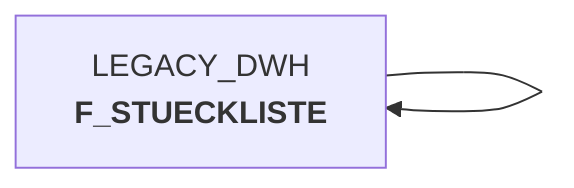

# sccwvs_030_wvs_erst_lief_aus_stkl20.sas (SAS Program)

:::warning Complexity Score
 **M**
| Category | Measure | Value |
|---|---|---|
| Code Size | NBR_CODE_LINES | 78 |
| Code Size | NBR_DATA_STEPS | 4 |
| Code Size | NBR_PROC_STEPS | 3 |
| Dependencies and Flow Complexity | LEN_OF_COND_CLAUSES | 456 |
| Dependencies and Flow Complexity | NBR_INTERM_TABLES | 8 |
| Dependencies and Flow Complexity | NBR_PROC_STEP_SERIES | 7 |
| SQL Specifics | NBR_ANALYT_FUNCS | 2 |
| SQL Specifics | NBR_NESTED_QUERIES | 0 |
| SQL Specifics | NBR_SQL_STATEMENTS | 3 |
| Technical Complexity | NBR_DYNM_CODE_GEN | 0 |
| Technical Complexity | NBR_EXTERNAL_SYS | 2 |
| Technical Complexity | NBR_MAPPING_FORMATS | 1 |
| Technical Complexity | NBR_USED_MACROS | 0 |
| Transformation Complexity | NBR_COND_LOGIC | 8 |
| Transformation Complexity | NBR_JOINS | 6 |
| Transformation Complexity | NBR_TABLE_INP | 4 |
| Transformation Complexity | NBR_TABLE_OUTP | 8 |
| Transformation Complexity | NBR_TRANSF_TYPES | 4 |
:::

## Program Description

This SAS script is part of the **BDWH_SCCWVS** application and implements supplier determination logic for the **WVS (WarenVersorgungsStatistik)** - Goods Supply Statistics system. The script processes bill of materials (Stückliste) type 20 sales articles to identify suppliers for POS articles where head articles are marked as ++V and position articles as ++L.

The main functionality involves analyzing supplier data from the last 3 days to determine consistent suppliers. The script creates a parallel environment to replace the legacy DWH system and corresponds to the original job **BDWH_ELVS_FEHLGRND.BDWH_DW017889** with minor modifications for the test environment.

**Key Processing Steps:**
- Extracts bill of materials type 20 data for all warehouses
- Retrieves goods receipt data from the last 30 days for regional analysis
- Creates extended datasets with following days (up to 3 additional days)
- Identifies and handles duplicate suppliers
- Generates final supplier determination based on consistency across multiple days

The script uses **Snowflake** connections for data retrieval from the legacy DWH and processes the data through multiple intermediate tables to ensure accurate supplier identification. *Created: 2024-03-06*

## Table Lineage

