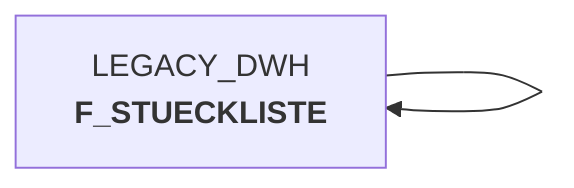

# sccwvs_030_wvs_erst_lief_aus_stkl20.sas (SAS Program)

## Program Description

_No description available_

## Table Lineage

```mermaid
%%{init: {'flowchart': { 'nodeSpacing': 10, 'rankSpacing': 40, 'rankdir': 'TB' }}}%%

flowchart LR

  LEGACY_DWH.F_STUECKLISTE["LEGACY_DWH<br/><b>F_STUECKLISTE</b>"] --> LEGACY_DWH.F_STUECKLISTE["LEGACY_DWH<br/><b>F_STUECKLISTE</b>"]
  click LEGACY_DWH.F_STUECKLISTE "../../tables/LEGACY_DWH/F_STUECKLISTE"
  click LEGACY_DWH.F_STUECKLISTE "../../tables/LEGACY_DWH/F_STUECKLISTE"
```
