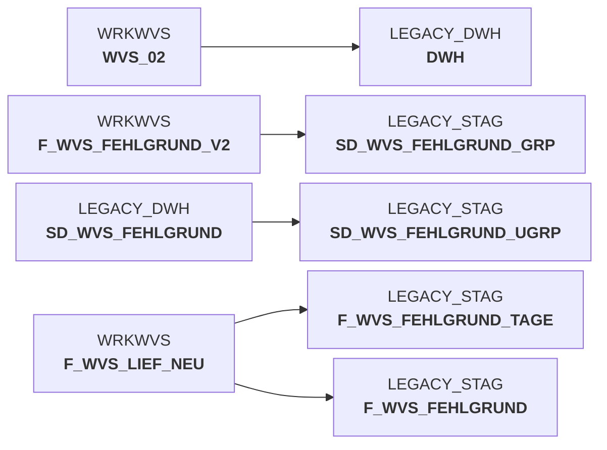

# sccwvs_250_wvs_relevant.sas (SAS Program)

## Program Description

_No description available_

## Table Lineage

```mermaid
%%{init: {'flowchart': { 'nodeSpacing': 10, 'rankSpacing': 40, 'rankdir': 'TB' }}}%%

flowchart LR

  WRKWVS.WVS_02["WRKWVS<br/><b>WVS_02</b>"] --> LEGACY_DWH.DWH["LEGACY_DWH<br/><b>DWH</b>"]
  WRKWVS.F_WVS_FEHLGRUND_V2["WRKWVS<br/><b>F_WVS_FEHLGRUND_V2</b>"] --> LEGACY_STAG.SD_WVS_FEHLGRUND_GRP["LEGACY_STAG<br/><b>SD_WVS_FEHLGRUND_GRP</b>"]
  LEGACY_DWH.SD_WVS_FEHLGRUND["LEGACY_DWH<br/><b>SD_WVS_FEHLGRUND</b>"] --> LEGACY_STAG.SD_WVS_FEHLGRUND_UGRP["LEGACY_STAG<br/><b>SD_WVS_FEHLGRUND_UGRP</b>"]
  WRKWVS.F_WVS_LIEF_NEU["WRKWVS<br/><b>F_WVS_LIEF_NEU</b>"] --> LEGACY_STAG.F_WVS_FEHLGRUND_TAGE["LEGACY_STAG<br/><b>F_WVS_FEHLGRUND_TAGE</b>"]
  WRKWVS.F_WVS_LIEF_NEU["WRKWVS<br/><b>F_WVS_LIEF_NEU</b>"] --> LEGACY_STAG.F_WVS_FEHLGRUND["LEGACY_STAG<br/><b>F_WVS_FEHLGRUND</b>"]
  click WRKWVS.WVS_02 "../../tables/WRKWVS/WVS_02"
  click WRKWVS.F_WVS_FEHLGRUND_V2 "../../tables/WRKWVS/F_WVS_FEHLGRUND_V2"
  click LEGACY_DWH.SD_WVS_FEHLGRUND "../../tables/LEGACY_DWH/SD_WVS_FEHLGRUND"
  click WRKWVS.F_WVS_LIEF_NEU "../../tables/WRKWVS/F_WVS_LIEF_NEU"
  click LEGACY_DWH.DWH "../../tables/LEGACY_DWH/DWH"
  click LEGACY_STAG.SD_WVS_FEHLGRUND_GRP "../../tables/LEGACY_STAG/SD_WVS_FEHLGRUND_GRP"
  click LEGACY_STAG.SD_WVS_FEHLGRUND_UGRP "../../tables/LEGACY_STAG/SD_WVS_FEHLGRUND_UGRP"
  click LEGACY_STAG.F_WVS_FEHLGRUND_TAGE "../../tables/LEGACY_STAG/F_WVS_FEHLGRUND_TAGE"
  click LEGACY_STAG.F_WVS_FEHLGRUND "../../tables/LEGACY_STAG/F_WVS_FEHLGRUND"
```
