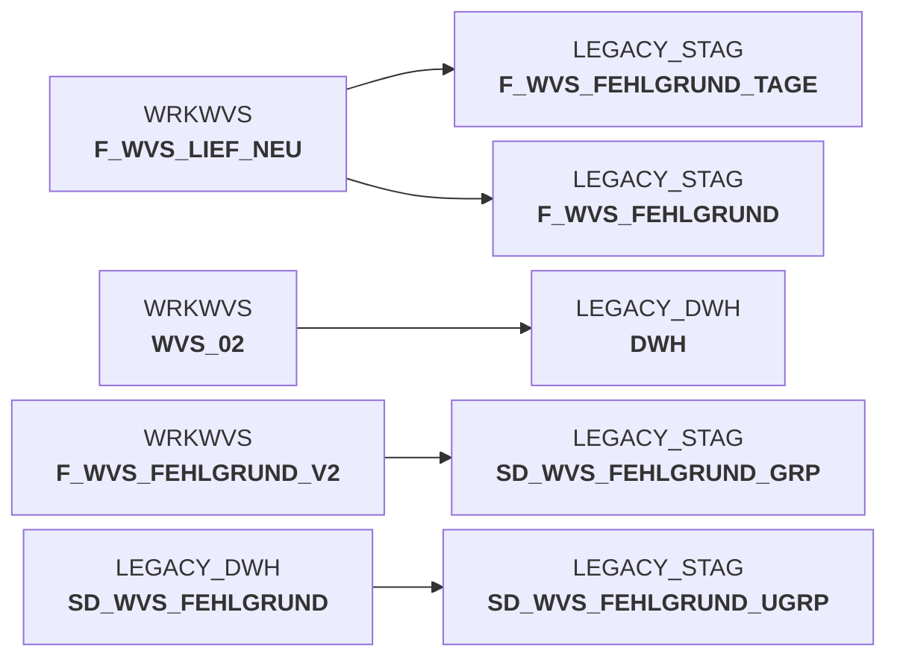

# sccwvs_250_wvs_relevant.sas (SAS Program)

:::info Complexity Score
 **XS**
| Category | Measure | Value |
|---|---|---|
| Code Size | NBR_CODE_LINES | 25 |
| Code Size | NBR_DATA_STEPS | 0 |
| Code Size | NBR_PROC_STEPS | 1 |
| Dependencies and Flow Complexity | LEN_OF_COND_CLAUSES | 156 |
| Dependencies and Flow Complexity | NBR_INTERM_TABLES | 1 |
| Dependencies and Flow Complexity | NBR_PROC_STEP_SERIES | 1 |
| SQL Specifics | NBR_ANALYT_FUNCS | 0 |
| SQL Specifics | NBR_NESTED_QUERIES | 0 |
| SQL Specifics | NBR_SQL_STATEMENTS | 1 |
| Technical Complexity | NBR_DYNM_CODE_GEN | 0 |
| Technical Complexity | NBR_EXTERNAL_SYS | 0 |
| Technical Complexity | NBR_MAPPING_FORMATS | 0 |
| Technical Complexity | NBR_USED_MACROS | 0 |
| Transformation Complexity | NBR_COND_LOGIC | 3 |
| Transformation Complexity | NBR_JOINS | 0 |
| Transformation Complexity | NBR_TABLE_INP | 1 |
| Transformation Complexity | NBR_TABLE_OUTP | 1 |
| Transformation Complexity | NBR_TRANSF_TYPES | 1 |
:::

## Program Description

This SAS script is part of the **BDWH_SCCWVS** application and handles the identification of WVS (WarenVersorgungsStatistik - Goods Supply Statistics) relevance within a parallel environment setup. The script processes data to replace the legacy data warehouse system.

The main functionality focuses on **marking WVS relevance** based on specific business rules:
- Records with KOPF_HERKUNFT 'L' (delivery date changes) are marked as not relevant (WVS_RELEVANT = 0)
- Records with KOPF_HERKUNFT 'I' (open orders) indicate adjusted delivery quantities (LIEFMG_ANGEPASST = 1)
- Records with KOPF_HERKUNFT 'P' are assigned value 2 for adjusted delivery quantities

The script creates a new table **f_wvs_fehlgrund_v2** by selecting and transforming data from the source table f_wvs_lief_neu, applying proper formatting to various fields including article IDs, quantities, monetary values, and delivery information. It specifically filters for records where herkunft_basis equals 'ELAB' and adds the calculated relevance indicators based on the origin type.

*Version: 2024-03-06, Job: BDWH_DWDW3327*

## Table Lineage

