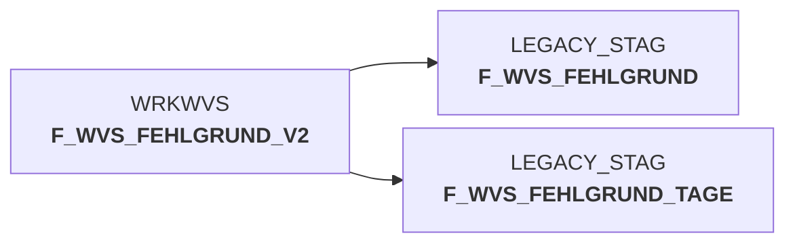

# sccwvs_300_fakt_n_stag.sas (SAS Program)

:::info Complexity Score
 **XS**
| Category | Measure | Value |
|---|---|---|
| Code Size | NBR_CODE_LINES | 1 |
| Code Size | NBR_DATA_STEPS | 0 |
| Code Size | NBR_PROC_STEPS | 0 |
| Dependencies and Flow Complexity | LEN_OF_COND_CLAUSES | 0 |
| Dependencies and Flow Complexity | NBR_INTERM_TABLES | 0 |
| Dependencies and Flow Complexity | NBR_PROC_STEP_SERIES | 0 |
| SQL Specifics | NBR_ANALYT_FUNCS | 0 |
| SQL Specifics | NBR_NESTED_QUERIES | 0 |
| SQL Specifics | NBR_SQL_STATEMENTS | 0 |
| Technical Complexity | NBR_DYNM_CODE_GEN | 0 |
| Technical Complexity | NBR_EXTERNAL_SYS | 0 |
| Technical Complexity | NBR_MAPPING_FORMATS | 0 |
| Technical Complexity | NBR_USED_MACROS | 1 |
| Transformation Complexity | NBR_COND_LOGIC | 0 |
| Transformation Complexity | NBR_JOINS | 0 |
| Transformation Complexity | NBR_TABLE_INP | 1 |
| Transformation Complexity | NBR_TABLE_OUTP | 1 |
| Transformation Complexity | NBR_TRANSF_TYPES | 0 |
:::

## Program Description

This SAS script is part of the **BDWH_SCCWVS** application and handles the loading of fact tables into the staging environment. The script specifically focuses on the **WVS (WarenVersorgungsStatistik)** - Goods Supply Statistics system.

The primary purpose is to build a parallel environment to the legacy data warehouse in **PRODUCT_SCC_PROD** for eventual replacement. The script loads fact table data into the **STAG** (staging) layer using the loadsnow macro, transferring data from the working dataset **wrkwvs.f_wvs_fehlgrund_v2** to the target table **F_WVS_FEHLGRUND** in the **LEGACY_STAG** schema.

Key features include:
- **Restartable job capability** - the job can be restarted if needed
- **Error handling documentation** for known failure scenarios
- Part of the broader data warehouse modernization initiative

This script was created on **2024-03-06** and operates under job name **BDWH_DWDW3331**. It serves as a critical component in the data pipeline for goods supply statistics processing.

## Table Lineage

