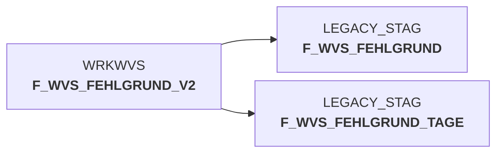

# sccwvs_300_fakt_n_stag.sas (SAS Program)

## Program Description

_No description available_

## Table Lineage

```mermaid
%%{init: {'flowchart': { 'nodeSpacing': 10, 'rankSpacing': 40, 'rankdir': 'TB' }}}%%

flowchart LR

  WRKWVS.F_WVS_FEHLGRUND_V2["WRKWVS<br/><b>F_WVS_FEHLGRUND_V2</b>"] --> LEGACY_STAG.F_WVS_FEHLGRUND["LEGACY_STAG<br/><b>F_WVS_FEHLGRUND</b>"]
  WRKWVS.F_WVS_FEHLGRUND_V2["WRKWVS<br/><b>F_WVS_FEHLGRUND_V2</b>"] --> LEGACY_STAG.F_WVS_FEHLGRUND_TAGE["LEGACY_STAG<br/><b>F_WVS_FEHLGRUND_TAGE</b>"]
  click WRKWVS.F_WVS_FEHLGRUND_V2 "../../tables/WRKWVS/F_WVS_FEHLGRUND_V2"
  click LEGACY_STAG.F_WVS_FEHLGRUND "../../tables/LEGACY_STAG/F_WVS_FEHLGRUND"
  click LEGACY_STAG.F_WVS_FEHLGRUND_TAGE "../../tables/LEGACY_STAG/F_WVS_FEHLGRUND_TAGE"
```
