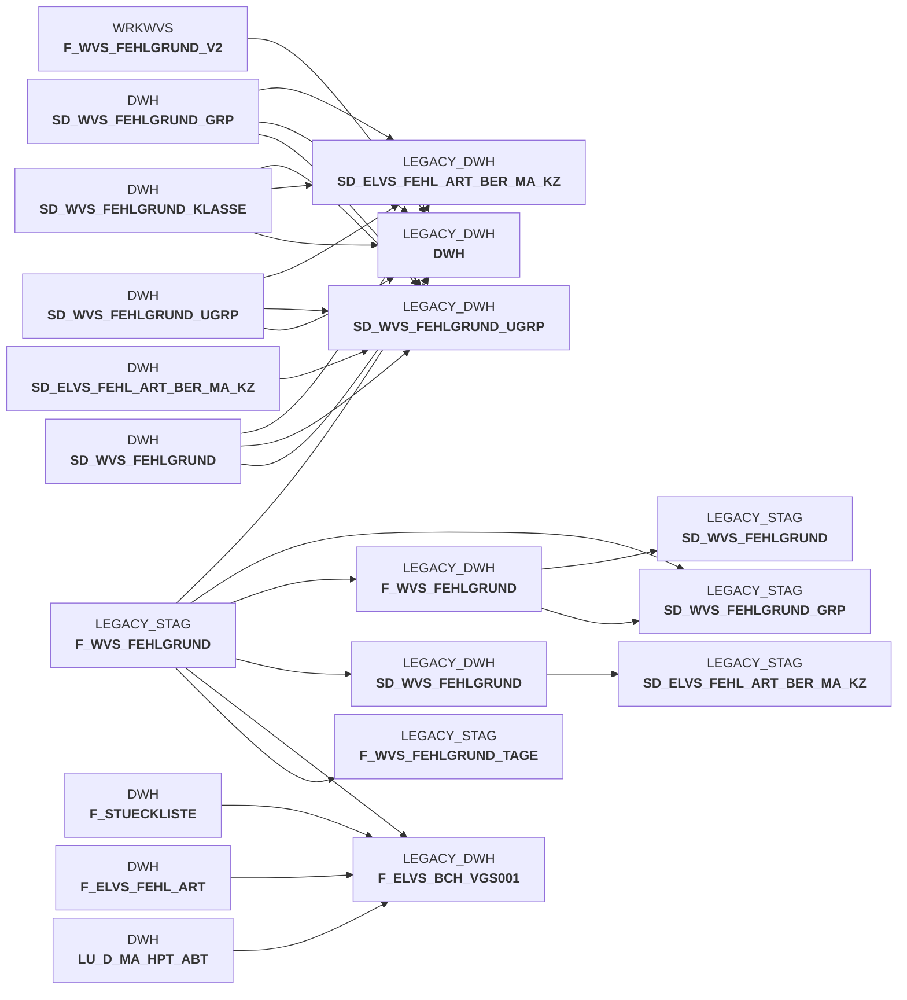

# sccwvs_400_fakt_n_dwh.sas (SAS Program)

:::info Complexity Score
 **S**
| Category | Measure | Value |
|---|---|---|
| Code Size | NBR_CODE_LINES | 78 |
| Code Size | NBR_DATA_STEPS | 0 |
| Code Size | NBR_PROC_STEPS | 1 |
| Dependencies and Flow Complexity | LEN_OF_COND_CLAUSES | 567 |
| Dependencies and Flow Complexity | NBR_INTERM_TABLES | 2 |
| Dependencies and Flow Complexity | NBR_PROC_STEP_SERIES | 1 |
| SQL Specifics | NBR_ANALYT_FUNCS | 2 |
| SQL Specifics | NBR_NESTED_QUERIES | 0 |
| SQL Specifics | NBR_SQL_STATEMENTS | 1 |
| Technical Complexity | NBR_DYNM_CODE_GEN | 0 |
| Technical Complexity | NBR_EXTERNAL_SYS | 2 |
| Technical Complexity | NBR_MAPPING_FORMATS | 0 |
| Technical Complexity | NBR_USED_MACROS | 2 |
| Transformation Complexity | NBR_COND_LOGIC | 8 |
| Transformation Complexity | NBR_JOINS | 0 |
| Transformation Complexity | NBR_TABLE_INP | 2 |
| Transformation Complexity | NBR_TABLE_OUTP | 2 |
| Transformation Complexity | NBR_TRANSF_TYPES | 2 |
:::

## Program Description

This SAS script is part of the **BDWH_SCCWVS** application and handles the transfer of **WVS (WarenVersorgungsStatistik)** fact table data from staging (STAG) to the data warehouse (DWH). The script processes goods supply statistics and manages error reason data for inventory management.

The main functionality includes:
- **Data Processing**: Transfers F_WVS_FEHLGRUND (error reason) data from staging to production DWH tables
- **Date Range Management**: Determines processing boundaries for ELAB data sources (ELVS sources are commented out due to warehouse migration)
- **Data Cleanup**: Deletes existing records within the determined date range before inserting updated data
- **Error Handling**: Implements special logic for predecessor-successor relationship issues (DWHCRO-209)
- **Data Validation**: Includes complex joins with multiple dimension tables to validate and enrich the data

The script uses **Snowflake** as the target database platform and includes warehouse sizing parameters. It features a macro-based approach for conditional processing and handles both deletion and insertion operations within transactions. The job is designed to be **restartable** and includes comprehensive error documentation for known failure scenarios.

*Created: 2024-03-06, Job: BDWH_DWDW3334*

## Table Lineage

