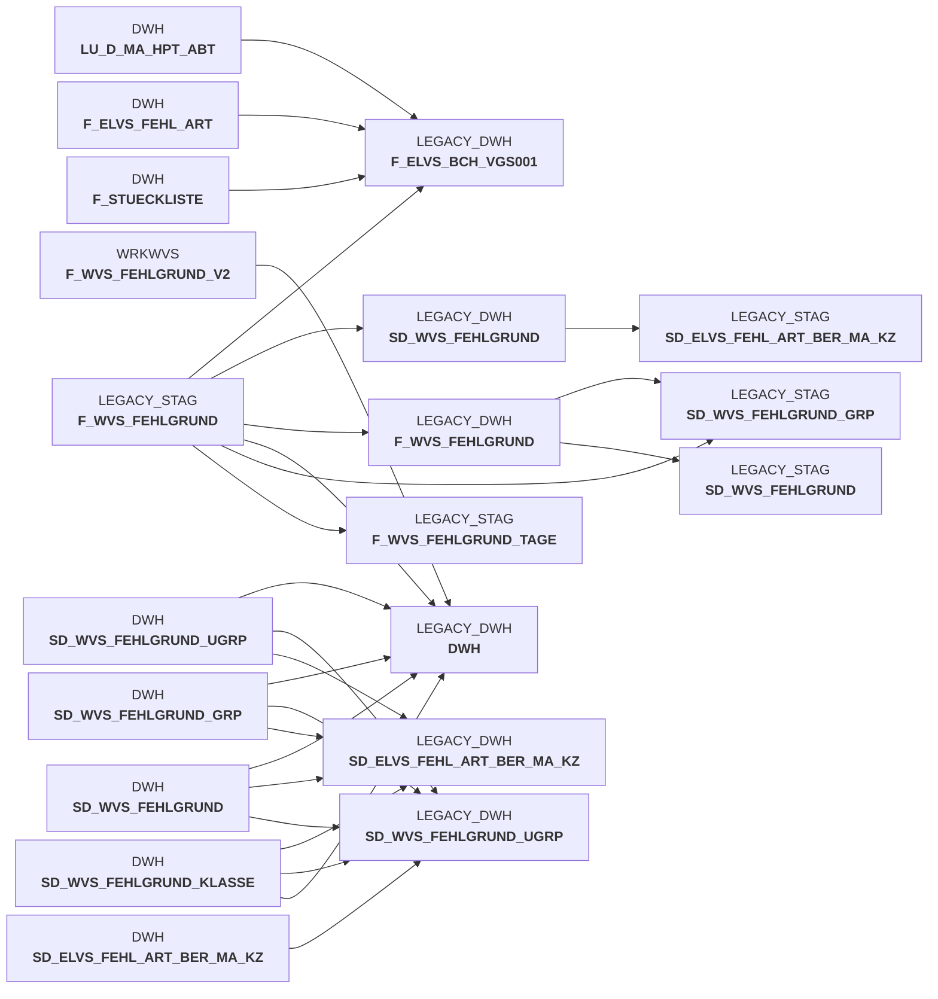

# sccwvs_400_fakt_n_dwh.sas (SAS Program)

## Program Description

_No description available_

## Table Lineage

```mermaid
%%{init: {'flowchart': { 'nodeSpacing': 10, 'rankSpacing': 40, 'rankdir': 'TB' }}}%%

flowchart LR

  LEGACY_STAG.F_WVS_FEHLGRUND["LEGACY_STAG<br/><b>F_WVS_FEHLGRUND</b>"] --> LEGACY_DWH.F_ELVS_BCH_VGS001["LEGACY_DWH<br/><b>F_ELVS_BCH_VGS001</b>"]
  DWH.LU_D_MA_HPT_ABT["DWH<br/><b>LU_D_MA_HPT_ABT</b>"] --> LEGACY_DWH.F_ELVS_BCH_VGS001["LEGACY_DWH<br/><b>F_ELVS_BCH_VGS001</b>"]
  LEGACY_STAG.F_WVS_FEHLGRUND["LEGACY_STAG<br/><b>F_WVS_FEHLGRUND</b>"] --> LEGACY_DWH.SD_WVS_FEHLGRUND["LEGACY_DWH<br/><b>SD_WVS_FEHLGRUND</b>"]
  DWH.SD_WVS_FEHLGRUND_GRP["DWH<br/><b>SD_WVS_FEHLGRUND_GRP</b>"] --> LEGACY_DWH.DWH["LEGACY_DWH<br/><b>DWH</b>"]
  LEGACY_DWH.F_WVS_FEHLGRUND["LEGACY_DWH<br/><b>F_WVS_FEHLGRUND</b>"] --> LEGACY_STAG.SD_WVS_FEHLGRUND_GRP["LEGACY_STAG<br/><b>SD_WVS_FEHLGRUND_GRP</b>"]
  DWH.SD_WVS_FEHLGRUND["DWH<br/><b>SD_WVS_FEHLGRUND</b>"] --> LEGACY_DWH.DWH["LEGACY_DWH<br/><b>DWH</b>"]
  DWH.SD_WVS_FEHLGRUND_UGRP["DWH<br/><b>SD_WVS_FEHLGRUND_UGRP</b>"] --> LEGACY_DWH.DWH["LEGACY_DWH<br/><b>DWH</b>"]
  LEGACY_DWH.SD_WVS_FEHLGRUND["LEGACY_DWH<br/><b>SD_WVS_FEHLGRUND</b>"] --> LEGACY_STAG.SD_ELVS_FEHL_ART_BER_MA_KZ["LEGACY_STAG<br/><b>SD_ELVS_FEHL_ART_BER_MA_KZ</b>"]
  DWH.SD_WVS_FEHLGRUND_UGRP["DWH<br/><b>SD_WVS_FEHLGRUND_UGRP</b>"] --> LEGACY_DWH.SD_WVS_FEHLGRUND_UGRP["LEGACY_DWH<br/><b>SD_WVS_FEHLGRUND_UGRP</b>"]
  LEGACY_STAG.F_WVS_FEHLGRUND["LEGACY_STAG<br/><b>F_WVS_FEHLGRUND</b>"] --> LEGACY_DWH.F_WVS_FEHLGRUND["LEGACY_DWH<br/><b>F_WVS_FEHLGRUND</b>"]
  DWH.SD_WVS_FEHLGRUND["DWH<br/><b>SD_WVS_FEHLGRUND</b>"] --> LEGACY_DWH.SD_ELVS_FEHL_ART_BER_MA_KZ["LEGACY_DWH<br/><b>SD_ELVS_FEHL_ART_BER_MA_KZ</b>"]
  DWH.SD_WVS_FEHLGRUND_UGRP["DWH<br/><b>SD_WVS_FEHLGRUND_UGRP</b>"] --> LEGACY_DWH.SD_ELVS_FEHL_ART_BER_MA_KZ["LEGACY_DWH<br/><b>SD_ELVS_FEHL_ART_BER_MA_KZ</b>"]
  DWH.SD_WVS_FEHLGRUND_KLASSE["DWH<br/><b>SD_WVS_FEHLGRUND_KLASSE</b>"] --> LEGACY_DWH.SD_ELVS_FEHL_ART_BER_MA_KZ["LEGACY_DWH<br/><b>SD_ELVS_FEHL_ART_BER_MA_KZ</b>"]
  DWH.F_ELVS_FEHL_ART["DWH<br/><b>F_ELVS_FEHL_ART</b>"] --> LEGACY_DWH.F_ELVS_BCH_VGS001["LEGACY_DWH<br/><b>F_ELVS_BCH_VGS001</b>"]
  DWH.F_STUECKLISTE["DWH<br/><b>F_STUECKLISTE</b>"] --> LEGACY_DWH.F_ELVS_BCH_VGS001["LEGACY_DWH<br/><b>F_ELVS_BCH_VGS001</b>"]
  DWH.SD_WVS_FEHLGRUND_GRP["DWH<br/><b>SD_WVS_FEHLGRUND_GRP</b>"] --> LEGACY_DWH.SD_WVS_FEHLGRUND_UGRP["LEGACY_DWH<br/><b>SD_WVS_FEHLGRUND_UGRP</b>"]
  DWH.SD_WVS_FEHLGRUND_KLASSE["DWH<br/><b>SD_WVS_FEHLGRUND_KLASSE</b>"] --> LEGACY_DWH.SD_WVS_FEHLGRUND_UGRP["LEGACY_DWH<br/><b>SD_WVS_FEHLGRUND_UGRP</b>"]
  DWH.SD_WVS_FEHLGRUND_GRP["DWH<br/><b>SD_WVS_FEHLGRUND_GRP</b>"] --> LEGACY_DWH.SD_ELVS_FEHL_ART_BER_MA_KZ["LEGACY_DWH<br/><b>SD_ELVS_FEHL_ART_BER_MA_KZ</b>"]
  LEGACY_DWH.F_WVS_FEHLGRUND["LEGACY_DWH<br/><b>F_WVS_FEHLGRUND</b>"] --> LEGACY_STAG.SD_WVS_FEHLGRUND["LEGACY_STAG<br/><b>SD_WVS_FEHLGRUND</b>"]
  LEGACY_STAG.F_WVS_FEHLGRUND["LEGACY_STAG<br/><b>F_WVS_FEHLGRUND</b>"] --> LEGACY_DWH.DWH["LEGACY_DWH<br/><b>DWH</b>"]
  DWH.SD_WVS_FEHLGRUND["DWH<br/><b>SD_WVS_FEHLGRUND</b>"] --> LEGACY_DWH.SD_WVS_FEHLGRUND_UGRP["LEGACY_DWH<br/><b>SD_WVS_FEHLGRUND_UGRP</b>"]
  LEGACY_STAG.F_WVS_FEHLGRUND["LEGACY_STAG<br/><b>F_WVS_FEHLGRUND</b>"] --> LEGACY_STAG.SD_WVS_FEHLGRUND_GRP["LEGACY_STAG<br/><b>SD_WVS_FEHLGRUND_GRP</b>"]
  LEGACY_STAG.F_WVS_FEHLGRUND["LEGACY_STAG<br/><b>F_WVS_FEHLGRUND</b>"] --> LEGACY_STAG.F_WVS_FEHLGRUND_TAGE["LEGACY_STAG<br/><b>F_WVS_FEHLGRUND_TAGE</b>"]
  DWH.SD_WVS_FEHLGRUND_KLASSE["DWH<br/><b>SD_WVS_FEHLGRUND_KLASSE</b>"] --> LEGACY_DWH.DWH["LEGACY_DWH<br/><b>DWH</b>"]
  DWH.SD_ELVS_FEHL_ART_BER_MA_KZ["DWH<br/><b>SD_ELVS_FEHL_ART_BER_MA_KZ</b>"] --> LEGACY_DWH.SD_WVS_FEHLGRUND_UGRP["LEGACY_DWH<br/><b>SD_WVS_FEHLGRUND_UGRP</b>"]
  WRKWVS.F_WVS_FEHLGRUND_V2["WRKWVS<br/><b>F_WVS_FEHLGRUND_V2</b>"] --> LEGACY_DWH.DWH["LEGACY_DWH<br/><b>DWH</b>"]
  click LEGACY_STAG.F_WVS_FEHLGRUND "../../tables/LEGACY_STAG/F_WVS_FEHLGRUND"
  click DWH.LU_D_MA_HPT_ABT "../../tables/DWH/LU_D_MA_HPT_ABT"
  click DWH.SD_WVS_FEHLGRUND_GRP "../../tables/DWH/SD_WVS_FEHLGRUND_GRP"
  click LEGACY_DWH.F_WVS_FEHLGRUND "../../tables/LEGACY_DWH/F_WVS_FEHLGRUND"
  click DWH.SD_WVS_FEHLGRUND "../../tables/DWH/SD_WVS_FEHLGRUND"
  click DWH.SD_WVS_FEHLGRUND_UGRP "../../tables/DWH/SD_WVS_FEHLGRUND_UGRP"
  click LEGACY_DWH.SD_WVS_FEHLGRUND "../../tables/LEGACY_DWH/SD_WVS_FEHLGRUND"
  click DWH.SD_WVS_FEHLGRUND_KLASSE "../../tables/DWH/SD_WVS_FEHLGRUND_KLASSE"
  click DWH.F_ELVS_FEHL_ART "../../tables/DWH/F_ELVS_FEHL_ART"
  click DWH.F_STUECKLISTE "../../tables/DWH/F_STUECKLISTE"
  click DWH.SD_ELVS_FEHL_ART_BER_MA_KZ "../../tables/DWH/SD_ELVS_FEHL_ART_BER_MA_KZ"
  click WRKWVS.F_WVS_FEHLGRUND_V2 "../../tables/WRKWVS/F_WVS_FEHLGRUND_V2"
  click LEGACY_DWH.F_ELVS_BCH_VGS001 "../../tables/LEGACY_DWH/F_ELVS_BCH_VGS001"
  click LEGACY_DWH.SD_WVS_FEHLGRUND "../../tables/LEGACY_DWH/SD_WVS_FEHLGRUND"
  click LEGACY_DWH.DWH "../../tables/LEGACY_DWH/DWH"
  click LEGACY_STAG.SD_WVS_FEHLGRUND_GRP "../../tables/LEGACY_STAG/SD_WVS_FEHLGRUND_GRP"
  click LEGACY_STAG.SD_ELVS_FEHL_ART_BER_MA_KZ "../../tables/LEGACY_STAG/SD_ELVS_FEHL_ART_BER_MA_KZ"
  click LEGACY_DWH.SD_WVS_FEHLGRUND_UGRP "../../tables/LEGACY_DWH/SD_WVS_FEHLGRUND_UGRP"
  click LEGACY_DWH.F_WVS_FEHLGRUND "../../tables/LEGACY_DWH/F_WVS_FEHLGRUND"
  click LEGACY_DWH.SD_ELVS_FEHL_ART_BER_MA_KZ "../../tables/LEGACY_DWH/SD_ELVS_FEHL_ART_BER_MA_KZ"
  click LEGACY_STAG.SD_WVS_FEHLGRUND "../../tables/LEGACY_STAG/SD_WVS_FEHLGRUND"
  click LEGACY_STAG.F_WVS_FEHLGRUND_TAGE "../../tables/LEGACY_STAG/F_WVS_FEHLGRUND_TAGE"
```
