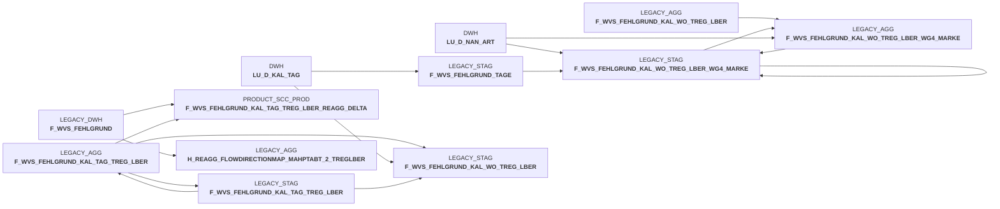

# sccwvs_500_wvs_aggregate.sas (SAS Program)

## Program Description

_No description available_

## Table Lineage

```mermaid
%%{init: {'flowchart': { 'nodeSpacing': 10, 'rankSpacing': 40, 'rankdir': 'TB' }}}%%

flowchart LR

  LEGACY_AGG.F_WVS_FEHLGRUND_KAL_TAG_TREG_LBER["LEGACY_AGG<br/><b>F_WVS_FEHLGRUND_KAL_TAG_TREG_LBER</b>"] --> LEGACY_STAG.F_WVS_FEHLGRUND_KAL_TAG_TREG_LBER["LEGACY_STAG<br/><b>F_WVS_FEHLGRUND_KAL_TAG_TREG_LBER</b>"]
  LEGACY_DWH.F_WVS_FEHLGRUND["LEGACY_DWH<br/><b>F_WVS_FEHLGRUND</b>"] --> PRODUCT_SCC_PROD.F_WVS_FEHLGRUND_KAL_TAG_TREG_LBER_REAGG_DELTA["PRODUCT_SCC_PROD<br/><b>F_WVS_FEHLGRUND_KAL_TAG_TREG_LBER_REAGG_DELTA</b>"]
  DWH.LU_D_KAL_TAG["DWH<br/><b>LU_D_KAL_TAG</b>"] --> LEGACY_STAG.F_WVS_FEHLGRUND_TAGE["LEGACY_STAG<br/><b>F_WVS_FEHLGRUND_TAGE</b>"]
  LEGACY_DWH.F_WVS_FEHLGRUND["LEGACY_DWH<br/><b>F_WVS_FEHLGRUND</b>"] --> LEGACY_AGG.H_REAGG_FLOWDIRECTIONMAP_MAHPTABT_2_TREGLBER["LEGACY_AGG<br/><b>H_REAGG_FLOWDIRECTIONMAP_MAHPTABT_2_TREGLBER</b>"]
  DWH.LU_D_NAN_ART["DWH<br/><b>LU_D_NAN_ART</b>"] --> LEGACY_STAG.F_WVS_FEHLGRUND_KAL_WO_TREG_LBER_WG4_MARKE["LEGACY_STAG<br/><b>F_WVS_FEHLGRUND_KAL_WO_TREG_LBER_WG4_MARKE</b>"]
  LEGACY_AGG.F_WVS_FEHLGRUND_KAL_WO_TREG_LBER["LEGACY_AGG<br/><b>F_WVS_FEHLGRUND_KAL_WO_TREG_LBER</b>"] --> LEGACY_AGG.F_WVS_FEHLGRUND_KAL_WO_TREG_LBER_WG4_MARKE["LEGACY_AGG<br/><b>F_WVS_FEHLGRUND_KAL_WO_TREG_LBER_WG4_MARKE</b>"]
  LEGACY_STAG.F_WVS_FEHLGRUND_TAGE["LEGACY_STAG<br/><b>F_WVS_FEHLGRUND_TAGE</b>"] --> LEGACY_STAG.F_WVS_FEHLGRUND_KAL_WO_TREG_LBER_WG4_MARKE["LEGACY_STAG<br/><b>F_WVS_FEHLGRUND_KAL_WO_TREG_LBER_WG4_MARKE</b>"]
  LEGACY_STAG.F_WVS_FEHLGRUND_KAL_TAG_TREG_LBER["LEGACY_STAG<br/><b>F_WVS_FEHLGRUND_KAL_TAG_TREG_LBER</b>"] --> LEGACY_AGG.F_WVS_FEHLGRUND_KAL_TAG_TREG_LBER["LEGACY_AGG<br/><b>F_WVS_FEHLGRUND_KAL_TAG_TREG_LBER</b>"]
  LEGACY_AGG.F_WVS_FEHLGRUND_KAL_TAG_TREG_LBER["LEGACY_AGG<br/><b>F_WVS_FEHLGRUND_KAL_TAG_TREG_LBER</b>"] --> LEGACY_STAG.F_WVS_FEHLGRUND_KAL_WO_TREG_LBER["LEGACY_STAG<br/><b>F_WVS_FEHLGRUND_KAL_WO_TREG_LBER</b>"]
  LEGACY_STAG.F_WVS_FEHLGRUND_KAL_WO_TREG_LBER_WG4_MARKE["LEGACY_STAG<br/><b>F_WVS_FEHLGRUND_KAL_WO_TREG_LBER_WG4_MARKE</b>"] --> LEGACY_AGG.F_WVS_FEHLGRUND_KAL_WO_TREG_LBER_WG4_MARKE["LEGACY_AGG<br/><b>F_WVS_FEHLGRUND_KAL_WO_TREG_LBER_WG4_MARKE</b>"]
  DWH.LU_D_KAL_TAG["DWH<br/><b>LU_D_KAL_TAG</b>"] --> LEGACY_STAG.F_WVS_FEHLGRUND_KAL_WO_TREG_LBER["LEGACY_STAG<br/><b>F_WVS_FEHLGRUND_KAL_WO_TREG_LBER</b>"]
  LEGACY_AGG.F_WVS_FEHLGRUND_KAL_TAG_TREG_LBER["LEGACY_AGG<br/><b>F_WVS_FEHLGRUND_KAL_TAG_TREG_LBER</b>"] --> PRODUCT_SCC_PROD.F_WVS_FEHLGRUND_KAL_TAG_TREG_LBER_REAGG_DELTA["PRODUCT_SCC_PROD<br/><b>F_WVS_FEHLGRUND_KAL_TAG_TREG_LBER_REAGG_DELTA</b>"]
  LEGACY_STAG.F_WVS_FEHLGRUND_KAL_TAG_TREG_LBER["LEGACY_STAG<br/><b>F_WVS_FEHLGRUND_KAL_TAG_TREG_LBER</b>"] --> LEGACY_STAG.F_WVS_FEHLGRUND_KAL_WO_TREG_LBER["LEGACY_STAG<br/><b>F_WVS_FEHLGRUND_KAL_WO_TREG_LBER</b>"]
  LEGACY_AGG.F_WVS_FEHLGRUND_KAL_WO_TREG_LBER_WG4_MARKE["LEGACY_AGG<br/><b>F_WVS_FEHLGRUND_KAL_WO_TREG_LBER_WG4_MARKE</b>"] --> LEGACY_STAG.F_WVS_FEHLGRUND_KAL_WO_TREG_LBER_WG4_MARKE["LEGACY_STAG<br/><b>F_WVS_FEHLGRUND_KAL_WO_TREG_LBER_WG4_MARKE</b>"]
  LEGACY_STAG.F_WVS_FEHLGRUND_KAL_WO_TREG_LBER_WG4_MARKE["LEGACY_STAG<br/><b>F_WVS_FEHLGRUND_KAL_WO_TREG_LBER_WG4_MARKE</b>"] --> LEGACY_STAG.F_WVS_FEHLGRUND_KAL_WO_TREG_LBER_WG4_MARKE["LEGACY_STAG<br/><b>F_WVS_FEHLGRUND_KAL_WO_TREG_LBER_WG4_MARKE</b>"]
  DWH.LU_D_NAN_ART["DWH<br/><b>LU_D_NAN_ART</b>"] --> LEGACY_AGG.F_WVS_FEHLGRUND_KAL_WO_TREG_LBER_WG4_MARKE["LEGACY_AGG<br/><b>F_WVS_FEHLGRUND_KAL_WO_TREG_LBER_WG4_MARKE</b>"]
  click LEGACY_AGG.F_WVS_FEHLGRUND_KAL_TAG_TREG_LBER "../../tables/LEGACY_AGG/F_WVS_FEHLGRUND_KAL_TAG_TREG_LBER"
  click LEGACY_DWH.F_WVS_FEHLGRUND "../../tables/LEGACY_DWH/F_WVS_FEHLGRUND"
  click DWH.LU_D_KAL_TAG "../../tables/DWH/LU_D_KAL_TAG"
  click DWH.LU_D_NAN_ART "../../tables/DWH/LU_D_NAN_ART"
  click LEGACY_AGG.F_WVS_FEHLGRUND_KAL_WO_TREG_LBER "../../tables/LEGACY_AGG/F_WVS_FEHLGRUND_KAL_WO_TREG_LBER"
  click LEGACY_STAG.F_WVS_FEHLGRUND_TAGE "../../tables/LEGACY_STAG/F_WVS_FEHLGRUND_TAGE"
  click LEGACY_STAG.F_WVS_FEHLGRUND_KAL_TAG_TREG_LBER "../../tables/LEGACY_STAG/F_WVS_FEHLGRUND_KAL_TAG_TREG_LBER"
  click LEGACY_STAG.F_WVS_FEHLGRUND_KAL_WO_TREG_LBER_WG4_MARKE "../../tables/LEGACY_STAG/F_WVS_FEHLGRUND_KAL_WO_TREG_LBER_WG4_MARKE"
  click LEGACY_AGG.F_WVS_FEHLGRUND_KAL_WO_TREG_LBER_WG4_MARKE "../../tables/LEGACY_AGG/F_WVS_FEHLGRUND_KAL_WO_TREG_LBER_WG4_MARKE"
  click LEGACY_STAG.F_WVS_FEHLGRUND_KAL_TAG_TREG_LBER "../../tables/LEGACY_STAG/F_WVS_FEHLGRUND_KAL_TAG_TREG_LBER"
  click PRODUCT_SCC_PROD.F_WVS_FEHLGRUND_KAL_TAG_TREG_LBER_REAGG_DELTA "../../tables/PRODUCT_SCC_PROD/F_WVS_FEHLGRUND_KAL_TAG_TREG_LBER_REAGG_DELTA"
  click LEGACY_STAG.F_WVS_FEHLGRUND_TAGE "../../tables/LEGACY_STAG/F_WVS_FEHLGRUND_TAGE"
  click LEGACY_AGG.H_REAGG_FLOWDIRECTIONMAP_MAHPTABT_2_TREGLBER "../../tables/LEGACY_AGG/H_REAGG_FLOWDIRECTIONMAP_MAHPTABT_2_TREGLBER"
  click LEGACY_STAG.F_WVS_FEHLGRUND_KAL_WO_TREG_LBER_WG4_MARKE "../../tables/LEGACY_STAG/F_WVS_FEHLGRUND_KAL_WO_TREG_LBER_WG4_MARKE"
  click LEGACY_AGG.F_WVS_FEHLGRUND_KAL_WO_TREG_LBER_WG4_MARKE "../../tables/LEGACY_AGG/F_WVS_FEHLGRUND_KAL_WO_TREG_LBER_WG4_MARKE"
  click LEGACY_AGG.F_WVS_FEHLGRUND_KAL_TAG_TREG_LBER "../../tables/LEGACY_AGG/F_WVS_FEHLGRUND_KAL_TAG_TREG_LBER"
  click LEGACY_STAG.F_WVS_FEHLGRUND_KAL_WO_TREG_LBER "../../tables/LEGACY_STAG/F_WVS_FEHLGRUND_KAL_WO_TREG_LBER"
```
