# sccwvs_500_wvs_aggregate.sas (SAS Program)

:::warning Complexity Score
 **M**
| Category | Measure | Value |
|---|---|---|
| Code Size | NBR_CODE_LINES | 125 |
| Code Size | NBR_DATA_STEPS | 0 |
| Code Size | NBR_PROC_STEPS | 1 |
| Dependencies and Flow Complexity | LEN_OF_COND_CLAUSES | 0 |
| Dependencies and Flow Complexity | NBR_INTERM_TABLES | 6 |
| Dependencies and Flow Complexity | NBR_PROC_STEP_SERIES | 1 |
| SQL Specifics | NBR_ANALYT_FUNCS | 8 |
| SQL Specifics | NBR_NESTED_QUERIES | 0 |
| SQL Specifics | NBR_SQL_STATEMENTS | 1 |
| Technical Complexity | NBR_DYNM_CODE_GEN | 0 |
| Technical Complexity | NBR_EXTERNAL_SYS | 2 |
| Technical Complexity | NBR_MAPPING_FORMATS | 0 |
| Technical Complexity | NBR_USED_MACROS | 1 |
| Transformation Complexity | NBR_COND_LOGIC | 0 |
| Transformation Complexity | NBR_JOINS | 6 |
| Transformation Complexity | NBR_TABLE_INP | 6 |
| Transformation Complexity | NBR_TABLE_OUTP | 6 |
| Transformation Complexity | NBR_TRANSF_TYPES | 3 |
:::

## Program Description

This SAS script is part of the **BDWH_SCCWVS** application and handles the aggregation of **WVS (WarenVersorgungsStatistik)** data - a goods supply statistics system. The script updates WVS aggregations using a **DELETE/INSERT approach** rather than MERGE operations, ensuring data consistency across detail and summary levels.

The process operates on a **one-year time interval** for recalculation and executes in four main steps:

**Step 0100**: Identifies relevant days (KAL_TAG_ID) and weeks (KAL_WO_ID) within a 365-day window around the current date and populates the staging table F_WVS_FEHLGRUND_TAGE.

**Step 0200**: Aggregates daily WVS error reason data by territorial area (F_WVS_FEHLGRUND_KAL_TAG_TREG_LBER), including inventory quantities and values across different price levels (purchase, goods, sales). Includes a reaggregate mechanism for delta processing using flow direction mapping.

**Step 0300**: Creates weekly aggregations (F_WVS_FEHLGRUND_KAL_WO_TREG_LBER) by summarizing the daily data grouped by calendar weeks.

**Step 0400**: Generates brand-level weekly aggregations (F_WVS_FEHLGRUND_KAL_WO_TREG_LBER_WG4_MARKE) by further grouping weekly data by product brand categories.

The script processes data through staging tables (LEGACY_STAG) before inserting into final aggregate tables (LEGACY_AGG), with comprehensive cleanup of temporary tables at completion. All operations use Snowflake database connections with configurable warehouse sizing for optimal performance.

## Table Lineage

```mermaid
%%{init: {'flowchart': { 'nodeSpacing': 10, 'rankSpacing': 40, 'rankdir': 'TB' }}}%%

flowchart LR

  LEGACY_AGG.F_WVS_FEHLGRUND_KAL_TAG_TREG_LBER["LEGACY_AGG<br/><b>F_WVS_FEHLGRUND_KAL_TAG_TREG_LBER</b>"] --> PRODUCT_SCC_PROD.F_WVS_FEHLGRUND_KAL_TAG_TREG_LBER_REAGG_DELTA["PRODUCT_SCC_PROD<br/><b>F_WVS_FEHLGRUND_KAL_TAG_TREG_LBER_REAGG_DELTA</b>"]
  LEGACY_STAG.F_WVS_FEHLGRUND_KAL_TAG_TREG_LBER["LEGACY_STAG<br/><b>F_WVS_FEHLGRUND_KAL_TAG_TREG_LBER</b>"] --> LEGACY_STAG.F_WVS_FEHLGRUND_KAL_WO_TREG_LBER["LEGACY_STAG<br/><b>F_WVS_FEHLGRUND_KAL_WO_TREG_LBER</b>"]
  LEGACY_AGG.F_WVS_FEHLGRUND_KAL_WO_TREG_LBER_WG4_MARKE["LEGACY_AGG<br/><b>F_WVS_FEHLGRUND_KAL_WO_TREG_LBER_WG4_MARKE</b>"] --> LEGACY_STAG.F_WVS_FEHLGRUND_KAL_WO_TREG_LBER_WG4_MARKE["LEGACY_STAG<br/><b>F_WVS_FEHLGRUND_KAL_WO_TREG_LBER_WG4_MARKE</b>"]
  LEGACY_STAG.F_WVS_FEHLGRUND_KAL_WO_TREG_LBER_WG4_MARKE["LEGACY_STAG<br/><b>F_WVS_FEHLGRUND_KAL_WO_TREG_LBER_WG4_MARKE</b>"] --> LEGACY_STAG.F_WVS_FEHLGRUND_KAL_WO_TREG_LBER_WG4_MARKE["LEGACY_STAG<br/><b>F_WVS_FEHLGRUND_KAL_WO_TREG_LBER_WG4_MARKE</b>"]
  DWH.LU_D_NAN_ART["DWH<br/><b>LU_D_NAN_ART</b>"] --> LEGACY_AGG.F_WVS_FEHLGRUND_KAL_WO_TREG_LBER_WG4_MARKE["LEGACY_AGG<br/><b>F_WVS_FEHLGRUND_KAL_WO_TREG_LBER_WG4_MARKE</b>"]
  LEGACY_AGG.F_WVS_FEHLGRUND_KAL_WO_TREG_LBER["LEGACY_AGG<br/><b>F_WVS_FEHLGRUND_KAL_WO_TREG_LBER</b>"] --> LEGACY_AGG.F_WVS_FEHLGRUND_KAL_WO_TREG_LBER_WG4_MARKE["LEGACY_AGG<br/><b>F_WVS_FEHLGRUND_KAL_WO_TREG_LBER_WG4_MARKE</b>"]
  LEGACY_STAG.F_WVS_FEHLGRUND_TAGE["LEGACY_STAG<br/><b>F_WVS_FEHLGRUND_TAGE</b>"] --> LEGACY_STAG.F_WVS_FEHLGRUND_KAL_WO_TREG_LBER_WG4_MARKE["LEGACY_STAG<br/><b>F_WVS_FEHLGRUND_KAL_WO_TREG_LBER_WG4_MARKE</b>"]
  LEGACY_AGG.F_WVS_FEHLGRUND_KAL_TAG_TREG_LBER["LEGACY_AGG<br/><b>F_WVS_FEHLGRUND_KAL_TAG_TREG_LBER</b>"] --> LEGACY_STAG.F_WVS_FEHLGRUND_KAL_WO_TREG_LBER["LEGACY_STAG<br/><b>F_WVS_FEHLGRUND_KAL_WO_TREG_LBER</b>"]
  LEGACY_STAG.F_WVS_FEHLGRUND_KAL_WO_TREG_LBER_WG4_MARKE["LEGACY_STAG<br/><b>F_WVS_FEHLGRUND_KAL_WO_TREG_LBER_WG4_MARKE</b>"] --> LEGACY_AGG.F_WVS_FEHLGRUND_KAL_WO_TREG_LBER_WG4_MARKE["LEGACY_AGG<br/><b>F_WVS_FEHLGRUND_KAL_WO_TREG_LBER_WG4_MARKE</b>"]
  LEGACY_AGG.F_WVS_FEHLGRUND_KAL_TAG_TREG_LBER["LEGACY_AGG<br/><b>F_WVS_FEHLGRUND_KAL_TAG_TREG_LBER</b>"] --> LEGACY_STAG.F_WVS_FEHLGRUND_KAL_TAG_TREG_LBER["LEGACY_STAG<br/><b>F_WVS_FEHLGRUND_KAL_TAG_TREG_LBER</b>"]
  LEGACY_DWH.F_WVS_FEHLGRUND["LEGACY_DWH<br/><b>F_WVS_FEHLGRUND</b>"] --> PRODUCT_SCC_PROD.F_WVS_FEHLGRUND_KAL_TAG_TREG_LBER_REAGG_DELTA["PRODUCT_SCC_PROD<br/><b>F_WVS_FEHLGRUND_KAL_TAG_TREG_LBER_REAGG_DELTA</b>"]
  LEGACY_STAG.F_WVS_FEHLGRUND_KAL_TAG_TREG_LBER["LEGACY_STAG<br/><b>F_WVS_FEHLGRUND_KAL_TAG_TREG_LBER</b>"] --> LEGACY_AGG.F_WVS_FEHLGRUND_KAL_TAG_TREG_LBER["LEGACY_AGG<br/><b>F_WVS_FEHLGRUND_KAL_TAG_TREG_LBER</b>"]
  DWH.LU_D_KAL_TAG["DWH<br/><b>LU_D_KAL_TAG</b>"] --> LEGACY_STAG.F_WVS_FEHLGRUND_KAL_WO_TREG_LBER["LEGACY_STAG<br/><b>F_WVS_FEHLGRUND_KAL_WO_TREG_LBER</b>"]
  DWH.LU_D_KAL_TAG["DWH<br/><b>LU_D_KAL_TAG</b>"] --> LEGACY_STAG.F_WVS_FEHLGRUND_TAGE["LEGACY_STAG<br/><b>F_WVS_FEHLGRUND_TAGE</b>"]
  LEGACY_DWH.F_WVS_FEHLGRUND["LEGACY_DWH<br/><b>F_WVS_FEHLGRUND</b>"] --> LEGACY_AGG.H_REAGG_FLOWDIRECTIONMAP_MAHPTABT_2_TREGLBER["LEGACY_AGG<br/><b>H_REAGG_FLOWDIRECTIONMAP_MAHPTABT_2_TREGLBER</b>"]
  DWH.LU_D_NAN_ART["DWH<br/><b>LU_D_NAN_ART</b>"] --> LEGACY_STAG.F_WVS_FEHLGRUND_KAL_WO_TREG_LBER_WG4_MARKE["LEGACY_STAG<br/><b>F_WVS_FEHLGRUND_KAL_WO_TREG_LBER_WG4_MARKE</b>"]
  click LEGACY_AGG.F_WVS_FEHLGRUND_KAL_TAG_TREG_LBER "../../tables/LEGACY_AGG/F_WVS_FEHLGRUND_KAL_TAG_TREG_LBER"
  click LEGACY_STAG.F_WVS_FEHLGRUND_KAL_TAG_TREG_LBER "../../tables/LEGACY_STAG/F_WVS_FEHLGRUND_KAL_TAG_TREG_LBER"
  click LEGACY_AGG.F_WVS_FEHLGRUND_KAL_WO_TREG_LBER_WG4_MARKE "../../tables/LEGACY_AGG/F_WVS_FEHLGRUND_KAL_WO_TREG_LBER_WG4_MARKE"
  click LEGACY_STAG.F_WVS_FEHLGRUND_KAL_WO_TREG_LBER_WG4_MARKE "../../tables/LEGACY_STAG/F_WVS_FEHLGRUND_KAL_WO_TREG_LBER_WG4_MARKE"
  click DWH.LU_D_NAN_ART "../../tables/DWH/LU_D_NAN_ART"
  click LEGACY_AGG.F_WVS_FEHLGRUND_KAL_WO_TREG_LBER "../../tables/LEGACY_AGG/F_WVS_FEHLGRUND_KAL_WO_TREG_LBER"
  click LEGACY_STAG.F_WVS_FEHLGRUND_TAGE "../../tables/LEGACY_STAG/F_WVS_FEHLGRUND_TAGE"
  click LEGACY_DWH.F_WVS_FEHLGRUND "../../tables/LEGACY_DWH/F_WVS_FEHLGRUND"
  click DWH.LU_D_KAL_TAG "../../tables/DWH/LU_D_KAL_TAG"
  click PRODUCT_SCC_PROD.F_WVS_FEHLGRUND_KAL_TAG_TREG_LBER_REAGG_DELTA "../../tables/PRODUCT_SCC_PROD/F_WVS_FEHLGRUND_KAL_TAG_TREG_LBER_REAGG_DELTA"
  click LEGACY_STAG.F_WVS_FEHLGRUND_KAL_WO_TREG_LBER "../../tables/LEGACY_STAG/F_WVS_FEHLGRUND_KAL_WO_TREG_LBER"
  click LEGACY_STAG.F_WVS_FEHLGRUND_KAL_WO_TREG_LBER_WG4_MARKE "../../tables/LEGACY_STAG/F_WVS_FEHLGRUND_KAL_WO_TREG_LBER_WG4_MARKE"
  click LEGACY_AGG.F_WVS_FEHLGRUND_KAL_WO_TREG_LBER_WG4_MARKE "../../tables/LEGACY_AGG/F_WVS_FEHLGRUND_KAL_WO_TREG_LBER_WG4_MARKE"
  click LEGACY_STAG.F_WVS_FEHLGRUND_KAL_TAG_TREG_LBER "../../tables/LEGACY_STAG/F_WVS_FEHLGRUND_KAL_TAG_TREG_LBER"
  click LEGACY_AGG.F_WVS_FEHLGRUND_KAL_TAG_TREG_LBER "../../tables/LEGACY_AGG/F_WVS_FEHLGRUND_KAL_TAG_TREG_LBER"
  click LEGACY_STAG.F_WVS_FEHLGRUND_TAGE "../../tables/LEGACY_STAG/F_WVS_FEHLGRUND_TAGE"
  click LEGACY_AGG.H_REAGG_FLOWDIRECTIONMAP_MAHPTABT_2_TREGLBER "../../tables/LEGACY_AGG/H_REAGG_FLOWDIRECTIONMAP_MAHPTABT_2_TREGLBER"
```

