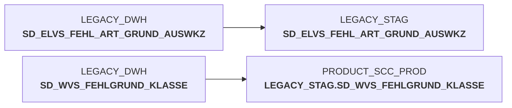

# sccwvs_600_cleandb.sas (SAS Program)

## Program Description

_No description available_

## Table Lineage

```mermaid
%%{init: {'flowchart': { 'nodeSpacing': 10, 'rankSpacing': 40, 'rankdir': 'TB' }}}%%

flowchart LR

  LEGACY_DWH.SD_ELVS_FEHL_ART_GRUND_AUSWKZ["LEGACY_DWH<br/><b>SD_ELVS_FEHL_ART_GRUND_AUSWKZ</b>"] --> LEGACY_STAG.SD_ELVS_FEHL_ART_GRUND_AUSWKZ["LEGACY_STAG<br/><b>SD_ELVS_FEHL_ART_GRUND_AUSWKZ</b>"]
  LEGACY_DWH.SD_WVS_FEHLGRUND_KLASSE["LEGACY_DWH<br/><b>SD_WVS_FEHLGRUND_KLASSE</b>"] --> PRODUCT_SCC_PROD.LEGACY_STAG.SD_WVS_FEHLGRUND_KLASSE["PRODUCT_SCC_PROD<br/><b>LEGACY_STAG.SD_WVS_FEHLGRUND_KLASSE</b>"]
  click LEGACY_DWH.SD_ELVS_FEHL_ART_GRUND_AUSWKZ "../../tables/LEGACY_DWH/SD_ELVS_FEHL_ART_GRUND_AUSWKZ"
  click LEGACY_DWH.SD_WVS_FEHLGRUND_KLASSE "../../tables/LEGACY_DWH/SD_WVS_FEHLGRUND_KLASSE"
  click LEGACY_STAG.SD_ELVS_FEHL_ART_GRUND_AUSWKZ "../../tables/LEGACY_STAG/SD_ELVS_FEHL_ART_GRUND_AUSWKZ"
  click PRODUCT_SCC_PROD.LEGACY_STAG.SD_WVS_FEHLGRUND_KLASSE "../../tables/PRODUCT_SCC_PROD/LEGACY_STAG.SD_WVS_FEHLGRUND_KLASSE"
```
