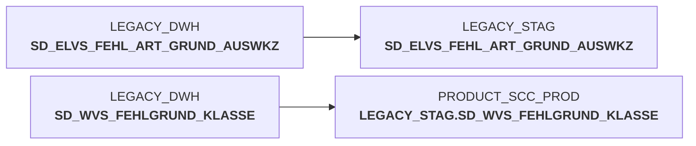

# sccwvs_600_cleandb.sas (SAS Program)

:::info Complexity Score
 **S**
| Category | Measure | Value |
|---|---|---|
| Code Size | NBR_CODE_LINES | 18 |
| Code Size | NBR_DATA_STEPS | 0 |
| Code Size | NBR_PROC_STEPS | 2 |
| Dependencies and Flow Complexity | LEN_OF_COND_CLAUSES | 0 |
| Dependencies and Flow Complexity | NBR_INTERM_TABLES | 0 |
| Dependencies and Flow Complexity | NBR_PROC_STEP_SERIES | 2 |
| SQL Specifics | NBR_ANALYT_FUNCS | 0 |
| SQL Specifics | NBR_NESTED_QUERIES | 0 |
| SQL Specifics | NBR_SQL_STATEMENTS | 2 |
| Technical Complexity | NBR_DYNM_CODE_GEN | 0 |
| Technical Complexity | NBR_EXTERNAL_SYS | 2 |
| Technical Complexity | NBR_MAPPING_FORMATS | 0 |
| Technical Complexity | NBR_USED_MACROS | 1 |
| Transformation Complexity | NBR_COND_LOGIC | 0 |
| Transformation Complexity | NBR_JOINS | 0 |
| Transformation Complexity | NBR_TABLE_INP | 0 |
| Transformation Complexity | NBR_TABLE_OUTP | 12 |
| Transformation Complexity | NBR_TRANSF_TYPES | 1 |
:::

## Program Description

This SAS script is part of the **BDWH_SCCWVS** application and serves as a database cleanup utility for the **WVS (WarenVersorgungsStatistik)** system. The script is designed to prepare a clean environment by emptying staging tables and work libraries before data processing operations.

The primary purpose is to **clear staging tables** in the LEGACY_STAG schema, including various WVS-related tables such as error reason classifications, tour tracking data, and calendar aggregations. It systematically deletes data from tables like SD_WVS_FEHLGRUND (error reasons), F_WVS_FEHLGRUND_KAL (calendar-based error aggregations), and temporary tracking tables.

The script operates in two main steps: **Step 0100** connects to a Snowflake database and executes DELETE statements on multiple staging tables with commit operations to ensure data consistency, while **Step 0200** cleans the work library (wrkwvs) using SAS PROC DATASETS.

This cleanup script is typically executed as part of a larger ETL process to ensure a clean starting state for subsequent data loading and transformation operations. It's designed to be **restartable** and includes error handling documentation for known failure scenarios.

## Table Lineage

