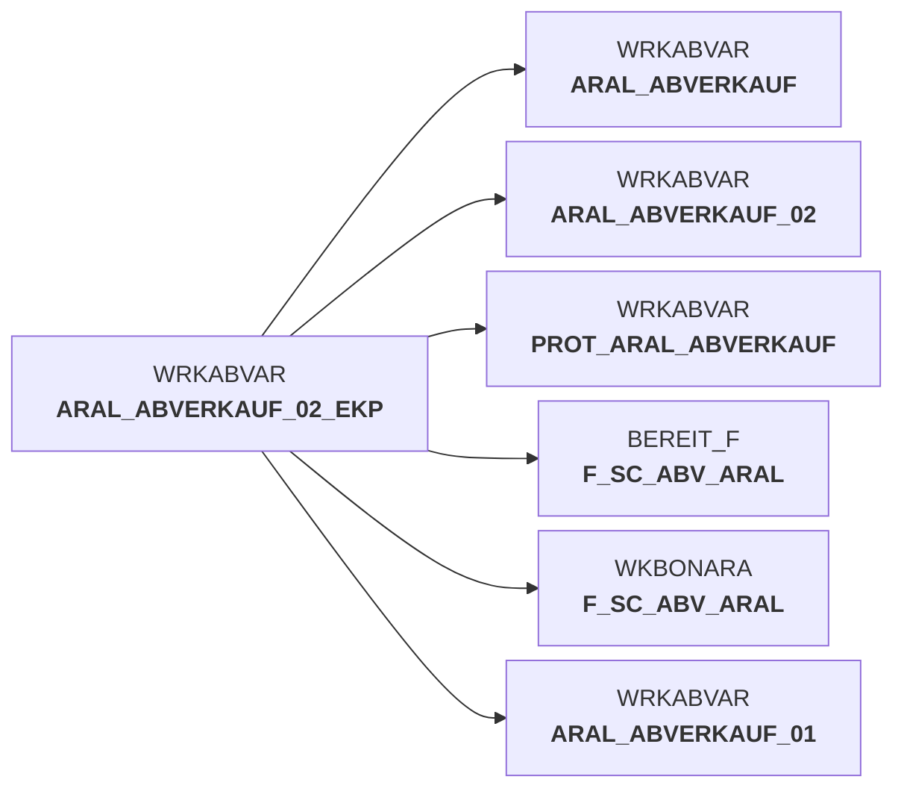

# abv_aral_bereit.sas (SAS Program)

:::info Complexity Score
 **S**
| Category | Measure | Value |
|---|---|---|
| Code Size | NBR_CODE_LINES | 67 |
| Code Size | NBR_DATA_STEPS | 1 |
| Code Size | NBR_PROC_STEPS | 1 |
| Dependencies and Flow Complexity | LEN_OF_COND_CLAUSES | 0 |
| Dependencies and Flow Complexity | NBR_INTERM_TABLES | 0 |
| Dependencies and Flow Complexity | NBR_PROC_STEP_SERIES | 2 |
| SQL Specifics | NBR_ANALYT_FUNCS | 0 |
| SQL Specifics | NBR_NESTED_QUERIES | 0 |
| SQL Specifics | NBR_SQL_STATEMENTS | 0 |
| Technical Complexity | NBR_DYNM_CODE_GEN | 0 |
| Technical Complexity | NBR_EXTERNAL_SYS | 0 |
| Technical Complexity | NBR_MAPPING_FORMATS | 67 |
| Technical Complexity | NBR_USED_MACROS | 0 |
| Transformation Complexity | NBR_COND_LOGIC | 7 |
| Transformation Complexity | NBR_JOINS | 0 |
| Transformation Complexity | NBR_TABLE_INP | 1 |
| Transformation Complexity | NBR_TABLE_OUTP | 2 |
| Transformation Complexity | NBR_TRANSF_TYPES | 2 |
:::

## Program Description

This SAS script is part of the **DWABVARAL** application and serves as a data preparation module for Aral sales data (**Aral Abverkaufsdaten**). The script processes and standardizes sales transaction data from Aral gas stations for integration into the data warehouse.

The primary function creates a structured dataset `F_SC_ABV_ARAL` containing comprehensive sales information including transaction details, pricing data, and various business metrics. Key data elements include **EAN codes**, **sales amounts**, **quantities**, **pricing information**, and **station identifiers**. The script handles both movement records (I) and control records (T) as indicated by the record type field.

The script performs **data cleansing operations** by setting null values to zero for critical financial fields such as purchase prices, net amounts, and gross amounts. This ensures data consistency for downstream analytical processes.

Additionally, the script creates a **copy of the processed dataset** for the BON application (`DW##BONARALFAKT`), enabling cross-system data sharing and reporting capabilities.

*Version History*: Initial version created March 2016, with updates in December 2016 adding new columns for enhanced data capture and analysis requirements.

## Table Lineage

