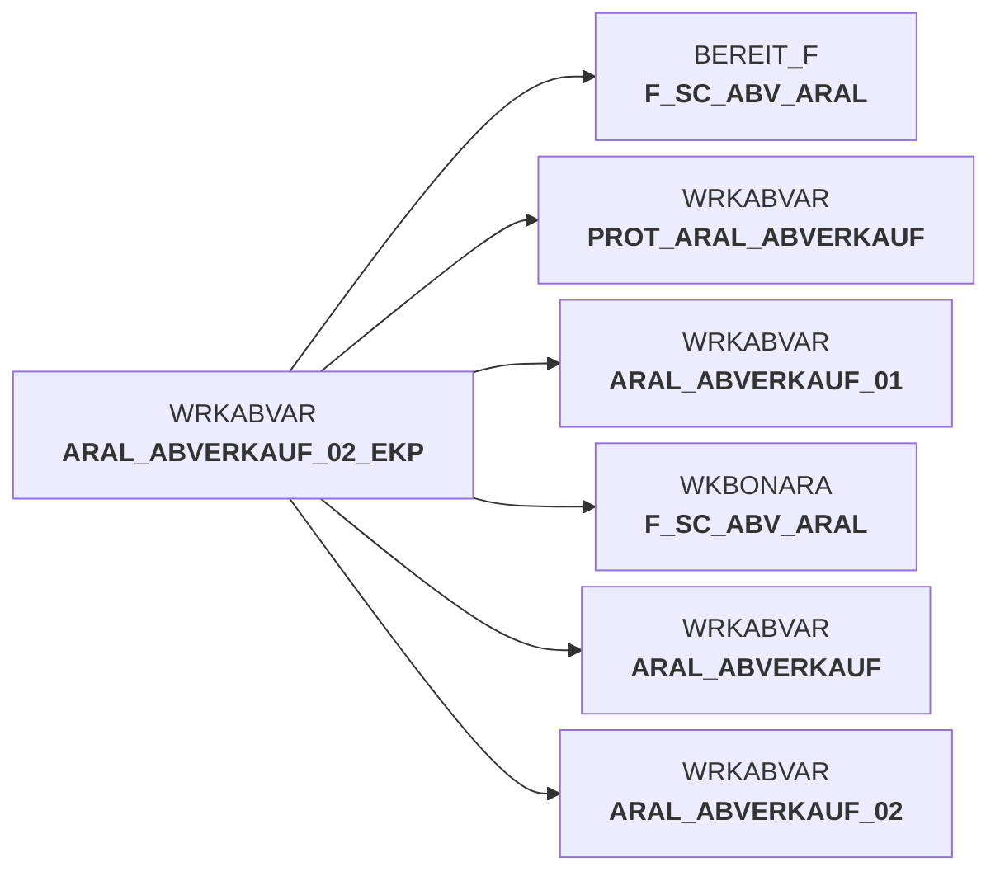

# abv_aral_bereit.sas (SAS Program)

## Program Description

_No description available_

## Table Lineage

```mermaid
%%{init: {'flowchart': { 'nodeSpacing': 10, 'rankSpacing': 40, 'rankdir': 'TB' }}}%%

flowchart LR

  WRKABVAR.ARAL_ABVERKAUF_02_EKP["WRKABVAR<br/><b>ARAL_ABVERKAUF_02_EKP</b>"] --> BEREIT_F.F_SC_ABV_ARAL["BEREIT_F<br/><b>F_SC_ABV_ARAL</b>"]
  WRKABVAR.ARAL_ABVERKAUF_02_EKP["WRKABVAR<br/><b>ARAL_ABVERKAUF_02_EKP</b>"] --> WRKABVAR.PROT_ARAL_ABVERKAUF["WRKABVAR<br/><b>PROT_ARAL_ABVERKAUF</b>"]
  WRKABVAR.ARAL_ABVERKAUF_02_EKP["WRKABVAR<br/><b>ARAL_ABVERKAUF_02_EKP</b>"] --> WRKABVAR.ARAL_ABVERKAUF_01["WRKABVAR<br/><b>ARAL_ABVERKAUF_01</b>"]
  WRKABVAR.ARAL_ABVERKAUF_02_EKP["WRKABVAR<br/><b>ARAL_ABVERKAUF_02_EKP</b>"] --> WKBONARA.F_SC_ABV_ARAL["WKBONARA<br/><b>F_SC_ABV_ARAL</b>"]
  WRKABVAR.ARAL_ABVERKAUF_02_EKP["WRKABVAR<br/><b>ARAL_ABVERKAUF_02_EKP</b>"] --> WRKABVAR.ARAL_ABVERKAUF["WRKABVAR<br/><b>ARAL_ABVERKAUF</b>"]
  WRKABVAR.ARAL_ABVERKAUF_02_EKP["WRKABVAR<br/><b>ARAL_ABVERKAUF_02_EKP</b>"] --> WRKABVAR.ARAL_ABVERKAUF_02["WRKABVAR<br/><b>ARAL_ABVERKAUF_02</b>"]
  click WRKABVAR.ARAL_ABVERKAUF_02_EKP "../../tables/WRKABVAR/ARAL_ABVERKAUF_02_EKP"
  click BEREIT_F.F_SC_ABV_ARAL "../../tables/BEREIT_F/F_SC_ABV_ARAL"
  click WRKABVAR.PROT_ARAL_ABVERKAUF "../../tables/WRKABVAR/PROT_ARAL_ABVERKAUF"
  click WRKABVAR.ARAL_ABVERKAUF_01 "../../tables/WRKABVAR/ARAL_ABVERKAUF_01"
  click WKBONARA.F_SC_ABV_ARAL "../../tables/WKBONARA/F_SC_ABV_ARAL"
  click WRKABVAR.ARAL_ABVERKAUF "../../tables/WRKABVAR/ARAL_ABVERKAUF"
  click WRKABVAR.ARAL_ABVERKAUF_02 "../../tables/WRKABVAR/ARAL_ABVERKAUF_02"
```
