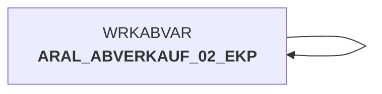

# abv_aral_bew_ekp.sas (SAS Program)

:::info Complexity Score
 **XS**
| Category | Measure | Value |
|---|---|---|
| Code Size | NBR_CODE_LINES | 2 |
| Code Size | NBR_DATA_STEPS | 0 |
| Code Size | NBR_PROC_STEPS | 0 |
| Dependencies and Flow Complexity | LEN_OF_COND_CLAUSES | 0 |
| Dependencies and Flow Complexity | NBR_INTERM_TABLES | 0 |
| Dependencies and Flow Complexity | NBR_PROC_STEP_SERIES | 1 |
| SQL Specifics | NBR_ANALYT_FUNCS | 0 |
| SQL Specifics | NBR_NESTED_QUERIES | 0 |
| SQL Specifics | NBR_SQL_STATEMENTS | 0 |
| Technical Complexity | NBR_DYNM_CODE_GEN | 0 |
| Technical Complexity | NBR_EXTERNAL_SYS | 0 |
| Technical Complexity | NBR_MAPPING_FORMATS | 0 |
| Technical Complexity | NBR_USED_MACROS | 1 |
| Transformation Complexity | NBR_COND_LOGIC | 0 |
| Transformation Complexity | NBR_JOINS | 0 |
| Transformation Complexity | NBR_TABLE_INP | 1 |
| Transformation Complexity | NBR_TABLE_OUTP | 1 |
| Transformation Complexity | NBR_TRANSF_TYPES | 1 |
:::

## Program Description

This SAS script performs **EK-Bewertung** (purchase price evaluation) for **Aral sales data** within the DWABVARAL data warehouse application. The script processes Aral retail sales information by applying purchase price calculations and evaluations.

The main functionality is implemented through the **%bewertg_wgpek** macro, which transforms the input dataset *ARAL_ABVERKAUF_02* from the WRKABVAR library into an evaluated output dataset *ARAL_ABVERKAUF_02_EKP*. The macro processes various financial fields including:

- **Sales values**: gross (abv_w_bto) and net (abv_w_nto) amounts
- **Purchase price calculations**: standard purchase price (abv_w_nn_ek), evaluated purchase price (abv_w_bew_ek)
- **Commodity group values**: wholesale purchase price (abv_w_wgp_ek) and market purchase price (abv_w_markt_ek)

The script uses *ARAL_MENGE* as the quantity field for calculations and operates without bonus indicators (bon_kz = N). This automated process is part of job **DWDW5142** and can be restarted as needed. The evaluation enhances the raw Aral sales data with comprehensive purchase price analytics for further business intelligence processing.

## Table Lineage

