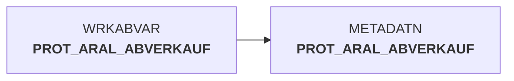

# abv_aral_meta.sas (SAS Program)

:::info Complexity Score
 **XS**
| Category | Measure | Value |
|---|---|---|
| Code Size | NBR_CODE_LINES | 4 |
| Code Size | NBR_DATA_STEPS | 0 |
| Code Size | NBR_PROC_STEPS | 1 |
| Dependencies and Flow Complexity | LEN_OF_COND_CLAUSES | 0 |
| Dependencies and Flow Complexity | NBR_INTERM_TABLES | 0 |
| Dependencies and Flow Complexity | NBR_PROC_STEP_SERIES | 1 |
| SQL Specifics | NBR_ANALYT_FUNCS | 0 |
| SQL Specifics | NBR_NESTED_QUERIES | 0 |
| SQL Specifics | NBR_SQL_STATEMENTS | 0 |
| Technical Complexity | NBR_DYNM_CODE_GEN | 0 |
| Technical Complexity | NBR_EXTERNAL_SYS | 0 |
| Technical Complexity | NBR_MAPPING_FORMATS | 0 |
| Technical Complexity | NBR_USED_MACROS | 0 |
| Transformation Complexity | NBR_COND_LOGIC | 0 |
| Transformation Complexity | NBR_JOINS | 0 |
| Transformation Complexity | NBR_TABLE_INP | 2 |
| Transformation Complexity | NBR_TABLE_OUTP | 1 |
| Transformation Complexity | NBR_TRANSF_TYPES | 1 |
:::

## Program Description

This SAS script is part of the **DWABVARAL** data warehouse application and serves as a metadata management component for Aral sales data processing. The script's primary function is to **append protocol data** from a working dataset to the main metadata repository.

The script executes a `PROC APPEND` operation that consolidates sales protocol information from the working library `WRKABVAR.PROT_ARAL_ABVERKAUF` into the permanent metadata table `metadatn.PROT_ARAL_ABVERKAUF`. This process ensures that all sales transaction metadata is properly archived and maintained in the central metadata repository.

This script is designed to be **restartable** (*JOB KANN WIEDER AUFGESETZT WERDEN*), making it suitable for batch processing environments where job recovery capabilities are essential. The metadata update operation is critical for maintaining data lineage and processing audit trails within the Aral sales data warehouse system.

*Created: March 17, 2016 

## Table Lineage

