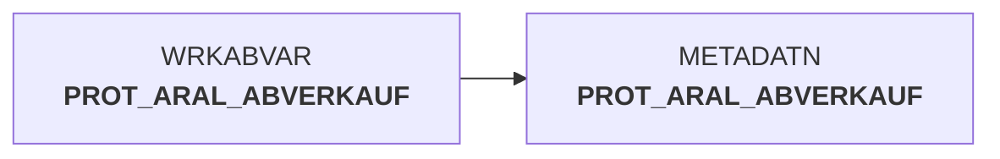

# abv_aral_meta.sas (SAS Program)

## Program Description

_No description available_

## Table Lineage

```mermaid
%%{init: {'flowchart': { 'nodeSpacing': 10, 'rankSpacing': 40, 'rankdir': 'TB' }}}%%

flowchart LR

  WRKABVAR.PROT_ARAL_ABVERKAUF["WRKABVAR<br/><b>PROT_ARAL_ABVERKAUF</b>"] --> METADATN.PROT_ARAL_ABVERKAUF["METADATN<br/><b>PROT_ARAL_ABVERKAUF</b>"]
  click WRKABVAR.PROT_ARAL_ABVERKAUF "../../tables/WRKABVAR/PROT_ARAL_ABVERKAUF"
  click METADATN.PROT_ARAL_ABVERKAUF "../../tables/METADATN/PROT_ARAL_ABVERKAUF"
```
