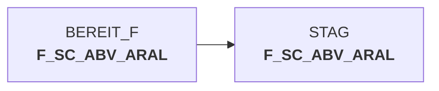

# dw010990.sas (SAS Program)

:::info Complexity Score
 **XS**
| Category | Measure | Value |
|---|---|---|
| Code Size | NBR_CODE_LINES | 11 |
| Code Size | NBR_DATA_STEPS | 0 |
| Code Size | NBR_PROC_STEPS | 0 |
| Dependencies and Flow Complexity | LEN_OF_COND_CLAUSES | 0 |
| Dependencies and Flow Complexity | NBR_INTERM_TABLES | 0 |
| Dependencies and Flow Complexity | NBR_PROC_STEP_SERIES | 1 |
| SQL Specifics | NBR_ANALYT_FUNCS | 0 |
| SQL Specifics | NBR_NESTED_QUERIES | 0 |
| SQL Specifics | NBR_SQL_STATEMENTS | 0 |
| Technical Complexity | NBR_DYNM_CODE_GEN | 1 |
| Technical Complexity | NBR_EXTERNAL_SYS | 1 |
| Technical Complexity | NBR_MAPPING_FORMATS | 0 |
| Technical Complexity | NBR_USED_MACROS | 2 |
| Transformation Complexity | NBR_COND_LOGIC | 0 |
| Transformation Complexity | NBR_JOINS | 0 |
| Transformation Complexity | NBR_TABLE_INP | 1 |
| Transformation Complexity | NBR_TABLE_OUTP | 0 |
| Transformation Complexity | NBR_TRANSF_TYPES | 1 |
:::

## Program Description

This SAS script is part of the **DWABVARAL** application and processes **Aral sales data according to STAG** standards. The script was created on March 17, 2016, and is designed to handle Aral retail sales information within a data warehouse environment.

The script follows a structured approach by first setting up the program library path and including essential declaration files. It incorporates **global declarations** through `decl_global.sas` and **legacy data warehouse declarations** via `decl_legacy_dwh.sas`. The main functionality involves loading sales data from the `BEREIT_F.F_SC_ABV_ARAL` table using the `%loadsnow` macro.

This script is **restartable** and includes provisions for error documentation and handling of known failure scenarios. It serves as a critical component in the data warehouse pipeline for processing and managing Aral fuel station sales data, ensuring proper data flow and transformation according to established business rules and technical standards.

## Table Lineage

