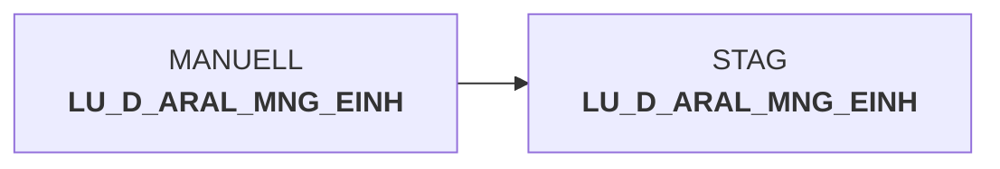

# dw010992.sas (SAS Program)

:::info Complexity Score
 **XS**
| Category | Measure | Value |
|---|---|---|
| Code Size | NBR_CODE_LINES | 11 |
| Code Size | NBR_DATA_STEPS | 0 |
| Code Size | NBR_PROC_STEPS | 0 |
| Dependencies and Flow Complexity | LEN_OF_COND_CLAUSES | 0 |
| Dependencies and Flow Complexity | NBR_INTERM_TABLES | 0 |
| Dependencies and Flow Complexity | NBR_PROC_STEP_SERIES | 1 |
| SQL Specifics | NBR_ANALYT_FUNCS | 0 |
| SQL Specifics | NBR_NESTED_QUERIES | 0 |
| SQL Specifics | NBR_SQL_STATEMENTS | 0 |
| Technical Complexity | NBR_DYNM_CODE_GEN | 1 |
| Technical Complexity | NBR_EXTERNAL_SYS | 1 |
| Technical Complexity | NBR_MAPPING_FORMATS | 0 |
| Technical Complexity | NBR_USED_MACROS | 2 |
| Transformation Complexity | NBR_COND_LOGIC | 0 |
| Transformation Complexity | NBR_JOINS | 0 |
| Transformation Complexity | NBR_TABLE_INP | 1 |
| Transformation Complexity | NBR_TABLE_OUTP | 0 |
| Transformation Complexity | NBR_TRANSF_TYPES | 1 |
:::

## Program Description

This SAS script is part of the **DWABVARAL** application and handles **Aral quantity units according to STAG** standards. The script was created on July 18, 2016, and is designed to be restartable in case of failures.

The script follows a standard structure by first setting up the program library path and including global declarations through *decl_global.sas*. It then incorporates legacy data warehouse database declarations via *decl_legacy_dwh.sas*. The main functionality involves loading data from the manual lookup table **LU_D_ARAL_MNG_EINH** using the *%loadsnow* macro.

This appears to be a data warehouse ETL process specifically focused on managing Aral fuel station quantity unit data. The script includes provisions for error handling and restart capabilities, making it suitable for production batch processing environments. The job identifier **DW010992** suggests this is part of a larger data warehouse processing suite.

## Table Lineage

