# DWABVARAL (Application)

:::danger Complexity Score
 **XL**
:::

## Application Description

_No description available_

## List of SAS programs

| SAS Program | Description |
|---|---|
| [snow_abv_aral_einlesen.sas](./snow_abv_aral_einlesen.sas.md) | tbd |
| [abv_aral_meta.sas](./abv_aral_meta.sas.md) | tbd |
| [abv_aral_bereit.sas](./abv_aral_bereit.sas.md) | tbd |
| [abv_aral_unzip.sas](./abv_aral_unzip.sas.md) | tbd |
| [dw010992.sas](./dw010992.sas.md) | tbd |
| [snow_abv_aral_insert_sca_delta.sas](./snow_abv_aral_insert_sca_delta.sas.md) | tbd |
| [snow_abv_aral_verdichtungen.sas](./snow_abv_aral_verdichtungen.sas.md) | tbd |
| [abv_aral_bew_ekp.sas](./abv_aral_bew_ekp.sas.md) | tbd |
| [abv_aral_move_beweg.sas](./abv_aral_move_beweg.sas.md) | tbd |
| [snow_abv_aral_nach_dwh.sas](./snow_abv_aral_nach_dwh.sas.md) | tbd |
| [dw010990.sas](./dw010990.sas.md) | tbd |

## Table Lineage

```mermaid
%%{init: {'flowchart': { 'nodeSpacing': 10, 'rankSpacing': 40, 'rankdir': 'TB' }}}%%

flowchart LR

  WRKABVAR.ARAL_ABVERKAUF_KONTROLL_SATZ["WRKABVAR<br/>ARAL_ABVERKAUF_KONTROLL_SATZ"] --> WRKABVAR.ARAL_VERGLEICH["WRKABVAR<br/>ARAL_VERGLEICH"]
  WRKABVAR.ARAL_VERGLEICH["WRKABVAR<br/>ARAL_VERGLEICH"] --> WRKABVAR.ARAL_VERGLEICH_01["WRKABVAR<br/>ARAL_VERGLEICH_01"]
  BEREIT_D.D_MA["BEREIT_D<br/>D_MA"] --> BEREIT_D.D_MA["BEREIT_D<br/>D_MA"]
  WRKABVAR.ARAL_ABVERKAUF_KONTROLL_SATZ["WRKABVAR<br/>ARAL_ABVERKAUF_KONTROLL_SATZ"] --> WRKABVAR.ARAL_ABVERKAUF_KONTROLL_SATZ["WRKABVAR<br/>ARAL_ABVERKAUF_KONTROLL_SATZ"]
  EDW.F_SC_ABV_ARAL["EDW<br/>F_SC_ABV_ARAL"] --> DMA.S_SC_ABV_ARAL_BASIS["DMA<br/>S_SC_ABV_ARAL_BASIS"]
  STAG.F_SC_ABV_ARAL["STAG<br/>F_SC_ABV_ARAL"] --> EDW.F_SC_ABV_ARAL["EDW<br/>F_SC_ABV_ARAL"]
  WRKABVAR.ARAL_ABVERKAUF_02_EKP["WRKABVAR<br/>ARAL_ABVERKAUF_02_EKP"] --> WRKABVAR.ARAL_ABVERKAUF_02["WRKABVAR<br/>ARAL_ABVERKAUF_02"]
  MANUELL.LU_D_ARAL_MNG_EINH["MANUELL<br/>LU_D_ARAL_MNG_EINH"] --> DMA.LU_D_ARAL_MNG_EINH["DMA<br/>LU_D_ARAL_MNG_EINH"]
  EDW.F_SC_ABV_ARAL["EDW<br/>F_SC_ABV_ARAL"] --> DMA.LU_D_ARAL_EAN["DMA<br/>LU_D_ARAL_EAN"]
  WRKABVAR.ARAL_ABVERKAUF_02_EKP["WRKABVAR<br/>ARAL_ABVERKAUF_02_EKP"] --> WRKABVAR.ARAL_ABVERKAUF_01["WRKABVAR<br/>ARAL_ABVERKAUF_01"]
  WRKABVAR.ARAL_ABVERKAUF_02_EKP["WRKABVAR<br/>ARAL_ABVERKAUF_02_EKP"] --> WRKABVAR.ARAL_ABVERKAUF_02_EKP["WRKABVAR<br/>ARAL_ABVERKAUF_02_EKP"]
  BEREIT_F.F_SC_ABV_ARAL["BEREIT_F<br/>F_SC_ABV_ARAL"] --> DWH.F_SC_ZAM_PROTOKOLL["DWH<br/>F_SC_ZAM_PROTOKOLL"]
  WRKABVAR.PROT_ARAL_ABVERKAUF["WRKABVAR<br/>PROT_ARAL_ABVERKAUF"] --> METADATN.PROT_ARAL_ABVERKAUF["METADATN<br/>PROT_ARAL_ABVERKAUF"]
  WRKABVAR.PHYSDAT["WRKABVAR<br/>PHYSDAT"] --> WRKABVAR.ARAL_TEST_FOLGEDATEI["WRKABVAR<br/>ARAL_TEST_FOLGEDATEI"]
  WRKABVAR.ARAL_ABVERKAUF_02_EKP["WRKABVAR<br/>ARAL_ABVERKAUF_02_EKP"] --> WRKABVAR.ARAL_ABVERKAUF["WRKABVAR<br/>ARAL_ABVERKAUF"]
  WRKABVAR.ARAL_ABVERKAUF_02_EKP["WRKABVAR<br/>ARAL_ABVERKAUF_02_EKP"] --> WRKABVAR.PROT_ARAL_ABVERKAUF["WRKABVAR<br/>PROT_ARAL_ABVERKAUF"]
  STAG.F_SC_ABV_ARAL["STAG<br/>F_SC_ABV_ARAL"] --> STAG.F_SC_ABV_KONZERN_DELTA["STAG<br/>F_SC_ABV_KONZERN_DELTA"]
  MANUELL.LU_D_ARAL_MNG_EINH["MANUELL<br/>LU_D_ARAL_MNG_EINH"] --> STAG.LU_D_ARAL_MNG_EINH["STAG<br/>LU_D_ARAL_MNG_EINH"]
  STAG.LU_D_ARAL_MNG_EINH["STAG<br/>LU_D_ARAL_MNG_EINH"] --> DMA.LU_D_ARAL_EAN["DMA<br/>LU_D_ARAL_EAN"]
  WRKABVAR.ARAL_ABVERKAUF_02_EKP["WRKABVAR<br/>ARAL_ABVERKAUF_02_EKP"] --> WRKABVAR.ARAL_ABVERKAUF_FEHLER["WRKABVAR<br/>ARAL_ABVERKAUF_FEHLER"]
  WRKABVAR.ARAL_ABVERKAUF["WRKABVAR<br/>ARAL_ABVERKAUF"] --> WRKABVAR.ARAL_VERGLEICH["WRKABVAR<br/>ARAL_VERGLEICH"]
  WRKABVAR.ARAL_ABVERKAUF_02_EKP["WRKABVAR<br/>ARAL_ABVERKAUF_02_EKP"] --> WKBONARA.F_SC_ABV_ARAL["WKBONARA<br/>F_SC_ABV_ARAL"]
  BEREIT_F.F_SC_ABV_ARAL["BEREIT_F<br/>F_SC_ABV_ARAL"] --> EDW.F_SC_ABV_ARAL["EDW<br/>F_SC_ABV_ARAL"]
  DMA.S_SC_ABV_ARAL_BASIS["DMA<br/>S_SC_ABV_ARAL_BASIS"] --> DMA.S_SC_ABV_ARAL_1210["DMA<br/>S_SC_ABV_ARAL_1210"]
  WRKABVAR.ARAL_ABVERKAUF_KONTROLL_SATZ["WRKABVAR<br/>ARAL_ABVERKAUF_KONTROLL_SATZ"] --> WRKABVAR.ARAL_VERGLEICH_01["WRKABVAR<br/>ARAL_VERGLEICH_01"]
  WRKABVAR.ARAL_ABVERKAUF_02_EKP["WRKABVAR<br/>ARAL_ABVERKAUF_02_EKP"] --> BEREIT_F.F_SC_ABV_ARAL["BEREIT_F<br/>F_SC_ABV_ARAL"]
  BEREIT_F.F_SC_ABV_ARAL["BEREIT_F<br/>F_SC_ABV_ARAL"] --> STAG.F_SC_ABV_ARAL["STAG<br/>F_SC_ABV_ARAL"]
  EDW.F_SC_ABV_ARAL["EDW<br/>F_SC_ABV_ARAL"] --> DMA.H_ARAL_EAN_NAN["DMA<br/>H_ARAL_EAN_NAN"]
  click WRKABVAR.ARAL_ABVERKAUF_KONTROLL_SATZ "../../tables/WRKABVAR/ARAL_ABVERKAUF_KONTROLL_SATZ"
  click WRKABVAR.ARAL_VERGLEICH "../../tables/WRKABVAR/ARAL_VERGLEICH"
  click BEREIT_D.D_MA "../../tables/BEREIT_D/D_MA"
  click WRKABVAR.ARAL_ABVERKAUF_KONTROLL_SATZ "../../tables/WRKABVAR/ARAL_ABVERKAUF_KONTROLL_SATZ"
  click EDW.F_SC_ABV_ARAL "../../tables/EDW/F_SC_ABV_ARAL"
  click STAG.F_SC_ABV_ARAL "../../tables/STAG/F_SC_ABV_ARAL"
  click WRKABVAR.ARAL_ABVERKAUF_02_EKP "../../tables/WRKABVAR/ARAL_ABVERKAUF_02_EKP"
  click MANUELL.LU_D_ARAL_MNG_EINH "../../tables/MANUELL/LU_D_ARAL_MNG_EINH"
  click EDW.F_SC_ABV_ARAL "../../tables/EDW/F_SC_ABV_ARAL"
  click WRKABVAR.ARAL_ABVERKAUF_02_EKP "../../tables/WRKABVAR/ARAL_ABVERKAUF_02_EKP"
  click WRKABVAR.ARAL_ABVERKAUF_02_EKP "../../tables/WRKABVAR/ARAL_ABVERKAUF_02_EKP"
  click BEREIT_F.F_SC_ABV_ARAL "../../tables/BEREIT_F/F_SC_ABV_ARAL"
  click WRKABVAR.PROT_ARAL_ABVERKAUF "../../tables/WRKABVAR/PROT_ARAL_ABVERKAUF"
  click WRKABVAR.PHYSDAT "../../tables/WRKABVAR/PHYSDAT"
  click WRKABVAR.ARAL_ABVERKAUF_02_EKP "../../tables/WRKABVAR/ARAL_ABVERKAUF_02_EKP"
  click WRKABVAR.ARAL_ABVERKAUF_02_EKP "../../tables/WRKABVAR/ARAL_ABVERKAUF_02_EKP"
  click STAG.F_SC_ABV_ARAL "../../tables/STAG/F_SC_ABV_ARAL"
  click MANUELL.LU_D_ARAL_MNG_EINH "../../tables/MANUELL/LU_D_ARAL_MNG_EINH"
  click STAG.LU_D_ARAL_MNG_EINH "../../tables/STAG/LU_D_ARAL_MNG_EINH"
  click WRKABVAR.ARAL_ABVERKAUF_02_EKP "../../tables/WRKABVAR/ARAL_ABVERKAUF_02_EKP"
  click WRKABVAR.ARAL_ABVERKAUF "../../tables/WRKABVAR/ARAL_ABVERKAUF"
  click WRKABVAR.ARAL_ABVERKAUF_02_EKP "../../tables/WRKABVAR/ARAL_ABVERKAUF_02_EKP"
  click BEREIT_F.F_SC_ABV_ARAL "../../tables/BEREIT_F/F_SC_ABV_ARAL"
  click DMA.S_SC_ABV_ARAL_BASIS "../../tables/DMA/S_SC_ABV_ARAL_BASIS"
  click WRKABVAR.ARAL_ABVERKAUF_KONTROLL_SATZ "../../tables/WRKABVAR/ARAL_ABVERKAUF_KONTROLL_SATZ"
  click WRKABVAR.ARAL_ABVERKAUF_02_EKP "../../tables/WRKABVAR/ARAL_ABVERKAUF_02_EKP"
  click BEREIT_F.F_SC_ABV_ARAL "../../tables/BEREIT_F/F_SC_ABV_ARAL"
  click EDW.F_SC_ABV_ARAL "../../tables/EDW/F_SC_ABV_ARAL"
  click WRKABVAR.ARAL_VERGLEICH "../../tables/WRKABVAR/ARAL_VERGLEICH"
  click WRKABVAR.ARAL_VERGLEICH_01 "../../tables/WRKABVAR/ARAL_VERGLEICH_01"
  click BEREIT_D.D_MA "../../tables/BEREIT_D/D_MA"
  click WRKABVAR.ARAL_ABVERKAUF_KONTROLL_SATZ "../../tables/WRKABVAR/ARAL_ABVERKAUF_KONTROLL_SATZ"
  click DMA.S_SC_ABV_ARAL_BASIS "../../tables/DMA/S_SC_ABV_ARAL_BASIS"
  click EDW.F_SC_ABV_ARAL "../../tables/EDW/F_SC_ABV_ARAL"
  click WRKABVAR.ARAL_ABVERKAUF_02 "../../tables/WRKABVAR/ARAL_ABVERKAUF_02"
  click DMA.LU_D_ARAL_MNG_EINH "../../tables/DMA/LU_D_ARAL_MNG_EINH"
  click DMA.LU_D_ARAL_EAN "../../tables/DMA/LU_D_ARAL_EAN"
  click WRKABVAR.PHYSDAT_ROH "../../tables/WRKABVAR/PHYSDAT_ROH"
  click WRKABVAR.ARAL_ABVERKAUF_01 "../../tables/WRKABVAR/ARAL_ABVERKAUF_01"
  click WRKABVAR.ARAL_ABVERKAUF_02_EKP "../../tables/WRKABVAR/ARAL_ABVERKAUF_02_EKP"
  click DWH.F_SC_ZAM_PROTOKOLL "../../tables/DWH/F_SC_ZAM_PROTOKOLL"
  click METADATN.PROT_ARAL_ABVERKAUF "../../tables/METADATN/PROT_ARAL_ABVERKAUF"
  click WRKABVAR.PHYSDAT "../../tables/WRKABVAR/PHYSDAT"
  click WRKABVAR.ARAL_TEST_FOLGEDATEI "../../tables/WRKABVAR/ARAL_TEST_FOLGEDATEI"
  click WRKABVAR.ARAL_ABVERKAUF "../../tables/WRKABVAR/ARAL_ABVERKAUF"
  click WRKABVAR.PROT_ARAL_ABVERKAUF "../../tables/WRKABVAR/PROT_ARAL_ABVERKAUF"
  click STAG.F_SC_ABV_KONZERN_DELTA "../../tables/STAG/F_SC_ABV_KONZERN_DELTA"
  click STAG.LU_D_ARAL_MNG_EINH "../../tables/STAG/LU_D_ARAL_MNG_EINH"
  click DMA.LU_D_ARAL_EAN "../../tables/DMA/LU_D_ARAL_EAN"
  click WRKABVAR.ARAL_ABVERKAUF_FEHLER "../../tables/WRKABVAR/ARAL_ABVERKAUF_FEHLER"
  click WRKABVAR.ARAL_VERGLEICH "../../tables/WRKABVAR/ARAL_VERGLEICH"
  click WKBONARA.F_SC_ABV_ARAL "../../tables/WKBONARA/F_SC_ABV_ARAL"
  click EDW.F_SC_ABV_ARAL "../../tables/EDW/F_SC_ABV_ARAL"
  click DMA.S_SC_ABV_ARAL_1210 "../../tables/DMA/S_SC_ABV_ARAL_1210"
  click WRKABVAR.ARAL_VERGLEICH_01 "../../tables/WRKABVAR/ARAL_VERGLEICH_01"
  click BEREIT_F.F_SC_ABV_ARAL "../../tables/BEREIT_F/F_SC_ABV_ARAL"
  click STAG.F_SC_ABV_ARAL "../../tables/STAG/F_SC_ABV_ARAL"
  click MANUELL.LU_D_ARAL_MNG_EINH "../../tables/MANUELL/LU_D_ARAL_MNG_EINH"
  click DMA.H_ARAL_EAN_NAN "../../tables/DMA/H_ARAL_EAN_NAN"
```

