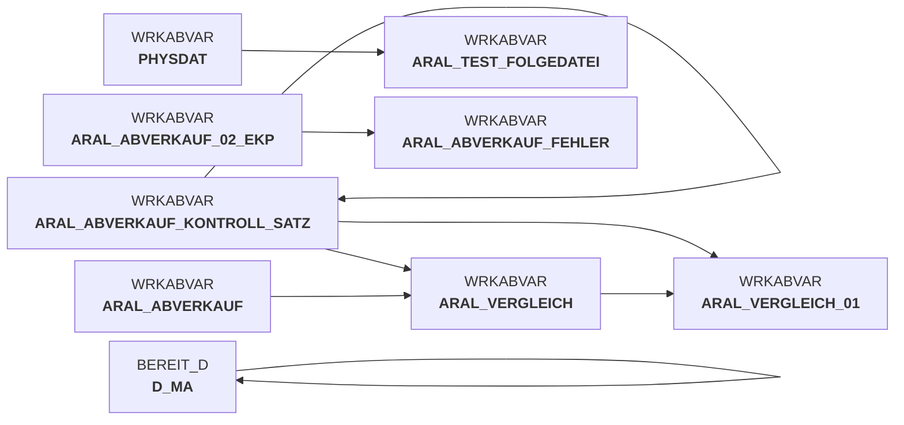

# snow_abv_aral_einlesen.sas (SAS Program)

## Program Description

_No description available_

## Table Lineage

```mermaid
%%{init: {'flowchart': { 'nodeSpacing': 10, 'rankSpacing': 40, 'rankdir': 'TB' }}}%%

flowchart LR

  WRKABVAR.ARAL_ABVERKAUF_KONTROLL_SATZ["WRKABVAR<br/><b>ARAL_ABVERKAUF_KONTROLL_SATZ</b>"] --> WRKABVAR.ARAL_ABVERKAUF_KONTROLL_SATZ["WRKABVAR<br/><b>ARAL_ABVERKAUF_KONTROLL_SATZ</b>"]
  WRKABVAR.ARAL_ABVERKAUF_KONTROLL_SATZ["WRKABVAR<br/><b>ARAL_ABVERKAUF_KONTROLL_SATZ</b>"] --> WRKABVAR.ARAL_VERGLEICH["WRKABVAR<br/><b>ARAL_VERGLEICH</b>"]
  BEREIT_D.D_MA["BEREIT_D<br/><b>D_MA</b>"] --> BEREIT_D.D_MA["BEREIT_D<br/><b>D_MA</b>"]
  WRKABVAR.PHYSDAT["WRKABVAR<br/><b>PHYSDAT</b>"] --> WRKABVAR.ARAL_TEST_FOLGEDATEI["WRKABVAR<br/><b>ARAL_TEST_FOLGEDATEI</b>"]
  WRKABVAR.ARAL_ABVERKAUF_02_EKP["WRKABVAR<br/><b>ARAL_ABVERKAUF_02_EKP</b>"] --> WRKABVAR.ARAL_ABVERKAUF_FEHLER["WRKABVAR<br/><b>ARAL_ABVERKAUF_FEHLER</b>"]
  WRKABVAR.ARAL_ABVERKAUF["WRKABVAR<br/><b>ARAL_ABVERKAUF</b>"] --> WRKABVAR.ARAL_VERGLEICH["WRKABVAR<br/><b>ARAL_VERGLEICH</b>"]
  WRKABVAR.ARAL_ABVERKAUF_KONTROLL_SATZ["WRKABVAR<br/><b>ARAL_ABVERKAUF_KONTROLL_SATZ</b>"] --> WRKABVAR.ARAL_VERGLEICH_01["WRKABVAR<br/><b>ARAL_VERGLEICH_01</b>"]
  WRKABVAR.ARAL_VERGLEICH["WRKABVAR<br/><b>ARAL_VERGLEICH</b>"] --> WRKABVAR.ARAL_VERGLEICH_01["WRKABVAR<br/><b>ARAL_VERGLEICH_01</b>"]
  click WRKABVAR.ARAL_ABVERKAUF_KONTROLL_SATZ "../../tables/WRKABVAR/ARAL_ABVERKAUF_KONTROLL_SATZ"
  click BEREIT_D.D_MA "../../tables/BEREIT_D/D_MA"
  click WRKABVAR.PHYSDAT "../../tables/WRKABVAR/PHYSDAT"
  click WRKABVAR.ARAL_ABVERKAUF_02_EKP "../../tables/WRKABVAR/ARAL_ABVERKAUF_02_EKP"
  click WRKABVAR.ARAL_ABVERKAUF "../../tables/WRKABVAR/ARAL_ABVERKAUF"
  click WRKABVAR.ARAL_VERGLEICH "../../tables/WRKABVAR/ARAL_VERGLEICH"
  click WRKABVAR.ARAL_ABVERKAUF_KONTROLL_SATZ "../../tables/WRKABVAR/ARAL_ABVERKAUF_KONTROLL_SATZ"
  click WRKABVAR.ARAL_VERGLEICH "../../tables/WRKABVAR/ARAL_VERGLEICH"
  click WRKABVAR.PHYSDAT "../../tables/WRKABVAR/PHYSDAT"
  click BEREIT_D.D_MA "../../tables/BEREIT_D/D_MA"
  click WRKABVAR.ARAL_TEST_FOLGEDATEI "../../tables/WRKABVAR/ARAL_TEST_FOLGEDATEI"
  click WRKABVAR.ARAL_ABVERKAUF_FEHLER "../../tables/WRKABVAR/ARAL_ABVERKAUF_FEHLER"
  click WRKABVAR.ARAL_VERGLEICH_01 "../../tables/WRKABVAR/ARAL_VERGLEICH_01"
```
