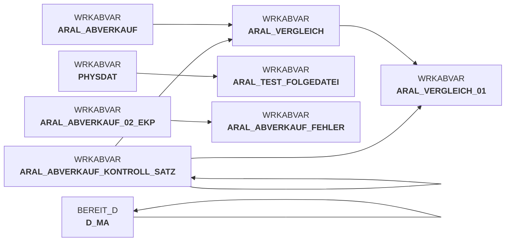

# snow_abv_aral_einlesen.sas (SAS Program)

:::warning Complexity Score
 **M**
| Category | Measure | Value |
|---|---|---|
| Code Size | NBR_CODE_LINES | 198 |
| Code Size | NBR_DATA_STEPS | 6 |
| Code Size | NBR_PROC_STEPS | 2 |
| Dependencies and Flow Complexity | LEN_OF_COND_CLAUSES | 312 |
| Dependencies and Flow Complexity | NBR_INTERM_TABLES | 6 |
| Dependencies and Flow Complexity | NBR_PROC_STEP_SERIES | 8 |
| SQL Specifics | NBR_ANALYT_FUNCS | 1 |
| SQL Specifics | NBR_NESTED_QUERIES | 0 |
| SQL Specifics | NBR_SQL_STATEMENTS | 2 |
| Technical Complexity | NBR_DYNM_CODE_GEN | 0 |
| Technical Complexity | NBR_EXTERNAL_SYS | 3 |
| Technical Complexity | NBR_MAPPING_FORMATS | 4 |
| Technical Complexity | NBR_USED_MACROS | 0 |
| Transformation Complexity | NBR_COND_LOGIC | 12 |
| Transformation Complexity | NBR_JOINS | 1 |
| Transformation Complexity | NBR_TABLE_INP | 4 |
| Transformation Complexity | NBR_TABLE_OUTP | 6 |
| Transformation Complexity | NBR_TRANSF_TYPES | 8 |
:::

## Program Description

This SAS script is part of the **DWABVARAL** data warehouse application and handles the **reading and processing of Aral sales data** (Abverkaufsdaten). The script performs comprehensive data ingestion from raw files, including validation, transformation, and error handling.

The main functionality includes:
- **File Detection**: Scans for incoming Aral sales data files and validates file sequence integrity
- **Data Processing**: Reads semicolon-delimited files containing sales transactions (I-records) and control records (T-records)
- **Data Validation**: Performs record count verification against control totals and validates file sequences
- **Data Transformation**: Converts raw sales data into standardized format with proper data types, adds derived fields like MA_ID (store ID) and NAN_ART_ID (article ID)
- **Error Handling**: Implements comprehensive error checking with detailed logging and abort mechanisms for data quality issues
- **Protocol Generation**: Creates audit trail records for tracking processed files and record counts

The script processes sales transaction data including EAN codes, quantities, prices, VAT information, and store identifiers. It enriches the data by joining with master data tables to resolve store and article IDs. **Version 1.9** includes enhancements for purchase price evaluation fields and improved contact information. The job can be restarted and includes detailed error documentation for known failure scenarios.

## Table Lineage

