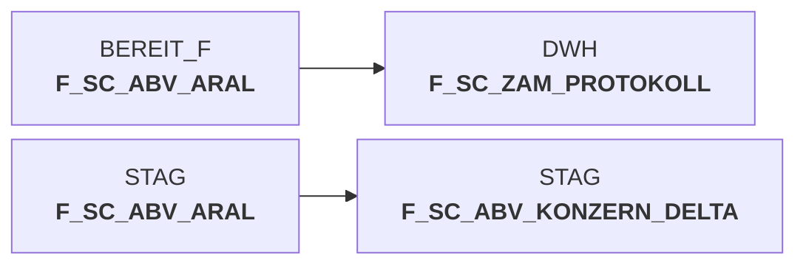

# snow_abv_aral_insert_sca_delta.sas (SAS Program)

:::info Complexity Score
 **XS**
| Category | Measure | Value |
|---|---|---|
| Code Size | NBR_CODE_LINES | 18 |
| Code Size | NBR_DATA_STEPS | 0 |
| Code Size | NBR_PROC_STEPS | 0 |
| Dependencies and Flow Complexity | LEN_OF_COND_CLAUSES | 0 |
| Dependencies and Flow Complexity | NBR_INTERM_TABLES | 0 |
| Dependencies and Flow Complexity | NBR_PROC_STEP_SERIES | 1 |
| SQL Specifics | NBR_ANALYT_FUNCS | 2 |
| SQL Specifics | NBR_NESTED_QUERIES | 0 |
| SQL Specifics | NBR_SQL_STATEMENTS | 1 |
| Technical Complexity | NBR_DYNM_CODE_GEN | 0 |
| Technical Complexity | NBR_EXTERNAL_SYS | 0 |
| Technical Complexity | NBR_MAPPING_FORMATS | 0 |
| Technical Complexity | NBR_USED_MACROS | 1 |
| Transformation Complexity | NBR_COND_LOGIC | 0 |
| Transformation Complexity | NBR_JOINS | 0 |
| Transformation Complexity | NBR_TABLE_INP | 1 |
| Transformation Complexity | NBR_TABLE_OUTP | 1 |
| Transformation Complexity | NBR_TRANSF_TYPES | 1 |
:::

## Program Description

This SAS script is part of the **DWABVARAL** application and handles the insertion of Aral sales data into the data warehouse staging table **F_SC_ABV_KONZERN_DELTA**. The script processes sales transaction data by aggregating various financial metrics including sales values, purchase costs, and quantities at different organizational levels.

The script first generates a unique sequential load number (**LFD_NR_LOAD**) by retrieving the maximum value from the production metadata table and incrementing it by one. This ensures consistent tracking across all data sources (ZAM, FAWIS) for each processing day.

The main functionality involves executing a complex SQL INSERT statement that aggregates Aral sales data from the staging table **F_SC_ABV_ARAL**. The aggregation groups data by multiple dimensions including market ID, article ID, calendar day, sales type, department, and various foreign key identifiers. Financial metrics such as net purchase costs, weighted purchase costs, net sales, gross sales, and quantities are summed up during the aggregation process.

The script is designed to be **restartable** and includes comprehensive error handling documentation. It's typically executed as part of job **DW011000** in the data warehouse processing pipeline for Aral retail sales data integration.

## Table Lineage

