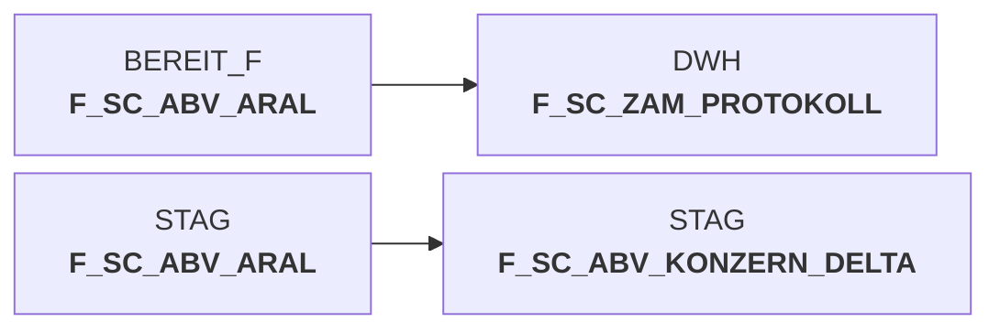

# snow_abv_aral_insert_sca_delta.sas (SAS Program)

## Program Description

_No description available_

## Table Lineage

```mermaid
%%{init: {'flowchart': { 'nodeSpacing': 10, 'rankSpacing': 40, 'rankdir': 'TB' }}}%%

flowchart LR

  BEREIT_F.F_SC_ABV_ARAL["BEREIT_F<br/><b>F_SC_ABV_ARAL</b>"] --> DWH.F_SC_ZAM_PROTOKOLL["DWH<br/><b>F_SC_ZAM_PROTOKOLL</b>"]
  STAG.F_SC_ABV_ARAL["STAG<br/><b>F_SC_ABV_ARAL</b>"] --> STAG.F_SC_ABV_KONZERN_DELTA["STAG<br/><b>F_SC_ABV_KONZERN_DELTA</b>"]
  click BEREIT_F.F_SC_ABV_ARAL "../../tables/BEREIT_F/F_SC_ABV_ARAL"
  click STAG.F_SC_ABV_ARAL "../../tables/STAG/F_SC_ABV_ARAL"
  click DWH.F_SC_ZAM_PROTOKOLL "../../tables/DWH/F_SC_ZAM_PROTOKOLL"
  click STAG.F_SC_ABV_KONZERN_DELTA "../../tables/STAG/F_SC_ABV_KONZERN_DELTA"
```
