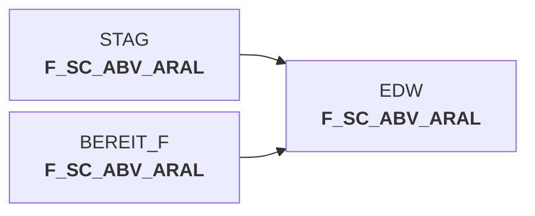

# snow_abv_aral_nach_dwh.sas (SAS Program)

## Program Description

_No description available_

## Table Lineage

```mermaid
%%{init: {'flowchart': { 'nodeSpacing': 10, 'rankSpacing': 40, 'rankdir': 'TB' }}}%%

flowchart LR

  STAG.F_SC_ABV_ARAL["STAG<br/><b>F_SC_ABV_ARAL</b>"] --> EDW.F_SC_ABV_ARAL["EDW<br/><b>F_SC_ABV_ARAL</b>"]
  BEREIT_F.F_SC_ABV_ARAL["BEREIT_F<br/><b>F_SC_ABV_ARAL</b>"] --> EDW.F_SC_ABV_ARAL["EDW<br/><b>F_SC_ABV_ARAL</b>"]
  click STAG.F_SC_ABV_ARAL "../../tables/STAG/F_SC_ABV_ARAL"
  click BEREIT_F.F_SC_ABV_ARAL "../../tables/BEREIT_F/F_SC_ABV_ARAL"
  click EDW.F_SC_ABV_ARAL "../../tables/EDW/F_SC_ABV_ARAL"
```
