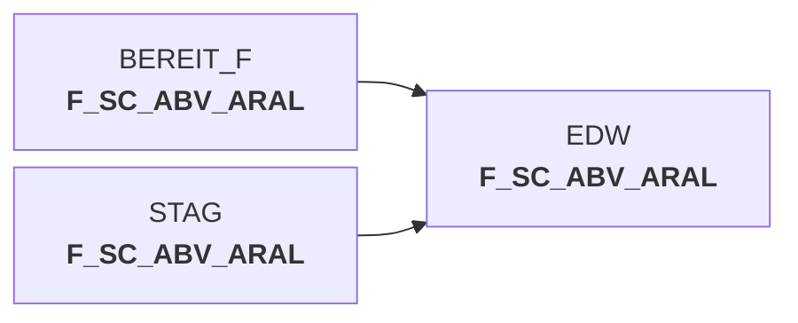

# snow_abv_aral_nach_dwh.sas (SAS Program)

:::info Complexity Score
 **XS**
| Category | Measure | Value |
|---|---|---|
| Code Size | NBR_CODE_LINES | 6 |
| Code Size | NBR_DATA_STEPS | 0 |
| Code Size | NBR_PROC_STEPS | 0 |
| Dependencies and Flow Complexity | LEN_OF_COND_CLAUSES | 0 |
| Dependencies and Flow Complexity | NBR_INTERM_TABLES | 0 |
| Dependencies and Flow Complexity | NBR_PROC_STEP_SERIES | 1 |
| SQL Specifics | NBR_ANALYT_FUNCS | 0 |
| SQL Specifics | NBR_NESTED_QUERIES | 0 |
| SQL Specifics | NBR_SQL_STATEMENTS | 1 |
| Technical Complexity | NBR_DYNM_CODE_GEN | 0 |
| Technical Complexity | NBR_EXTERNAL_SYS | 0 |
| Technical Complexity | NBR_MAPPING_FORMATS | 0 |
| Technical Complexity | NBR_USED_MACROS | 1 |
| Transformation Complexity | NBR_COND_LOGIC | 0 |
| Transformation Complexity | NBR_JOINS | 0 |
| Transformation Complexity | NBR_TABLE_INP | 0 |
| Transformation Complexity | NBR_TABLE_OUTP | 0 |
| Transformation Complexity | NBR_TRANSF_TYPES | 0 |
:::

## Program Description

This SAS script is part of the **DWABVARAL** application and handles the transfer of Aral sales data from the staging area (STAG) to the data warehouse (DWH). The script establishes a connection to the Snowflake database and performs a complete data transfer by inserting all records from the staging table `STAG.F_SC_ABV_ARAL` into the corresponding data warehouse table `EDW.F_SC_ABV_ARAL`.

The script follows a simple ETL pattern: it connects to Snowflake using the `%snowcon` macro, executes an INSERT statement to copy all data, commits the transaction, and then disconnects. This is a **restartable job** (Job ID: DW010991) that can be re-executed if needed.

**Usage**: Run this script as part of the data warehouse loading process to move processed Aral sales data from staging to the final data warehouse tables. The script is designed for batch processing and should be executed after the staging tables have been populated with the latest Aral sales information.

*Created: March 17, 2016*

## Table Lineage

