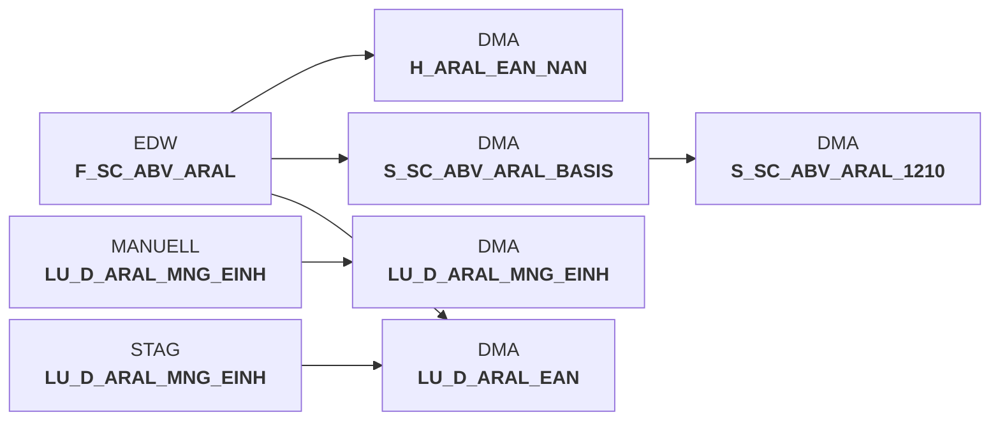

# snow_abv_aral_verdichtungen.sas (SAS Program)

:::info Complexity Score
 **S**
| Category | Measure | Value |
|---|---|---|
| Code Size | NBR_CODE_LINES | 75 |
| Code Size | NBR_DATA_STEPS | 0 |
| Code Size | NBR_PROC_STEPS | 0 |
| Dependencies and Flow Complexity | LEN_OF_COND_CLAUSES | 0 |
| Dependencies and Flow Complexity | NBR_INTERM_TABLES | 0 |
| Dependencies and Flow Complexity | NBR_PROC_STEP_SERIES | 1 |
| SQL Specifics | NBR_ANALYT_FUNCS | 2 |
| SQL Specifics | NBR_NESTED_QUERIES | 0 |
| SQL Specifics | NBR_SQL_STATEMENTS | 5 |
| Technical Complexity | NBR_DYNM_CODE_GEN | 0 |
| Technical Complexity | NBR_EXTERNAL_SYS | 0 |
| Technical Complexity | NBR_MAPPING_FORMATS | 0 |
| Technical Complexity | NBR_USED_MACROS | 1 |
| Transformation Complexity | NBR_COND_LOGIC | 0 |
| Transformation Complexity | NBR_JOINS | 0 |
| Transformation Complexity | NBR_TABLE_INP | 4 |
| Transformation Complexity | NBR_TABLE_OUTP | 4 |
| Transformation Complexity | NBR_TRANSF_TYPES | 2 |
:::

## Program Description

This SAS script processes **Aral sales data aggregations** for the DWABVARAL application (Job DW010993). The script performs data consolidation operations by extracting sales information from staging tables and creating multiple aggregated views in the data mart.

The script executes several **data processing steps**: it manages lookup tables for Aral quantity units and EAN codes, creates a basis sales table with calculated fields including EAN IDs and position numbers, generates helper tables for EAN-to-product mappings, and produces final aggregated sales summaries grouped by store, date, and product type.

**Key operations** include data deletion and insertion cycles, EAN code standardization with ID generation, duplicate handling through row numbering, and sales metrics calculation including quantities, position counts, and receipt numbers. The script uses Snowflake connections with variable warehouse sizing and includes proper transaction management with commits.

This is a **restartable job** designed for regular execution in the data warehouse environment, processing retail sales data from Aral gas stations into structured analytical formats for downstream reporting and analysis.

## Table Lineage

