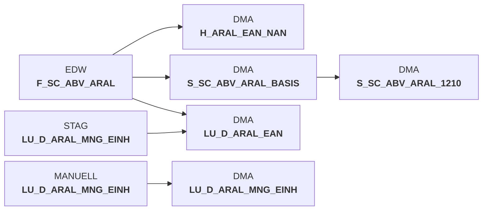

# snow_abv_aral_verdichtungen.sas (SAS Program)

## Program Description

_No description available_

## Table Lineage

```mermaid
%%{init: {'flowchart': { 'nodeSpacing': 10, 'rankSpacing': 40, 'rankdir': 'TB' }}}%%

flowchart LR

  EDW.F_SC_ABV_ARAL["EDW<br/><b>F_SC_ABV_ARAL</b>"] --> DMA.H_ARAL_EAN_NAN["DMA<br/><b>H_ARAL_EAN_NAN</b>"]
  DMA.S_SC_ABV_ARAL_BASIS["DMA<br/><b>S_SC_ABV_ARAL_BASIS</b>"] --> DMA.S_SC_ABV_ARAL_1210["DMA<br/><b>S_SC_ABV_ARAL_1210</b>"]
  STAG.LU_D_ARAL_MNG_EINH["STAG<br/><b>LU_D_ARAL_MNG_EINH</b>"] --> DMA.LU_D_ARAL_EAN["DMA<br/><b>LU_D_ARAL_EAN</b>"]
  EDW.F_SC_ABV_ARAL["EDW<br/><b>F_SC_ABV_ARAL</b>"] --> DMA.LU_D_ARAL_EAN["DMA<br/><b>LU_D_ARAL_EAN</b>"]
  MANUELL.LU_D_ARAL_MNG_EINH["MANUELL<br/><b>LU_D_ARAL_MNG_EINH</b>"] --> DMA.LU_D_ARAL_MNG_EINH["DMA<br/><b>LU_D_ARAL_MNG_EINH</b>"]
  EDW.F_SC_ABV_ARAL["EDW<br/><b>F_SC_ABV_ARAL</b>"] --> DMA.S_SC_ABV_ARAL_BASIS["DMA<br/><b>S_SC_ABV_ARAL_BASIS</b>"]
  click EDW.F_SC_ABV_ARAL "../../tables/EDW/F_SC_ABV_ARAL"
  click DMA.S_SC_ABV_ARAL_BASIS "../../tables/DMA/S_SC_ABV_ARAL_BASIS"
  click STAG.LU_D_ARAL_MNG_EINH "../../tables/STAG/LU_D_ARAL_MNG_EINH"
  click MANUELL.LU_D_ARAL_MNG_EINH "../../tables/MANUELL/LU_D_ARAL_MNG_EINH"
  click DMA.H_ARAL_EAN_NAN "../../tables/DMA/H_ARAL_EAN_NAN"
  click DMA.S_SC_ABV_ARAL_1210 "../../tables/DMA/S_SC_ABV_ARAL_1210"
  click DMA.LU_D_ARAL_EAN "../../tables/DMA/LU_D_ARAL_EAN"
  click DMA.LU_D_ARAL_MNG_EINH "../../tables/DMA/LU_D_ARAL_MNG_EINH"
  click DMA.S_SC_ABV_ARAL_BASIS "../../tables/DMA/S_SC_ABV_ARAL_BASIS"
```
