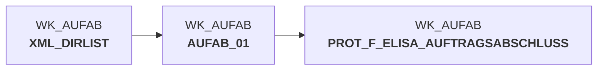

# auftragsabschlussmeldung_einlesen.sas (SAS Program)

:::warning Complexity Score
 **L**
| Category | Measure | Value |
|---|---|---|
| Code Size | NBR_CODE_LINES | 185 |
| Code Size | NBR_DATA_STEPS | 8 |
| Code Size | NBR_PROC_STEPS | 6 |
| Dependencies and Flow Complexity | LEN_OF_COND_CLAUSES | 892 |
| Dependencies and Flow Complexity | NBR_INTERM_TABLES | 6 |
| Dependencies and Flow Complexity | NBR_PROC_STEP_SERIES | 14 |
| SQL Specifics | NBR_ANALYT_FUNCS | 3 |
| SQL Specifics | NBR_NESTED_QUERIES | 0 |
| SQL Specifics | NBR_SQL_STATEMENTS | 8 |
| Technical Complexity | NBR_DYNM_CODE_GEN | 8 |
| Technical Complexity | NBR_EXTERNAL_SYS | 2 |
| Technical Complexity | NBR_MAPPING_FORMATS | 1 |
| Technical Complexity | NBR_USED_MACROS | 3 |
| Transformation Complexity | NBR_COND_LOGIC | 12 |
| Transformation Complexity | NBR_JOINS | 4 |
| Transformation Complexity | NBR_TABLE_INP | 4 |
| Transformation Complexity | NBR_TABLE_OUTP | 8 |
| Transformation Complexity | NBR_TRANSF_TYPES | 5 |
:::

## Program Description

This SAS script processes **order completion messages** from the pL-Store system to ELISA within the **DWELISAAUFTRAB** application. The script reads XML files containing order completion data generated during the commissioning process when the last NVE (shipping unit) for an order is processed.

The script performs several key functions:

**XML File Processing**: Identifies and reads all XML files from the raw data directory, processing each file individually to handle large volumes and preserve filename information.

**Data Structure Handling**: Manages a 2-level position hierarchy where orders can contain 1-n WaNVE (outbound shipping units) and each WaNVE can contain 1-n articles. The interface separates header and position data to minimize data volume.

**Data Consolidation**: Aggregates multiple WE-NVEs (inbound shipping units) and WA-NVEs to prevent record duplication while maintaining correct actual quantities. Handles cancelled positions as separate records with appropriate flags.

**Metadata Management**: Tracks processing statistics including number of files processed, records loaded, and maintains sequential numbering for audit purposes.

**Error Handling**: Includes automated email notifications when zero records are processed, indicating potential XML structure changes requiring MAP file updates.

The script is designed for **restartability** and includes comprehensive logging for production monitoring and troubleshooting.

## Table Lineage

