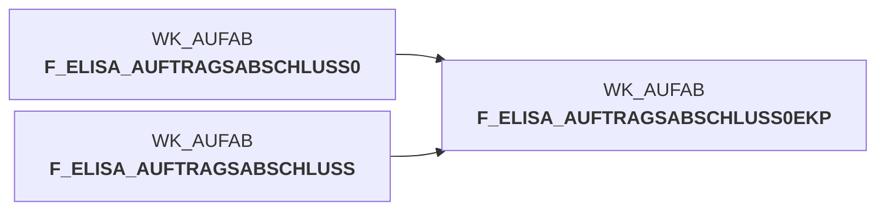

# auftragsabschlussmeldung_ekp.sas (SAS Program)

:::warning Complexity Score
 **L**
| Category | Measure | Value |
|---|---|---|
| Code Size | NBR_CODE_LINES | 195 |
| Code Size | NBR_DATA_STEPS | 12 |
| Code Size | NBR_PROC_STEPS | 4 |
| Dependencies and Flow Complexity | LEN_OF_COND_CLAUSES | 485 |
| Dependencies and Flow Complexity | NBR_INTERM_TABLES | 11 |
| Dependencies and Flow Complexity | NBR_PROC_STEP_SERIES | 16 |
| SQL Specifics | NBR_ANALYT_FUNCS | 3 |
| SQL Specifics | NBR_NESTED_QUERIES | 0 |
| SQL Specifics | NBR_SQL_STATEMENTS | 6 |
| Technical Complexity | NBR_DYNM_CODE_GEN | 0 |
| Technical Complexity | NBR_EXTERNAL_SYS | 1 |
| Technical Complexity | NBR_MAPPING_FORMATS | 0 |
| Technical Complexity | NBR_USED_MACROS | 1 |
| Transformation Complexity | NBR_COND_LOGIC | 18 |
| Transformation Complexity | NBR_JOINS | 6 |
| Transformation Complexity | NBR_TABLE_INP | 1 |
| Transformation Complexity | NBR_TABLE_OUTP | 12 |
| Transformation Complexity | NBR_TRANSF_TYPES | 3 |
:::

## Program Description

This SAS script processes **order completion messages** from pL-Store to ELISA by adding **purchase prices (EK-Preise)** using a multi-stage evaluation approach. The script implements a hierarchical pricing strategy with **6 evaluation stages**: Stage 0 performs regular evaluation with current valid prices, intermediate stage handles bill of materials type V (no evaluation), Stage 1-2 use future and past prices respectively, Stage 3 applies warehouse-independent average prices with current validity, and Stage 5 uses overall average prices independent of warehouse and validity periods.

The script processes input from **wk_aufab.f_elisa_auftragsabschluss0** and generates **wk_aufab.f_elisa_auftragsabschluss0ekp** as final output. It includes comprehensive **logging and monitoring** through macro functions that track record counts at each processing stage. **Warning files** are generated for all non-regularly evaluated records including future/past priced items and unpriced articles.

Key features include **replacement article logic**, special handling for **zero quantities** (BEST_MG=0), and **bill of materials type V identification**. The script maintains detailed documentation of processing steps and generates statistical summaries for quality control. Created for application **BDWH_ELISAAUFTRAB** as job **BDWH_DW002029** on 2020-04-21.

## Table Lineage

