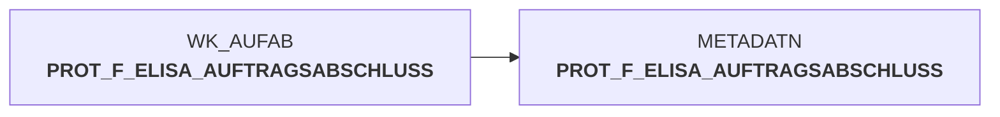

# auftragsabschlussmeldung_metadaten.sas (SAS Program)

:::info Complexity Score
 **XS**
| Category | Measure | Value |
|---|---|---|
| Code Size | NBR_CODE_LINES | 18 |
| Code Size | NBR_DATA_STEPS | 1 |
| Code Size | NBR_PROC_STEPS | 1 |
| Dependencies and Flow Complexity | LEN_OF_COND_CLAUSES | 0 |
| Dependencies and Flow Complexity | NBR_INTERM_TABLES | 0 |
| Dependencies and Flow Complexity | NBR_PROC_STEP_SERIES | 2 |
| SQL Specifics | NBR_ANALYT_FUNCS | 0 |
| SQL Specifics | NBR_NESTED_QUERIES | 0 |
| SQL Specifics | NBR_SQL_STATEMENTS | 0 |
| Technical Complexity | NBR_DYNM_CODE_GEN | 0 |
| Technical Complexity | NBR_EXTERNAL_SYS | 0 |
| Technical Complexity | NBR_MAPPING_FORMATS | 0 |
| Technical Complexity | NBR_USED_MACROS | 0 |
| Transformation Complexity | NBR_COND_LOGIC | 0 |
| Transformation Complexity | NBR_JOINS | 0 |
| Transformation Complexity | NBR_TABLE_INP | 1 |
| Transformation Complexity | NBR_TABLE_OUTP | 1 |
| Transformation Complexity | NBR_TRANSF_TYPES | 1 |
:::

## Program Description

This SAS script is part of the **DWELISAAUFTRAB** application and handles metadata management for order completion notifications (Auftragsabschlussmeldung V2). The script performs two primary functions:

**Error Data Management**: Creates a permanent error repository by copying error records from the working dataset `wk_aufab.aufab_err` to the permanent error table `error.f_elisa_auftragsabschluss_err`. This ensures that any processing errors encountered during order completion are preserved for analysis and troubleshooting.

**Metadata Archival**: Appends protocol and metadata information from the working dataset `wk_aufab.prot_f_elisa_auftragsabschluss` to the permanent metadata table `metadatn.prot_f_elisa_auftragsabschluss`. This maintains a comprehensive audit trail of all order completion processing activities.

The script operates as part of job **DWDW6486** and serves as a critical component in the data warehouse's order management workflow, ensuring data integrity and providing essential logging capabilities for the ELISA order completion process. *Initial version created on January 31, 2017.*

## Table Lineage

