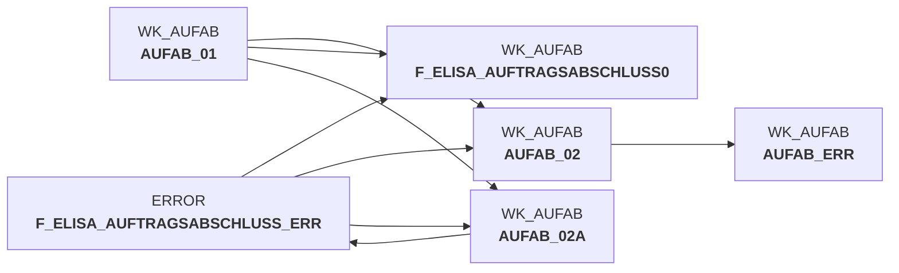

# auftragsabschlussmeldung_transfrm.sas (SAS Program)

:::warning Complexity Score
 **M**
| Category | Measure | Value |
|---|---|---|
| Code Size | NBR_CODE_LINES | 185 |
| Code Size | NBR_DATA_STEPS | 3 |
| Code Size | NBR_PROC_STEPS | 1 |
| Dependencies and Flow Complexity | LEN_OF_COND_CLAUSES | 1245 |
| Dependencies and Flow Complexity | NBR_INTERM_TABLES | 2 |
| Dependencies and Flow Complexity | NBR_PROC_STEP_SERIES | 4 |
| SQL Specifics | NBR_ANALYT_FUNCS | 0 |
| SQL Specifics | NBR_NESTED_QUERIES | 0 |
| SQL Specifics | NBR_SQL_STATEMENTS | 0 |
| Technical Complexity | NBR_DYNM_CODE_GEN | 0 |
| Technical Complexity | NBR_EXTERNAL_SYS | 2 |
| Technical Complexity | NBR_MAPPING_FORMATS | 5 |
| Technical Complexity | NBR_USED_MACROS | 0 |
| Transformation Complexity | NBR_COND_LOGIC | 25 |
| Transformation Complexity | NBR_JOINS | 0 |
| Transformation Complexity | NBR_TABLE_INP | 2 |
| Transformation Complexity | NBR_TABLE_OUTP | 2 |
| Transformation Complexity | NBR_TRANSF_TYPES | 4 |
:::

## Program Description

This **SAS transformation script** processes order completion messages from the pL-Store system to ELISA within the **DWELISAAUFTRAB** application. The script handles the transformation of commissioning data that is generated when the last NVE (shipping unit) of an order is processed.

The script performs **three main processing steps**: First, it deduplicates records based on key fields and handles error data from previous processing stages. Second, it executes comprehensive data transformations including master data lookups and field mappings - converting warehouse numbers to MA_LAG_ID and LAG_ID using specific formats, transforming article numbers to NAN_ART_ID, and mapping supplier numbers to LIEF_ID. Third, it manages metadata for error records and generates protocol information.

**Key transformations** include date field consolidation into proper timestamp formats, handling of version-specific field changes (particularly for V8 where field names were modified), and management of cancellation records with appropriate dummy values for NULL fields. The script supports a **two-level position structure** where orders can contain multiple WaNVE units, each containing multiple articles.

The transformation accommodates **evolving message versions** by implementing field renaming strategies to maintain EDW table compatibility across different interface versions. Error handling includes comprehensive validation of transformed IDs and routing of invalid records to separate error datasets for further analysis.

## Table Lineage

