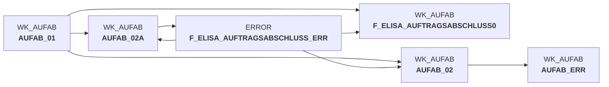

# auftragsabschlussmeldung_transfrm.sas (SAS Program)

## Program Description

_No description available_

## Table Lineage

```mermaid
%%{init: {'flowchart': { 'nodeSpacing': 10, 'rankSpacing': 40, 'rankdir': 'TB' }}}%%

flowchart LR

  WK_AUFAB.AUFAB_01["WK_AUFAB<br/><b>AUFAB_01</b>"] --> WK_AUFAB.F_ELISA_AUFTRAGSABSCHLUSS0["WK_AUFAB<br/><b>F_ELISA_AUFTRAGSABSCHLUSS0</b>"]
  WK_AUFAB.AUFAB_01["WK_AUFAB<br/><b>AUFAB_01</b>"] --> WK_AUFAB.AUFAB_02["WK_AUFAB<br/><b>AUFAB_02</b>"]
  ERROR.F_ELISA_AUFTRAGSABSCHLUSS_ERR["ERROR<br/><b>F_ELISA_AUFTRAGSABSCHLUSS_ERR</b>"] --> WK_AUFAB.AUFAB_02["WK_AUFAB<br/><b>AUFAB_02</b>"]
  ERROR.F_ELISA_AUFTRAGSABSCHLUSS_ERR["ERROR<br/><b>F_ELISA_AUFTRAGSABSCHLUSS_ERR</b>"] --> WK_AUFAB.AUFAB_02A["WK_AUFAB<br/><b>AUFAB_02A</b>"]
  WK_AUFAB.AUFAB_02A["WK_AUFAB<br/><b>AUFAB_02A</b>"] --> ERROR.F_ELISA_AUFTRAGSABSCHLUSS_ERR["ERROR<br/><b>F_ELISA_AUFTRAGSABSCHLUSS_ERR</b>"]
  WK_AUFAB.AUFAB_01["WK_AUFAB<br/><b>AUFAB_01</b>"] --> WK_AUFAB.AUFAB_02A["WK_AUFAB<br/><b>AUFAB_02A</b>"]
  WK_AUFAB.AUFAB_02["WK_AUFAB<br/><b>AUFAB_02</b>"] --> WK_AUFAB.AUFAB_ERR["WK_AUFAB<br/><b>AUFAB_ERR</b>"]
  ERROR.F_ELISA_AUFTRAGSABSCHLUSS_ERR["ERROR<br/><b>F_ELISA_AUFTRAGSABSCHLUSS_ERR</b>"] --> WK_AUFAB.F_ELISA_AUFTRAGSABSCHLUSS0["WK_AUFAB<br/><b>F_ELISA_AUFTRAGSABSCHLUSS0</b>"]
  click WK_AUFAB.AUFAB_01 "../../tables/WK_AUFAB/AUFAB_01"
  click ERROR.F_ELISA_AUFTRAGSABSCHLUSS_ERR "../../tables/ERROR/F_ELISA_AUFTRAGSABSCHLUSS_ERR"
  click WK_AUFAB.AUFAB_02A "../../tables/WK_AUFAB/AUFAB_02A"
  click WK_AUFAB.AUFAB_02 "../../tables/WK_AUFAB/AUFAB_02"
  click WK_AUFAB.F_ELISA_AUFTRAGSABSCHLUSS0 "../../tables/WK_AUFAB/F_ELISA_AUFTRAGSABSCHLUSS0"
  click WK_AUFAB.AUFAB_02 "../../tables/WK_AUFAB/AUFAB_02"
  click WK_AUFAB.AUFAB_02A "../../tables/WK_AUFAB/AUFAB_02A"
  click ERROR.F_ELISA_AUFTRAGSABSCHLUSS_ERR "../../tables/ERROR/F_ELISA_AUFTRAGSABSCHLUSS_ERR"
  click WK_AUFAB.AUFAB_ERR "../../tables/WK_AUFAB/AUFAB_ERR"
```
