# DWELISAAUFTRAB (Application)

:::danger Complexity Score
 **XL**
:::

## Application Description

_No description available_

## List of SAS programs

| SAS Program | Description |
|---|---|
| [auftragsabschlussmeldung_ekp.sas](./auftragsabschlussmeldung_ekp.sas.md) | tbd |
| [snow_auftragsabschlussmeldung_fa_n_edw.sas](./snow_auftragsabschlussmeldung_fa_n_edw.sas.md) | tbd |
| [snow_auftragsabschlussmeldung_fa_mapping.sas](./snow_auftragsabschlussmeldung_fa_mapping.sas.md) | tbd |
| [auftragsabschlussmeldung_einlesen.sas](./auftragsabschlussmeldung_einlesen.sas.md) | tbd |
| [auftragsabschlussmeldung_transfrm.sas](./auftragsabschlussmeldung_transfrm.sas.md) | tbd |
| [auftragsabschlussmeldung_metadaten.sas](./auftragsabschlussmeldung_metadaten.sas.md) | tbd |
| [auftragsabschlussmeldung_vkp.sas](./auftragsabschlussmeldung_vkp.sas.md) | tbd |
| [snow_auftragsabschlussmeldung_laden.sas](./snow_auftragsabschlussmeldung_laden.sas.md) | tbd |

## Table Lineage

```mermaid
%%{init: {'flowchart': { 'nodeSpacing': 10, 'rankSpacing': 40, 'rankdir': 'TB' }}}%%

flowchart LR

  ERROR.F_ELISA_AUFTRAGSABSCHLUSS_ERR["ERROR<br/>F_ELISA_AUFTRAGSABSCHLUSS_ERR"] --> WK_AUFAB.AUFAB_02["WK_AUFAB<br/>AUFAB_02"]
  WK_AUFAB.F_ELISA_AUFTRAGSABSCHLUSS0EKP["WK_AUFAB<br/>F_ELISA_AUFTRAGSABSCHLUSS0EKP"] --> WK_AUFAB.F_ELISA_AUFTRAGSABSCHLUSS["WK_AUFAB<br/>F_ELISA_AUFTRAGSABSCHLUSS"]
  WK_AUFAB.AUFAB_02["WK_AUFAB<br/>AUFAB_02"] --> WK_AUFAB.AUFAB_ERR["WK_AUFAB<br/>AUFAB_ERR"]
  DWH.LU_D_NAN_ART["DWH<br/>LU_D_NAN_ART"] --> WK_AUFAB.F_ELISA_AUFTRAGSABSCHLUSS["WK_AUFAB<br/>F_ELISA_AUFTRAGSABSCHLUSS"]
  WK_AUFAB.AUFAB_02A["WK_AUFAB<br/>AUFAB_02A"] --> ERROR.F_ELISA_AUFTRAGSABSCHLUSS_ERR["ERROR<br/>F_ELISA_AUFTRAGSABSCHLUSS_ERR"]
  LEGACY_STAG.F_ELISA_FEHL_ART["LEGACY_STAG<br/>F_ELISA_FEHL_ART"] --> LEGACY_STAG.F_ELISA_FEHL_ART["LEGACY_STAG<br/>F_ELISA_FEHL_ART"]
  LEGACY_STAG.F_ELISA_FEHL_ART["LEGACY_STAG<br/>F_ELISA_FEHL_ART"] --> LEGACY_DMA.F_ELISA_FEHL_ART["LEGACY_DMA<br/>F_ELISA_FEHL_ART"]
  LEGACY_STAG.F_ELISA_AUFTRAGSABSCHLUSS_ERSATZART["LEGACY_STAG<br/>F_ELISA_AUFTRAGSABSCHLUSS_ERSATZART"] --> WK_AUFAB.F_ELISA_AUFTRAGSABSCHLUSS["WK_AUFAB<br/>F_ELISA_AUFTRAGSABSCHLUSS"]
  WK_AUFAB.XML_DIRLIST["WK_AUFAB<br/>XML_DIRLIST"] --> WK_AUFAB.AUFAB_01["WK_AUFAB<br/>AUFAB_01"]
  WK_AUFAB.AUFAB_01["WK_AUFAB<br/>AUFAB_01"] --> WK_AUFAB.PROT_F_ELISA_AUFTRAGSABSCHLUSS["WK_AUFAB<br/>PROT_F_ELISA_AUFTRAGSABSCHLUSS"]
  ERROR.F_ELISA_AUFTRAGSABSCHLUSS_ERR["ERROR<br/>F_ELISA_AUFTRAGSABSCHLUSS_ERR"] --> WK_AUFAB.AUFAB_02A["WK_AUFAB<br/>AUFAB_02A"]
  WK_AUFAB.PROT_F_ELISA_AUFTRAGSABSCHLUSS["WK_AUFAB<br/>PROT_F_ELISA_AUFTRAGSABSCHLUSS"] --> METADATN.PROT_F_ELISA_AUFTRAGSABSCHLUSS["METADATN<br/>PROT_F_ELISA_AUFTRAGSABSCHLUSS"]
  WK_AUFAB.F_ELISA_AUFTRAGSABSCHLUSS["WK_AUFAB<br/>F_ELISA_AUFTRAGSABSCHLUSS"] --> LEGACY_STAG.F_ELISA_AUFTRAGSABSCHLUSS["LEGACY_STAG<br/>F_ELISA_AUFTRAGSABSCHLUSS"]
  ERROR.F_ELISA_AUFTRAGSABSCHLUSS_ERR["ERROR<br/>F_ELISA_AUFTRAGSABSCHLUSS_ERR"] --> WK_AUFAB.F_ELISA_AUFTRAGSABSCHLUSS0["WK_AUFAB<br/>F_ELISA_AUFTRAGSABSCHLUSS0"]
  LEGACY_STAG.F_ELISA_FEHL_ART["LEGACY_STAG<br/>F_ELISA_FEHL_ART"] --> LEGACY_EDW.F_ELISA_AUFTRAGSABSCHLUSS["LEGACY_EDW<br/>F_ELISA_AUFTRAGSABSCHLUSS"]
  WK_AUFAB.AUFAB_01["WK_AUFAB<br/>AUFAB_01"] --> WK_AUFAB.AUFAB_02A["WK_AUFAB<br/>AUFAB_02A"]
  WK_AUFAB.F_ELISA_AUFTRAGSABSCHLUSS["WK_AUFAB<br/>F_ELISA_AUFTRAGSABSCHLUSS"] --> WK_AUFAB.F_ELISA_AUFTRAGSABSCHLUSS0EKP["WK_AUFAB<br/>F_ELISA_AUFTRAGSABSCHLUSS0EKP"]
  DWH.LU_D_MA_HPT_ABT["DWH<br/>LU_D_MA_HPT_ABT"] --> WK_AUFAB.F_ELISA_AUFTRAGSABSCHLUSS["WK_AUFAB<br/>F_ELISA_AUFTRAGSABSCHLUSS"]
  WK_AUFAB.F_ELISA_AUFTRAGSABSCHLUSS["WK_AUFAB<br/>F_ELISA_AUFTRAGSABSCHLUSS"] --> WK_AUFAB.PROT_F_ELISA_AUFTRAGSABSCHLUSS["WK_AUFAB<br/>PROT_F_ELISA_AUFTRAGSABSCHLUSS"]
  WK_AUFAB.F_ELISA_AUFTRAGSABSCHLUSS0["WK_AUFAB<br/>F_ELISA_AUFTRAGSABSCHLUSS0"] --> WK_AUFAB.F_ELISA_AUFTRAGSABSCHLUSS0EKP["WK_AUFAB<br/>F_ELISA_AUFTRAGSABSCHLUSS0EKP"]
  PRODUCT_SCC_PROD.LEGACY_STAG.F_ELISA_FEHL_ART["PRODUCT_SCC_PROD<br/>LEGACY_STAG.F_ELISA_FEHL_ART"] --> LEGACY_STAG.F_ELISA_AUFTRAGSABSCHLUSS_ERSATZART["LEGACY_STAG<br/>F_ELISA_AUFTRAGSABSCHLUSS_ERSATZART"]
  WK_AUFAB.AUFAB_01["WK_AUFAB<br/>AUFAB_01"] --> WK_AUFAB.AUFAB_02["WK_AUFAB<br/>AUFAB_02"]
  WK_AUFAB.AUFAB_01["WK_AUFAB<br/>AUFAB_01"] --> WK_AUFAB.F_ELISA_AUFTRAGSABSCHLUSS0["WK_AUFAB<br/>F_ELISA_AUFTRAGSABSCHLUSS0"]
  EDW.F_ELISA_KDAUFTRAGAEND["EDW<br/>F_ELISA_KDAUFTRAGAEND"] --> WK_AUFAB.F_ELISA_AUFTRAGSABSCHLUSS["WK_AUFAB<br/>F_ELISA_AUFTRAGSABSCHLUSS"]
  click ERROR.F_ELISA_AUFTRAGSABSCHLUSS_ERR "../../tables/ERROR/F_ELISA_AUFTRAGSABSCHLUSS_ERR"
  click WK_AUFAB.F_ELISA_AUFTRAGSABSCHLUSS0EKP "../../tables/WK_AUFAB/F_ELISA_AUFTRAGSABSCHLUSS0EKP"
  click WK_AUFAB.AUFAB_02 "../../tables/WK_AUFAB/AUFAB_02"
  click DWH.LU_D_NAN_ART "../../tables/DWH/LU_D_NAN_ART"
  click WK_AUFAB.AUFAB_02A "../../tables/WK_AUFAB/AUFAB_02A"
  click LEGACY_STAG.F_ELISA_FEHL_ART "../../tables/LEGACY_STAG/F_ELISA_FEHL_ART"
  click LEGACY_STAG.F_ELISA_FEHL_ART "../../tables/LEGACY_STAG/F_ELISA_FEHL_ART"
  click LEGACY_STAG.F_ELISA_AUFTRAGSABSCHLUSS_ERSATZART "../../tables/LEGACY_STAG/F_ELISA_AUFTRAGSABSCHLUSS_ERSATZART"
  click WK_AUFAB.XML_DIRLIST "../../tables/WK_AUFAB/XML_DIRLIST"
  click WK_AUFAB.AUFAB_01 "../../tables/WK_AUFAB/AUFAB_01"
  click ERROR.F_ELISA_AUFTRAGSABSCHLUSS_ERR "../../tables/ERROR/F_ELISA_AUFTRAGSABSCHLUSS_ERR"
  click WK_AUFAB.PROT_F_ELISA_AUFTRAGSABSCHLUSS "../../tables/WK_AUFAB/PROT_F_ELISA_AUFTRAGSABSCHLUSS"
  click WK_AUFAB.F_ELISA_AUFTRAGSABSCHLUSS "../../tables/WK_AUFAB/F_ELISA_AUFTRAGSABSCHLUSS"
  click ERROR.F_ELISA_AUFTRAGSABSCHLUSS_ERR "../../tables/ERROR/F_ELISA_AUFTRAGSABSCHLUSS_ERR"
  click LEGACY_STAG.F_ELISA_FEHL_ART "../../tables/LEGACY_STAG/F_ELISA_FEHL_ART"
  click WK_AUFAB.AUFAB_01 "../../tables/WK_AUFAB/AUFAB_01"
  click WK_AUFAB.F_ELISA_AUFTRAGSABSCHLUSS "../../tables/WK_AUFAB/F_ELISA_AUFTRAGSABSCHLUSS"
  click DWH.LU_D_MA_HPT_ABT "../../tables/DWH/LU_D_MA_HPT_ABT"
  click WK_AUFAB.F_ELISA_AUFTRAGSABSCHLUSS "../../tables/WK_AUFAB/F_ELISA_AUFTRAGSABSCHLUSS"
  click WK_AUFAB.F_ELISA_AUFTRAGSABSCHLUSS0 "../../tables/WK_AUFAB/F_ELISA_AUFTRAGSABSCHLUSS0"
  click PRODUCT_SCC_PROD.LEGACY_STAG.F_ELISA_FEHL_ART "../../tables/PRODUCT_SCC_PROD/LEGACY_STAG.F_ELISA_FEHL_ART"
  click WK_AUFAB.AUFAB_01 "../../tables/WK_AUFAB/AUFAB_01"
  click WK_AUFAB.AUFAB_01 "../../tables/WK_AUFAB/AUFAB_01"
  click EDW.F_ELISA_KDAUFTRAGAEND "../../tables/EDW/F_ELISA_KDAUFTRAGAEND"
  click WK_AUFAB.AUFAB_02 "../../tables/WK_AUFAB/AUFAB_02"
  click WK_AUFAB.F_ELISA_AUFTRAGSABSCHLUSS "../../tables/WK_AUFAB/F_ELISA_AUFTRAGSABSCHLUSS"
  click WK_AUFAB.AUFAB_ERR "../../tables/WK_AUFAB/AUFAB_ERR"
  click WK_AUFAB.F_ELISA_AUFTRAGSABSCHLUSS "../../tables/WK_AUFAB/F_ELISA_AUFTRAGSABSCHLUSS"
  click ERROR.F_ELISA_AUFTRAGSABSCHLUSS_ERR "../../tables/ERROR/F_ELISA_AUFTRAGSABSCHLUSS_ERR"
  click LEGACY_STAG.F_ELISA_FEHL_ART "../../tables/LEGACY_STAG/F_ELISA_FEHL_ART"
  click LEGACY_DMA.F_ELISA_FEHL_ART "../../tables/LEGACY_DMA/F_ELISA_FEHL_ART"
  click WK_AUFAB.F_ELISA_AUFTRAGSABSCHLUSS "../../tables/WK_AUFAB/F_ELISA_AUFTRAGSABSCHLUSS"
  click WK_AUFAB.AUFAB_01 "../../tables/WK_AUFAB/AUFAB_01"
  click WK_AUFAB.PROT_F_ELISA_AUFTRAGSABSCHLUSS "../../tables/WK_AUFAB/PROT_F_ELISA_AUFTRAGSABSCHLUSS"
  click WK_AUFAB.AUFAB_02A "../../tables/WK_AUFAB/AUFAB_02A"
  click WK_AUFAB.F_ELISA_AUFTRAGSABSCHLUSS "../../tables/WK_AUFAB/F_ELISA_AUFTRAGSABSCHLUSS"
  click METADATN.PROT_F_ELISA_AUFTRAGSABSCHLUSS "../../tables/METADATN/PROT_F_ELISA_AUFTRAGSABSCHLUSS"
  click LEGACY_STAG.F_ELISA_AUFTRAGSABSCHLUSS "../../tables/LEGACY_STAG/F_ELISA_AUFTRAGSABSCHLUSS"
  click WK_AUFAB.XML_DIRLIST "../../tables/WK_AUFAB/XML_DIRLIST"
  click WK_AUFAB.F_ELISA_AUFTRAGSABSCHLUSS0 "../../tables/WK_AUFAB/F_ELISA_AUFTRAGSABSCHLUSS0"
  click WK_AUFAB.PROT_F_ELISA_AUFTRAGSABSCHLUSS "../../tables/WK_AUFAB/PROT_F_ELISA_AUFTRAGSABSCHLUSS"
  click LEGACY_EDW.F_ELISA_AUFTRAGSABSCHLUSS "../../tables/LEGACY_EDW/F_ELISA_AUFTRAGSABSCHLUSS"
  click WK_AUFAB.AUFAB_01 "../../tables/WK_AUFAB/AUFAB_01"
  click WK_AUFAB.AUFAB_02A "../../tables/WK_AUFAB/AUFAB_02A"
  click WK_AUFAB.F_ELISA_AUFTRAGSABSCHLUSS0EKP "../../tables/WK_AUFAB/F_ELISA_AUFTRAGSABSCHLUSS0EKP"
  click WK_AUFAB.F_ELISA_AUFTRAGSABSCHLUSS "../../tables/WK_AUFAB/F_ELISA_AUFTRAGSABSCHLUSS"
  click WK_AUFAB.PROT_F_ELISA_AUFTRAGSABSCHLUSS "../../tables/WK_AUFAB/PROT_F_ELISA_AUFTRAGSABSCHLUSS"
  click WK_AUFAB.F_ELISA_AUFTRAGSABSCHLUSS0EKP "../../tables/WK_AUFAB/F_ELISA_AUFTRAGSABSCHLUSS0EKP"
  click LEGACY_STAG.F_ELISA_AUFTRAGSABSCHLUSS_ERSATZART "../../tables/LEGACY_STAG/F_ELISA_AUFTRAGSABSCHLUSS_ERSATZART"
  click WK_AUFAB.AUFAB_02 "../../tables/WK_AUFAB/AUFAB_02"
  click WK_AUFAB.F_ELISA_AUFTRAGSABSCHLUSS0 "../../tables/WK_AUFAB/F_ELISA_AUFTRAGSABSCHLUSS0"
  click WK_AUFAB.F_ELISA_AUFTRAGSABSCHLUSS "../../tables/WK_AUFAB/F_ELISA_AUFTRAGSABSCHLUSS"
```

