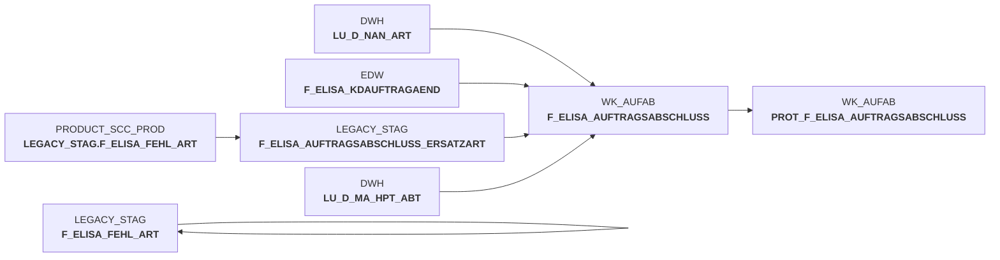

# snow_auftragsabschlussmeldung_fa_mapping.sas (SAS Program)

:::warning Complexity Score
 **M**
| Category | Measure | Value |
|---|---|---|
| Code Size | NBR_CODE_LINES | 85 |
| Code Size | NBR_DATA_STEPS | 0 |
| Code Size | NBR_PROC_STEPS | 1 |
| Dependencies and Flow Complexity | LEN_OF_COND_CLAUSES | 1245 |
| Dependencies and Flow Complexity | NBR_INTERM_TABLES | 1 |
| Dependencies and Flow Complexity | NBR_PROC_STEP_SERIES | 1 |
| SQL Specifics | NBR_ANALYT_FUNCS | 5 |
| SQL Specifics | NBR_NESTED_QUERIES | 1 |
| SQL Specifics | NBR_SQL_STATEMENTS | 2 |
| Technical Complexity | NBR_DYNM_CODE_GEN | 0 |
| Technical Complexity | NBR_EXTERNAL_SYS | 1 |
| Technical Complexity | NBR_MAPPING_FORMATS | 0 |
| Technical Complexity | NBR_USED_MACROS | 0 |
| Transformation Complexity | NBR_COND_LOGIC | 8 |
| Transformation Complexity | NBR_JOINS | 3 |
| Transformation Complexity | NBR_TABLE_INP | 4 |
| Transformation Complexity | NBR_TABLE_OUTP | 2 |
| Transformation Complexity | NBR_TRANSF_TYPES | 2 |
:::

## Program Description

This SAS script processes **order completion messages** from pL-Store to ELISA system, performing data aggregation and mapping operations at the F_ELVS_FEHL_ART level. The script transforms XML message data into the F_ELISA_FEHL_ART result table structure.

The main functionality includes:
- **Data aggregation** based on unique keys: warehouse number, document number, item identifier, document date, and NAN
- **Replacement article handling** with two scenarios: complete replacement where original NAN is fully substituted, and partial replacement where original NAN is partially served and partially replaced
- **Order quantity corrections** to maintain data consistency during replacement processes

The script operates in three main steps:
1. **Step 00100**: Processes replacement article assignments by joining reference NANs with original articles and correcting order quantities
2. **Step 00200**: Integrated into Step 00100 for efficiency improvements
3. **Step 00300**: Aggregates records to match F_ELVS_FEHL_ART structure using min/max/avg functions while handling NULL values appropriately

The process ensures **data integrity** by maintaining proper quantity calculations and handles complex replacement scenarios where multiple articles may substitute a single original item. All operations are performed using Snowflake database connections with appropriate transaction management.

## Table Lineage

