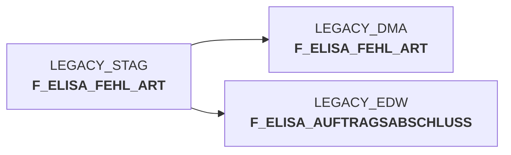

# snow_auftragsabschlussmeldung_fa_n_edw.sas (SAS Program)

:::info Complexity Score
 **XS**
| Category | Measure | Value |
|---|---|---|
| Code Size | NBR_CODE_LINES | 65 |
| Code Size | NBR_DATA_STEPS | 0 |
| Code Size | NBR_PROC_STEPS | 1 |
| Dependencies and Flow Complexity | LEN_OF_COND_CLAUSES | 1125 |
| Dependencies and Flow Complexity | NBR_INTERM_TABLES | 0 |
| Dependencies and Flow Complexity | NBR_PROC_STEP_SERIES | 1 |
| SQL Specifics | NBR_ANALYT_FUNCS | 0 |
| SQL Specifics | NBR_NESTED_QUERIES | 0 |
| SQL Specifics | NBR_SQL_STATEMENTS | 1 |
| Technical Complexity | NBR_DYNM_CODE_GEN | 0 |
| Technical Complexity | NBR_EXTERNAL_SYS | 1 |
| Technical Complexity | NBR_MAPPING_FORMATS | 0 |
| Technical Complexity | NBR_USED_MACROS | 0 |
| Transformation Complexity | NBR_COND_LOGIC | 1 |
| Transformation Complexity | NBR_JOINS | 1 |
| Transformation Complexity | NBR_TABLE_INP | 2 |
| Transformation Complexity | NBR_TABLE_OUTP | 1 |
| Transformation Complexity | NBR_TRANSF_TYPES | 1 |
:::

## Program Description

This SAS script processes **XML order completion messages** (AuftragsabschlussmeldungV2) within the DWELISAAUFTRAB application framework. The script transfers data from the staging environment (STAG) to the Enterprise Data Warehouse (EDW) using a **merge operation** on the F_ELISA_FEHL_ART table.

The primary function is to handle **order completion notifications** while managing potential duplicate or corrected data deliveries through an **upsert pattern** (merge into). The script connects to a Snowflake data warehouse and synchronizes records between source and target tables based on a composite key consisting of eight fields: ma_lag_id, nan_art_id, akt_kz, kal_tag_id, kopf_lifschn_nr, pos_kst8_aufnr, ma_hpt_abt_id, and pos_waeinh.

**Key Features:**
- Handles both **insert and update operations** for new and existing records
- Processes delivery quantities, weights, pricing information, and error classifications
- Manages warehouse logistics data including storage locations and article information
- Supports **data correction scenarios** through merge functionality
- Executes within Snowflake environment with configurable warehouse sizing

The script is part of job **DW013910** and was initially developed in 2017 with updates through 2022, ensuring reliable data integration for order fulfillment processes.

## Table Lineage

