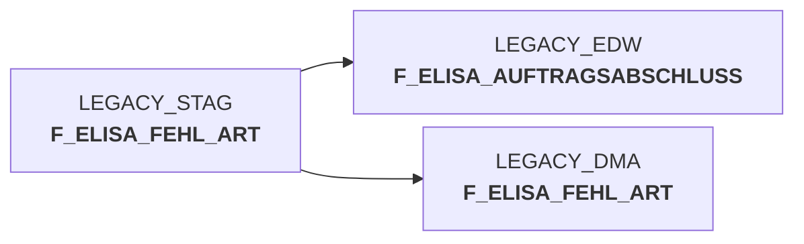

# snow_auftragsabschlussmeldung_fa_n_edw.sas (SAS Program)

## Program Description

_No description available_

## Table Lineage

```mermaid
%%{init: {'flowchart': { 'nodeSpacing': 10, 'rankSpacing': 40, 'rankdir': 'TB' }}}%%

flowchart LR

  LEGACY_STAG.F_ELISA_FEHL_ART["LEGACY_STAG<br/><b>F_ELISA_FEHL_ART</b>"] --> LEGACY_EDW.F_ELISA_AUFTRAGSABSCHLUSS["LEGACY_EDW<br/><b>F_ELISA_AUFTRAGSABSCHLUSS</b>"]
  LEGACY_STAG.F_ELISA_FEHL_ART["LEGACY_STAG<br/><b>F_ELISA_FEHL_ART</b>"] --> LEGACY_DMA.F_ELISA_FEHL_ART["LEGACY_DMA<br/><b>F_ELISA_FEHL_ART</b>"]
  click LEGACY_STAG.F_ELISA_FEHL_ART "../../tables/LEGACY_STAG/F_ELISA_FEHL_ART"
  click LEGACY_EDW.F_ELISA_AUFTRAGSABSCHLUSS "../../tables/LEGACY_EDW/F_ELISA_AUFTRAGSABSCHLUSS"
  click LEGACY_DMA.F_ELISA_FEHL_ART "../../tables/LEGACY_DMA/F_ELISA_FEHL_ART"
```
