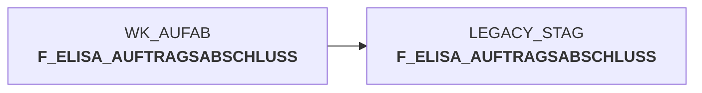

# snow_auftragsabschlussmeldung_laden.sas (SAS Program)

## Program Description

_No description available_

## Table Lineage

```mermaid
%%{init: {'flowchart': { 'nodeSpacing': 10, 'rankSpacing': 40, 'rankdir': 'TB' }}}%%

flowchart LR

  WK_AUFAB.F_ELISA_AUFTRAGSABSCHLUSS["WK_AUFAB<br/><b>F_ELISA_AUFTRAGSABSCHLUSS</b>"] --> LEGACY_STAG.F_ELISA_AUFTRAGSABSCHLUSS["LEGACY_STAG<br/><b>F_ELISA_AUFTRAGSABSCHLUSS</b>"]
  click WK_AUFAB.F_ELISA_AUFTRAGSABSCHLUSS "../../tables/WK_AUFAB/F_ELISA_AUFTRAGSABSCHLUSS"
  click LEGACY_STAG.F_ELISA_AUFTRAGSABSCHLUSS "../../tables/LEGACY_STAG/F_ELISA_AUFTRAGSABSCHLUSS"
```
