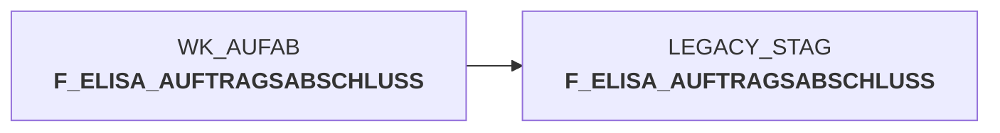

# snow_auftragsabschlussmeldung_laden.sas (SAS Program)

:::info Complexity Score
 **XS**
| Category | Measure | Value |
|---|---|---|
| Code Size | NBR_CODE_LINES | 18 |
| Code Size | NBR_DATA_STEPS | 0 |
| Code Size | NBR_PROC_STEPS | 1 |
| Dependencies and Flow Complexity | LEN_OF_COND_CLAUSES | 0 |
| Dependencies and Flow Complexity | NBR_INTERM_TABLES | 0 |
| Dependencies and Flow Complexity | NBR_PROC_STEP_SERIES | 1 |
| SQL Specifics | NBR_ANALYT_FUNCS | 0 |
| SQL Specifics | NBR_NESTED_QUERIES | 0 |
| SQL Specifics | NBR_SQL_STATEMENTS | 1 |
| Technical Complexity | NBR_DYNM_CODE_GEN | 0 |
| Technical Complexity | NBR_EXTERNAL_SYS | 1 |
| Technical Complexity | NBR_MAPPING_FORMATS | 0 |
| Technical Complexity | NBR_USED_MACROS | 1 |
| Transformation Complexity | NBR_COND_LOGIC | 0 |
| Transformation Complexity | NBR_JOINS | 0 |
| Transformation Complexity | NBR_TABLE_INP | 1 |
| Transformation Complexity | NBR_TABLE_OUTP | 1 |
| Transformation Complexity | NBR_TRANSF_TYPES | 1 |
:::

## Program Description

This SAS script is part of the **DWELISAAUFTRAB** application and handles the loading of XML order completion messages (AuftragsabschlussmeldungV2) into the staging environment. The script executes as **Job DW013907** and performs two main operations:

**Primary Function**: Uses the `%loadsnow` macro to transfer order completion data from the working dataset `wk_aufab.f_elisa_auftragsabschluss` to the target table `f_elisa_auftragsabschluss` in the `LEGACY_STAG` schema.

**Secondary Function**: Updates protocol tracking by executing a SQL procedure that counts the loaded records from `leg_stag.f_elisa_auftragsabschluss` and stores this count in the `geladene_saetze` field of the protocol table `wk_aufab.prot_f_elisa_auftragsabschluss`.

This script is essential for the **ELISA order processing workflow**, ensuring that order completion messages are properly staged for further data warehouse processing while maintaining accurate load statistics for monitoring and auditing purposes. The script was initially created on *2022-10-27* with subsequent revisions tracked in the version log.

## Table Lineage

