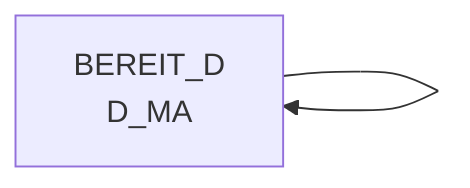

# D_MA (Table)

## Table Description

The **DWABVARAL** application processes Aral fuel station sales data through a comprehensive ETL pipeline. This table serves as a **master data repository for market/store information** within the data warehouse infrastructure.

The application handles the complete lifecycle of Aral sales data processing, including:
- **Data Movement**: Moving raw sales files from staging directories to processing areas
- **Data Extraction**: Unzipping and reading Aral sales transaction files with validation controls
- **Data Transformation**: Converting raw sales records into standardized warehouse format with proper market ID mapping
- **Data Loading**: Inserting processed data into Snowflake data warehouse tables

The **bereit_d.D_MA** table is specifically utilized during the sales data processing to **map Aral partner numbers (ILN_WARE) to internal market IDs (MA_ID)**. This mapping is critical for associating sales transactions with the correct store locations and includes validity date ranges (MA_GUELT_VON/MA_GUELT_BIS) to ensure accurate historical data processing.

The table supports the application's data quality controls by providing fallback mechanisms when market mappings cannot be established, ensuring data integrity throughout the processing pipeline. This is essential for downstream reporting and analytics in the retail data warehouse environment.

## Lineage / Impact



## Statements

The following statements create/modify this table:

<Util>CREATE TABLE</Util> inside [DWABVARAL/snow_abv_aral_einlesen.sas](../../Applications/DWABVARAL/snow_abv_aral_einlesen.sas):
```sql:line-numbers
PROC SQL;
CREATE TABLE WRKABVAR.ARAL_ABVERKAUF_01 AS
SELECT A.*, COALESCE(B.MA_ID,1000000000) AS MA_ID
FROM WRKABVAR.ARAL_ABVERKAUF A
LEFT JOIN bereit_d.D_MA B
ON A.ARAL_PART_NR = B.ILN_WARE
AND A.KAL_TAG_ID between B.MA_GUELT_VON and B.MA_GUELT_BIS
;
QUIT;
```

## References

The table D_MA is used in the following SAS programs:

| Application | SAS Program |
|---|---|
| [DWABVARAL](../../Applications/DWABVARAL) | [snow_abv_aral_einlesen.sas](../../Applications/DWABVARAL/snow_abv_aral_einlesen.sas) |
## Table Schema

| Field Name | Datatype | Precision | Scale | Is Nullable | Constraint | Description |
|---|---|---|---|---|---|---|
| MA_ID | INTEGER | 10 | 0 | FALSE | PRIMARY KEY | Market ID - unique identifier for each market/store |
| ILN_WARE | VARCHAR | 13 | 0 | TRUE |   | International Location Number for goods - used for matching with ARAL partner numbers |
| MA_GUELT_VON | DATE |  |  | TRUE |   | Market validity start date - beginning of validity period for market data |
| MA_GUELT_BIS | DATE |  |  | TRUE |   | Market validity end date - end of validity period for market data |
| MA_NAME | VARCHAR | 100 | 0 | TRUE |   | Market name - descriptive name of the market/store |
| MA_STATUS | VARCHAR | 10 | 0 | TRUE |   | Market status - current operational status of the market |
| MA_TYP | VARCHAR | 20 | 0 | TRUE |   | Market type - classification of market type |
| REGION_ID | INTEGER | 5 | 0 | TRUE |   | Region ID - identifier for geographical region |
| KONZ_NR | INTEGER | 9 | 0 | TRUE |   | Konzern number - corporate group identifier |
| VLT_ID | VARCHAR | 3 | 0 | TRUE |   | Currency ID - currency identifier for transactions |